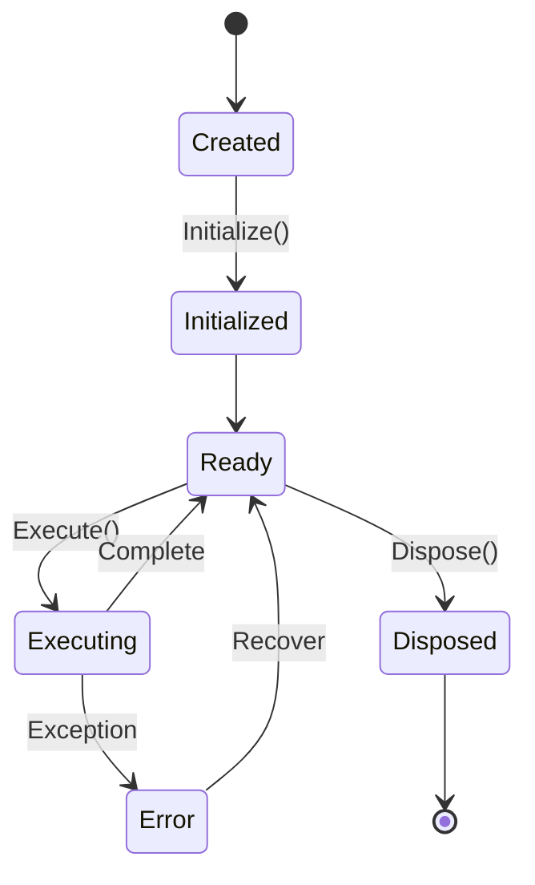
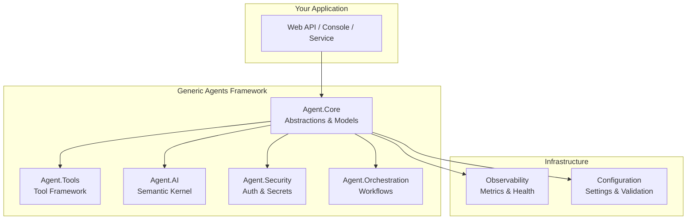

# GitHub Wiki Success Guide

This guide outlines how to create a fantastic GitHub repository wiki that becomes the definitive resource for the Generic AI Agent System, driving adoption and community engagement.

## 🏠 Wiki Structure & Navigation

### **📋 Main Wiki Pages**

```
Home (Landing Page)
├── 🚀 Quick Start
├── 📖 Getting Started
│   ├── Installation
│   ├── Your First Agent
│   └── Basic Concepts
├── 🎯 Tutorials
│   ├── Building Simple Agents
│   ├── AI-Powered Agents
│   ├── Multi-Agent Workflows
│   └── Enterprise Integration
├── 📚 Guides
│   ├── Architecture Overview
│   ├── Security & Authentication  
│   ├── Configuration Management
│   ├── Monitoring & Observability
│   └── Performance Optimization
├── 🔧 API Reference
│   ├── Core Components
│   ├── Agent Interfaces
│   ├── Tool Framework
│   └── Extension Points
├── 💡 Examples & Samples
│   ├── Real-World Use Cases
│   ├── Integration Patterns
│   └── Best Practices
├── 🏗️ Advanced Topics
│   ├── Custom Tool Development
│   ├── Workflow Orchestration
│   ├── Multi-Tenant Architecture
│   └── Performance Tuning
├── 🤝 Contributing
│   ├── Development Setup
│   ├── Coding Standards
│   ├── Testing Guidelines
│   └── Pull Request Process
└── 📞 Support & Community
    ├── FAQ
    ├── Troubleshooting
    ├── Community Guidelines
    └── Getting Help
```

## 📖 Page-by-Page Content Strategy

### 🏠 **Home Page (Wiki Landing)**

```markdown
# Welcome to the Generic AI Agent System Wiki

<div align="center">


**Build intelligent, scalable AI agent systems with .NET 8**

[](https://www.nuget.org/packages/GenericAgents.Core/)
[](https://www.nuget.org/packages/GenericAgents.Core/)
[](https://github.com/yourusername/generic-agents/stargazers)
[](https://github.com/yourusername/generic-agents/actions)

[🚀 Quick Start](Quick-Start) | [📖 Documentation](Getting-Started) | [💡 Examples](Examples-&-Samples) | [🤝 Contributing](Contributing)

</div>

## What is Generic AI Agent System?

The Generic AI Agent System is a production-ready framework for building enterprise-grade AI agent applications with .NET 8. It provides:

✅ **Modular Architecture** - Use only the components you need  
✅ **AI Integration** - Built-in Semantic Kernel support  
✅ **Enterprise Security** - JWT auth, RBAC, secret management  
✅ **Workflow Orchestration** - Coordinate multiple agents  
✅ **Production Ready** - Monitoring, health checks, performance  

## 🎯 Perfect For

- **Enterprise Developers** building AI-powered applications
- **Solution Architects** designing agent-based systems
- **Product Teams** adding intelligence to existing applications
- **DevOps Engineers** deploying scalable AI solutions

## 📊 Quick Stats

- **🏗️ Architecture**: 12+ modular components
- **🧪 Testing**: 95%+ code coverage, 140+ tests
- **🔒 Security**: Enterprise-grade authentication & authorization
- **📈 Performance**: Benchmarked and optimized
- **📚 Documentation**: Comprehensive guides and examples

## 🚀 Get Started in 5 Minutes

```bash
# Install the core package
dotnet add package GenericAgents.Core

# Create your first agent
dotnet new console -n MyAgentApp
cd MyAgentApp
```

[Continue with Quick Start →](Quick-Start)

## 📈 What Our Users Say

> "Reduced our AI integration time from weeks to days. The security features are exactly what we needed for enterprise deployment." - *Senior Architect, Fortune 500 Company*

> "The workflow orchestration is incredibly powerful. We're processing 10x more documents with the same team." - *CTO, Document Processing Startup*

## 🗺️ Navigation Help

**New to AI Agents?** → Start with [Getting Started](Getting-Started)  
**Ready to Build?** → Jump to [Tutorials](Tutorials)  
**Need Examples?** → Check out [Samples](Examples-&-Samples)  
**Advanced User?** → Explore [Architecture](Advanced-Topics)  
**Want to Contribute?** → Read [Contributing Guide](Contributing)
```

### 🚀 **Quick Start Page**

```markdown
# Quick Start Guide

Get up and running with your first AI agent in under 5 minutes!

## Prerequisites

- ✅ .NET 8 SDK installed
- ✅ Visual Studio 2022 or VS Code
- ✅ Basic C# knowledge

## Step 1: Create New Project

```bash
dotnet new console -n MyFirstAgent
cd MyFirstAgent
```

## Step 2: Install Packages

```bash
# Core framework (required)
dotnet add package GenericAgents.Core

# AI capabilities (optional)
dotnet add package GenericAgents.AI

# Security features (optional)  
dotnet add package GenericAgents.Security
```

## Step 3: Write Your First Agent

Replace `Program.cs` with:

```csharp
using Agent.Core;
using Agent.Core.Models;
using Microsoft.Extensions.DependencyInjection;
using Microsoft.Extensions.Hosting;

// Create and configure services
var builder = Host.CreateApplicationBuilder(args);
builder.Services.AddAgentCore();

var host = builder.Build();

// Create your agent
var agent = new GreetingAgent();

// Initialize and execute
await agent.InitializeAsync(new AgentConfiguration());
var result = await agent.ExecuteAsync(new AgentRequest 
{
    Data = new { Name = "World" }
});

Console.WriteLine($"Agent Response: {result.Data}");

// Simple greeting agent implementation
public class GreetingAgent : BaseAgent
{
    public GreetingAgent() : base("greeting", "Says hello to users") { }

    protected override async Task<AgentResult> ExecuteInternalAsync(
        AgentRequest request, 
        CancellationToken cancellationToken)
    {
        var name = request.GetData<dynamic>()?.Name ?? "Friend";
        var greeting = $"Hello, {name}! Welcome to Generic Agents!";
        
        return AgentResult.CreateSuccess(greeting);
    }
}
```

## Step 4: Run Your Agent

```bash
dotnet run
```

**Expected Output:**
```
Agent Response: Hello, World! Welcome to Generic Agents!
```

## 🎉 Congratulations!

You've just created your first AI agent! Here's what happened:

1. **Service Registration** - `AddAgentCore()` registered framework services
2. **Agent Creation** - Extended `BaseAgent` with custom logic
3. **Execution** - Framework handled lifecycle and error management

## 🎯 Next Steps

- **📖 [Learn Core Concepts](Getting-Started#core-concepts)** - Understand agents, tools, and workflows
- **🤖 [Add AI Capabilities](Tutorials#ai-powered-agents)** - Integrate with OpenAI/Azure OpenAI
- **🔧 [Build Custom Tools](Tutorials#custom-tools)** - Extend agent capabilities
- **🎭 [Create Workflows](Tutorials#multi-agent-workflows)** - Orchestrate multiple agents

## ❓ Need Help?

- **🐛 Found a bug?** → [Report an issue](https://github.com/yourusername/generic-agents/issues)
- **❓ Have questions?** → [Start a discussion](https://github.com/yourusername/generic-agents/discussions)
- **💬 Join the community** → [Discord Server](link-to-discord)
```

### 📚 **Getting Started - Core Concepts**

```markdown
# Core Concepts

Understanding the fundamental concepts that make the Generic AI Agent System powerful and flexible.

## 🤖 What is an Agent?

An **Agent** is an autonomous unit that processes requests and produces results. Think of it as a specialized microservice that can:

- 🧠 **Make decisions** based on input data
- 🔧 **Use tools** to perform actions
- 🤝 **Collaborate** with other agents
- 📊 **Report** on its activities

### Agent Lifecycle



## 🔧 What are Tools?

**Tools** are reusable capabilities that agents can use to perform specific tasks:

```csharp
[Tool("file-reader", "Reads content from files")]
public class FileReaderTool : BaseTool
{
    public override async Task<ToolResult> ExecuteAsync(
        Dictionary<string, object> parameters, 
        CancellationToken cancellationToken = default)
    {
        var filePath = parameters["path"].ToString();
        var content = await File.ReadAllTextAsync(filePath);
        return ToolResult.CreateSuccess(content);
    }
}
```

**Key Features:**
- ✅ **Auto-Discovery** - Automatically found and registered
- ✅ **Parameter Validation** - Type-safe parameter handling
- ✅ **Reusable** - Shared across multiple agents
- ✅ **Extensible** - Easy to create custom tools

## 🎭 What are Workflows?

**Workflows** coordinate multiple agents to accomplish complex tasks:

```csharp
var workflow = new WorkflowDefinition
{
    Name = "document-processing",
    ExecutionMode = WorkflowExecutionMode.Sequential,
    Steps = new[]
    {
        new WorkflowStep { AgentId = "scanner", Order = 1 },
        new WorkflowStep { AgentId = "analyzer", Order = 2 },
        new WorkflowStep { AgentId = "summarizer", Order = 3 }
    }
};
```

**Execution Modes:**
- 🔄 **Sequential** - One after another
- ⚡ **Parallel** - All at once
- 🌐 **Dependency-Based** - Based on prerequisites

## 🏗️ Architecture Overview



## 📦 Package Architecture

The framework is split into focused packages:

| Package | Purpose | Dependencies |
|---------|---------|--------------|
| **GenericAgents.Core** | Foundation classes and interfaces | None |
| **GenericAgents.AI** | Semantic Kernel integration | Core |
| **GenericAgents.Security** | Authentication & authorization | Core |
| **GenericAgents.Tools** | Tool framework | Core |
| **GenericAgents.Orchestration** | Workflow engine | Core, AI |

**Design Principle:** Use only what you need! 

## 🎯 Common Patterns

### **Simple Agent Pattern**
```csharp
public class CalculatorAgent : BaseAgent
{
    public CalculatorAgent() : base("calculator") { }
    
    protected override async Task<AgentResult> ExecuteInternalAsync(
        AgentRequest request, CancellationToken cancellationToken)
    {
        // Business logic here
        return AgentResult.CreateSuccess(result);
    }
}
```

### **AI-Powered Agent Pattern**
```csharp
public class SmartAnalysisAgent : BaseAgent
{
    private readonly IAIService _aiService;
    
    protected override async Task<AgentResult> ExecuteInternalAsync(
        AgentRequest request, CancellationToken cancellationToken)
    {
        var analysis = await _aiService.AnalyzeAsync(request.Data);
        return AgentResult.CreateSuccess(analysis);
    }
}
```

### **Tool-Using Agent Pattern**
```csharp
public class FileProcessorAgent : BaseAgent
{
    private readonly IToolRegistry _tools;
    
    protected override async Task<AgentResult> ExecuteInternalAsync(
        AgentRequest request, CancellationToken cancellationToken)
    {
        var reader = _tools.GetTool("file-reader");
        var content = await reader.ExecuteAsync(parameters);
        
        // Process content...
        
        return AgentResult.CreateSuccess(processedContent);
    }
}
```

## ✅ Best Practices

### **Agent Design**
- ✅ **Single Responsibility** - One agent, one purpose
- ✅ **Stateless** - Don't store state between requests
- ✅ **Error Handling** - Always handle exceptions gracefully
- ✅ **Logging** - Log important decisions and errors

### **Tool Development**
- ✅ **Parameter Validation** - Always validate inputs
- ✅ **Idempotent** - Same input = same output
- ✅ **Resource Cleanup** - Dispose resources properly
- ✅ **Documentation** - Clear parameter descriptions

### **Workflow Design**
- ✅ **Error Recovery** - Plan for failures
- ✅ **Monitoring** - Track execution progress
- ✅ **Testing** - Test each step and the whole flow
- ✅ **Documentation** - Document business logic

## 🎓 Ready to Build?

Now that you understand the core concepts, choose your path:

- **🏃 Quick Builder** → [Build Your First AI Agent](Tutorials#ai-powered-agents)
- **🔧 Tool Maker** → [Create Custom Tools](Tutorials#custom-tools)  
- **🎭 Orchestrator** → [Design Workflows](Tutorials#multi-agent-workflows)
- **🏗️ Architect** → [Advanced Architecture](Advanced-Topics)
```

## 🎨 Visual Design Guidelines

### **📊 Use Rich Visuals**

#### **Mermaid Diagrams**
- **Architecture diagrams** for complex relationships
- **Sequence diagrams** for process flows
- **State diagrams** for lifecycles
- **Flowcharts** for decision trees

#### **Code Syntax Highlighting**
- **Always specify language** for syntax highlighting
- **Use realistic examples** not "foo/bar"
- **Include expected outputs** when helpful
- **Show both simple and complex scenarios**

#### **Badges and Metrics**
```markdown


```

### **🎯 Content Strategy**

#### **Progressive Disclosure**
- **Level 1**: What is it? (30 seconds)
- **Level 2**: How do I use it? (5 minutes)  
- **Level 3**: How does it work? (30 minutes)
- **Level 4**: How do I extend it? (Expert level)

#### **Multiple Learning Paths**
- **👶 Beginner Path**: Concepts → Quick Start → Simple Tutorial
- **🏃 Fast Track**: Quick Start → Advanced Examples → Production
- **🔧 Builder Path**: Tools → Custom Development → Best Practices
- **🏗️ Architect Path**: Architecture → Performance → Enterprise

## 📈 Success Metrics for Wiki

### **📊 Analytics to Track**
```
Engagement Metrics:
├── Page Views (by page)
├── Time on Page
├── Bounce Rate  
├── Search Queries
└── External Links Clicked

Content Performance:
├── Most Popular Pages
├── Search Terms Used
├── External Traffic Sources
└── Conversion to GitHub Stars/Downloads

Community Engagement:
├── Wiki Edit Suggestions
├── Discussion References to Wiki
├── Issue References to Wiki Pages
└── External Blog/Article References
```

### **🎯 Optimization Strategies**

#### **SEO for GitHub Wiki**
- **Descriptive page titles** with keywords
- **Rich internal linking** between related pages
- **External links** to authoritative sources
- **Image alt text** for accessibility and SEO

#### **Mobile-First Design**
- **Responsive tables** that work on small screens
- **Collapsible sections** for long content
- **Touch-friendly navigation** and links
- **Fast-loading images** and diagrams

#### **Search Optimization**
- **Clear headings** that match what users search for
- **Keyword-rich content** without stuffing
- **Cross-references** between related concepts
- **Table of contents** for long pages

## 🚀 Launch Checklist

### **Pre-Launch** ✅
- [ ] All main pages created and populated
- [ ] Navigation tested on desktop and mobile
- [ ] All links verified (internal and external)
- [ ] Code examples tested and working
- [ ] Mermaid diagrams render correctly
- [ ] Images optimized and alt text added
- [ ] Spelling and grammar checked

### **Post-Launch** 📈
- [ ] Analytics setup and monitoring
- [ ] Community feedback collected
- [ ] Regular content updates scheduled
- [ ] Search terms monitored and content optimized
- [ ] User journey analysis and improvement
- [ ] A/B test different content approaches

## 💡 Pro Tips for Wiki Excellence

### **Content Creation**
- **Write for scanning** - use bullet points, headers, highlights
- **Show, don't tell** - more code examples, fewer explanations
- **Answer questions** users actually have, not what you think they should know
- **Update regularly** - stale content kills credibility

### **Community Building**
- **Enable discussions** on complex topics
- **Encourage contributions** with clear guidelines
- **Respond quickly** to questions and suggestions
- **Showcase user success** stories and contributions

### **Performance**
- **Optimize images** - use WebP format when possible
- **Keep pages focused** - break up very long pages
- **Use caching** - leverage GitHub's CDN for static assets
- **Monitor load times** - especially for diagram-heavy pages

---

**Remember: A great wiki is not just documentation - it's the foundation of a thriving developer community!** 🌟