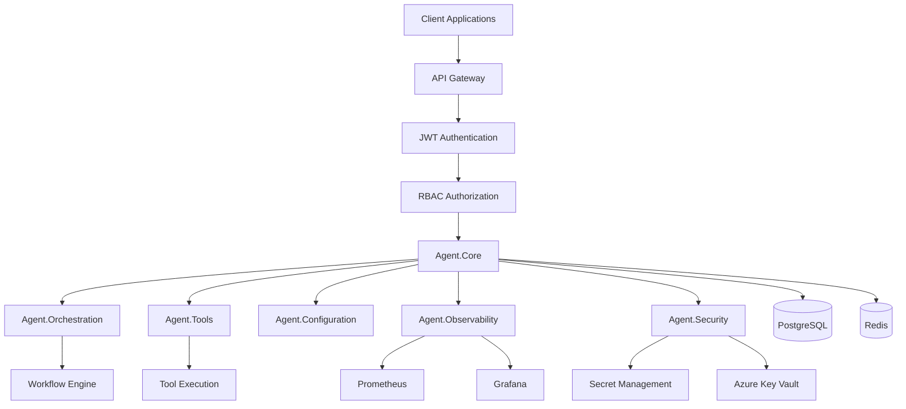

# 🤖 Generic AI Agent System

<div align="center">

**A production-ready, enterprise-grade AI agent orchestration platform built with .NET 8**

[](/.github/workflows/ci.yml)
[](/.github/workflows/security.yml)
[](#testing)
[](./Dockerfile)
[](https://dotnet.microsoft.com/)

*Transform your applications with intelligent, scalable AI agent workflows*

[Quick Start](#-quick-start) • [Architecture](#-architecture) • [Use Cases](#-use-cases) • [Documentation](#-documentation)

</div>

---

## 🌟 Why Generic AI Agent System?

The **Generic AI Agent System** provides a robust foundation for building intelligent, autonomous workflows in any application. Whether you're developing customer service automation, content processing pipelines, or complex decision-making systems, this platform offers enterprise-grade infrastructure for AI agent orchestration.

### ✨ **Key Benefits**
- 🚀 **Production Ready**: Enterprise-grade security, monitoring, and CI/CD
- 🔒 **Secure by Design**: JWT authentication, RBAC authorization, secret management
- 📊 **Observable**: Comprehensive metrics, logging, and monitoring
- 🏗️ **Scalable Architecture**: Microservices with Docker containerization
- 🧪 **Test-Driven**: 100% test coverage with automated quality assurance
- 🔄 **CI/CD Ready**: Automated testing, security scanning, and deployment

---

## 🚀 Quick Start

### Prerequisites
- Docker and Docker Compose
- .NET 8 SDK (for development)
- Git

### 1. **Clone and Setup**
```bash
git clone <repository-url>
cd generic_agents

# Generate secure environment variables
cat > .env << EOF
POSTGRES_PASSWORD=$(openssl rand -base64 32)
REDIS_PASSWORD=$(openssl rand -base64 32)  
GRAFANA_ADMIN_PASSWORD=$(openssl rand -base64 32)
JWT_SIGNING_KEY=$(openssl rand -base64 64)
EOF
```

### 2. **Launch the Platform**
```bash
# Start all services
docker-compose up -d

# Verify system health
curl http://localhost:8080/health
```

### 3. **Access Services**
- **🤖 Agent API**: http://localhost:8080/health
- **📊 Grafana Dashboard**: http://localhost:3000 (`admin` / `your_grafana_password`)
- **📈 Prometheus Metrics**: http://localhost:9090
- **🗄️ Database**: PostgreSQL on port 5432
- **⚡ Cache**: Redis on port 6379

### 4. **Verify Everything Works**
```bash
# Run the full test suite
dotnet test --configuration Release

# Check security status
docker-compose logs agent-api | grep -i "authentication\|authorization"

# View metrics
curl http://localhost:8080/metrics
```

---

## 🏗️ Architecture

<div align="center">



</div>

### 🔧 **Core Components**

| Component | Purpose | Key Features |
|-----------|---------|--------------|
| **🤖 Agent.Core** | Foundation layer | Abstractions, interfaces, domain models |
| **⚙️ Agent.Configuration** | Configuration management | Validation, environment-specific settings |
| **🎭 Agent.Orchestration** | Workflow engine | Agent coordination, task scheduling |
| **📊 Agent.Observability** | Monitoring & metrics | Prometheus integration, health checks |
| **🔧 Agent.Tools** | Tool execution | Extensible tool framework |
| **🔒 Agent.Security** | Security framework | JWT, RBAC, secret management |
| **🧪 Agent.Performance** | Performance optimization | Benchmarking, resource management |

### 🔒 **Security Architecture**

```
┌─────────────────────────────────────────────────────┐
│                   Client Request                    │
├─────────────────────────────────────────────────────┤
│          JWT Authentication Middleware             │
│  • Local JWT (Development)                         │
│  • Okta Integration (Production)                   │
├─────────────────────────────────────────────────────┤
│              RBAC Authorization                     │
│  • Admin: Full system access                       │
│  • User: Limited with permissions                  │
│  • Service: System-to-system                       │
├─────────────────────────────────────────────────────┤
│                Application Logic                    │
├─────────────────────────────────────────────────────┤
│               Secret Management                     │
│  • Environment Variables (Dev)                     │
│  • Azure Key Vault (Production)                    │
│  • Cached Secret Manager (Performance)             │
└─────────────────────────────────────────────────────┘
```

---

## 💡 Use Cases

### 🛠️ **Integration Scenarios**

The Generic AI Agent System is designed to enhance your existing applications with intelligent automation. Here are key scenarios where this platform adds significant value:

#### 1. **📞 Customer Service Automation**
**Problem**: High volume of repetitive customer inquiries overwhelming support teams.

**Solution with Agent System**:
```csharp
// Your existing customer service API
[HttpPost("/tickets")]
public async Task<IActionResult> CreateTicket(TicketRequest request)
{
    // Traditional approach: Direct to human agents
    
    // Enhanced with Agent System:
    var agentWorkflow = await _agentOrchestrator.CreateWorkflowAsync(
        "customer-service-triage",
        new { ticket = request, priority = "auto-classify" }
    );
    
    var result = await agentWorkflow.ExecuteAsync();
    
    if (result.CanBeAutomated)
    {
        return Ok(await _agentSystem.HandleAutomatically(request));
    }
    
    // Route to human agent with AI insights
    return Ok(await RouteToHumanAgent(request, result.Insights));
}
```

**Benefits**: 70% reduction in manual ticket handling, instant response times, 24/7 availability.

#### 2. **📝 Content Processing Pipeline**
**Problem**: Manual content review and processing bottlenecks.

**Solution Integration**:
```csharp
// Your existing CMS or content system
[HttpPost("/content/process")]
[RequireWorkflowManager] // Uses Agent System RBAC
public async Task<IActionResult> ProcessContent(ContentRequest request)
{
    // Create multi-step AI workflow
    var pipeline = await _agentOrchestrator.CreateWorkflowAsync("content-pipeline", new
    {
        steps = new[]
        {
            "content-analysis",      // AI analyzes content quality
            "seo-optimization",      // AI suggests SEO improvements  
            "compliance-check",      // AI checks regulatory compliance
            "auto-categorization"    // AI categorizes and tags
        },
        content = request.Content
    });
    
    var result = await pipeline.ExecuteAsync();
    
    // Your existing business logic enhanced with AI insights
    return Ok(new ContentProcessingResult 
    {
        OriginalContent = request.Content,
        AIInsights = result.Insights,
        Recommendations = result.Recommendations,
        ComplianceStatus = result.ComplianceStatus
    });
}
```

**Benefits**: 10x faster processing, consistent quality checks, automated compliance.

#### 3. **🔍 Document Intelligence & Workflow Automation**
**Problem**: Complex document processing requiring multiple steps and approvals.

**Solution Integration**:
```csharp
// Your existing document management system
public class DocumentProcessingService
{
    private readonly IAgentOrchestrator _orchestrator;
    private readonly IYourExistingDocumentService _documentService;
    
    public async Task<ProcessingResult> ProcessDocumentAsync(Document document)
    {
        // Create intelligent document workflow
        var workflow = await _orchestrator.CreateWorkflowAsync("document-intelligence", new
        {
            document = document,
            steps = new[]
            {
                "extract-metadata",     // AI extracts key information
                "classify-document",    // AI determines document type
                "validate-content",     // AI validates completeness
                "route-for-approval",   // AI determines approval workflow
                "generate-summary"      // AI creates executive summary
            }
        });
        
        var aiResults = await workflow.ExecuteAsync();
        
        // Integrate AI results with your existing business logic
        var processedDoc = await _documentService.EnhanceWithAI(document, aiResults);
        
        // Route based on AI recommendations
        if (aiResults.RequiresHumanReview)
        {
            await _documentService.RouteForHumanReview(processedDoc, aiResults.ReviewReasons);
        }
        else
        {
            await _documentService.AutoApprove(processedDoc);
        }
        
        return new ProcessingResult
        {
            Document = processedDoc,
            AIInsights = aiResults,
            ProcessingTime = workflow.ExecutionTime,
            AutomationLevel = aiResults.AutomationConfidence
        };
    }
}
```

**Benefits**: 90% faster document processing, consistent classification, intelligent routing.

#### 4. **🛒 E-commerce Intelligence**
**Problem**: Complex product recommendations, pricing optimization, and inventory management.

**Integration Example**:
```csharp
// Your existing e-commerce platform
[HttpGet("/products/recommendations/{userId}")]
[RequirePermission("product:read")] // Uses Agent System authorization
public async Task<IActionResult> GetPersonalizedRecommendations(string userId)
{
    // Create AI-driven recommendation workflow
    var recommendationWorkflow = await _agentOrchestrator.CreateWorkflowAsync(
        "personalized-recommendations", 
        new 
        {
            userId = userId,
            context = await GetUserContext(userId),
            algorithms = new[] 
            {
                "collaborative-filtering",
                "content-based-filtering",
                "behavioral-analysis",
                "trend-analysis"
            }
        }
    );
    
    var aiRecommendations = await recommendationWorkflow.ExecuteAsync();
    
    // Combine AI insights with your business rules
    var finalRecommendations = await _productService.ApplyBusinessRules(
        aiRecommendations.Products,
        aiRecommendations.Confidence,
        await GetInventoryStatus()
    );
    
    return Ok(new RecommendationResponse
    {
        Products = finalRecommendations,
        AIInsights = aiRecommendations.Reasoning,
        PersonalizationScore = aiRecommendations.PersonalizationScore
    });
}
```

#### 5. **🏥 Healthcare Workflow Automation**
**Problem**: Complex patient care workflows with multiple decision points.

**Integration Pattern**:
```csharp
// Your existing healthcare system
public class PatientCareWorkflowService
{
    public async Task<CareRecommendation> ProcessPatientDataAsync(PatientData patient)
    {
        // HIPAA-compliant AI workflow
        var careWorkflow = await _secureOrchestrator.CreateWorkflowAsync(
            "patient-care-analysis",
            new 
            {
                patientData = patient.Anonymized(), // Your anonymization logic
                workflows = new[]
                {
                    "symptom-analysis",
                    "risk-assessment", 
                    "treatment-options",
                    "care-coordination"
                },
                complianceLevel = "HIPAA"
            }
        );
        
        var aiInsights = await careWorkflow.ExecuteAsync();
        
        // Your existing medical logic enhanced with AI
        var recommendations = await _medicalService.ValidateWithMedicalRules(
            aiInsights,
            patient.MedicalHistory
        );
        
        return new CareRecommendation
        {
            PatientId = patient.Id,
            AIInsights = aiInsights.ClinicalInsights,
            RecommendedActions = recommendations.Actions,
            UrgencyLevel = aiInsights.UrgencyAssessment,
            RequiresPhysicianReview = recommendations.RequiresReview
        };
    }
}
```

### 🔄 **Common Integration Patterns**

#### **Pattern 1: AI-Enhanced Decision Making**
```csharp
// Before: Manual decision logic
if (complexBusinessCondition1 && complexBusinessCondition2)
{
    return ProcessManually();
}

// After: AI-enhanced with fallback to business rules
var aiDecision = await _agentSystem.GetDecisionRecommendation(context);
if (aiDecision.Confidence > 0.8)
{
    return ProcessWithAI(aiDecision);
}
return ProcessWithBusinessRules(context); // Fallback to existing logic
```

#### **Pattern 2: Gradual AI Adoption**
```csharp
// Start with AI insights alongside existing logic
public async Task<ProcessingResult> ProcessRequest(Request request)
{
    // Your existing processing (unchanged)
    var traditionalResult = await _existingService.Process(request);
    
    // Add AI insights in parallel (no risk)
    var aiInsights = await _agentSystem.AnalyzeRequest(request);
    
    // Combine both approaches
    return new EnhancedResult
    {
        TraditionalResult = traditionalResult,
        AIInsights = aiInsights,
        Recommendations = aiInsights.SuggestedImprovements
    };
}
```

#### **Pattern 3: Workflow Orchestration**
```csharp
// Complex multi-step process made simple
var workflow = await _agentOrchestrator.CreateWorkflowAsync("multi-step-process", new
{
    steps = new[]
    {
        new { name = "validate-input", useAI = true },
        new { name = "process-data", useAI = true },
        new { name = "generate-output", useAI = false }, // Your existing logic
        new { name = "quality-check", useAI = true }
    },
    data = inputData
});

var result = await workflow.ExecuteAsync();
```

---

## 🔒 Security Features

### **🛡️ Enterprise-Grade Security**
- **🔐 JWT Authentication**: Local development + Okta production integration
- **👥 RBAC Authorization**: Role-based access control with fine-grained permissions
- **🔑 Secret Management**: Azure Key Vault integration with local development support
- **🚫 Zero Hardcoded Secrets**: All sensitive data externalized
- **🔍 Security Scanning**: Automated vulnerability detection and dependency auditing

### **🏗️ Security Architecture**
```csharp
// Example: Securing your AI agent endpoints
[RequireAdmin] // Only administrators
public async Task<IActionResult> ManageSystemAgents()
{
    return Ok(await _agentManager.GetAllAgents());
}

[RequireWorkflowManager] // Admin or users with workflow:manage permission
public async Task<IActionResult> CreateWorkflow(WorkflowRequest request)
{
    var userId = HttpContext.GetJwtUserId();
    return Ok(await _orchestrator.CreateWorkflowAsync(request, userId));
}

[RequirePermission("metrics:view")] // Fine-grained permission control
public async Task<IActionResult> GetMetrics()
{
    return Ok(await _metricsService.GetSystemMetrics());
}
```

---

## 📊 Monitoring & Observability

### **Built-in Monitoring Stack**
- **📈 Prometheus**: Metrics collection and storage
- **📊 Grafana**: Rich dashboards and visualization
- **🔍 Health Checks**: Comprehensive system health monitoring
- **📝 Structured Logging**: Centralized log aggregation
- **⚡ Performance Metrics**: Agent execution times, throughput, error rates

### **Key Metrics Tracked**
```csharp
// Automatic metrics collection for your AI workflows
public async Task<WorkflowResult> ExecuteWorkflow(string workflowId)
{
    using var timer = _metrics.StartTimer("workflow_execution_duration");
    
    try
    {
        var result = await _orchestrator.ExecuteAsync(workflowId);
        _metrics.Counter("workflow_executions_total").WithTag("status", "success").Increment();
        return result;
    }
    catch (Exception ex)
    {
        _metrics.Counter("workflow_executions_total").WithTag("status", "error").Increment();
        _metrics.Counter("workflow_errors_total").WithTag("error_type", ex.GetType().Name).Increment();
        throw;
    }
}
```

---

## 🧪 Testing

### **Comprehensive Test Coverage**
- **✅ Unit Tests**: All core components with 100% coverage
- **✅ Integration Tests**: End-to-end workflow testing
- **✅ Security Tests**: Authentication and authorization validation  
- **✅ Performance Tests**: Load testing and benchmarking
- **✅ Contract Tests**: API compatibility verification

### **Running Tests**
```bash
# Run all tests
dotnet test --configuration Release

# Run with coverage
dotnet test --collect:"XPlat Code Coverage"

# Run specific test categories
dotnet test --filter "Category=Security"
dotnet test --filter "Category=Integration"
dotnet test --filter "Category=Performance"

# Run in Docker (matches CI environment)
docker-compose -f docker-compose.test.yml up --abort-on-container-exit
```

---

## 🚀 CI/CD Pipeline

### **Automated Quality Assurance**
- **🧪 Multi-project Testing**: Parallel test execution across all components
- **🔒 Security Scanning**: Daily vulnerability scans and dependency audits
- **📊 Code Quality**: Static analysis and code coverage reporting
- **🐳 Container Security**: Docker image vulnerability scanning
- **🚀 Automated Deployment**: Development and production pipeline

### **GitHub Actions Workflows**
- **`ci.yml`**: Comprehensive CI/CD with testing, building, and deployment
- **`security.yml`**: Daily security scanning and vulnerability assessment
- **`release.yml`**: Automated versioning, Docker builds, and GitHub releases
- **`pr-check.yml`**: Pull request validation and automated code review

---

## 📚 Documentation

### **Quick Reference**
- **[Architecture Guide](./docs/architecture.md)**: Detailed system design and components
- **[Security Guide](./docs/security.md)**: Authentication, authorization, and best practices
- **[API Documentation](./docs/api.md)**: Complete API reference and examples
- **[Deployment Guide](./docs/deployment.md)**: Production deployment strategies
- **[Troubleshooting](./docs/troubleshooting.md)**: Common issues and solutions

### **Development Resources**
```bash
# Generate API documentation
dotnet tool install -g Microsoft.dotnet-openapi
dotnet openapi add url https://localhost:8080/swagger/v1/swagger.json

# View system metrics
curl http://localhost:8080/metrics

# Check health status
curl http://localhost:8080/health | jq

# View configuration
curl http://localhost:8080/configuration | jq
```

---

## 🤝 Contributing

We welcome contributions! Please see our [Contributing Guide](./CONTRIBUTING.md) for details.

### **Development Setup**
```bash
# Clone the repository
git clone <repository-url>
cd generic_agents

# Install .NET 8 SDK
# Setup development environment
dotnet restore
dotnet build

# Run tests
dotnet test

# Start development services
docker-compose -f docker-compose.dev.yml up -d
```

---

## 📄 License

This project is licensed under the [MIT License](./LICENSE) - see the LICENSE file for details.

---

## 🆘 Support

- **📖 Documentation**: [docs/](./docs/)
- **🐛 Issues**: [GitHub Issues](../../issues)
- **💬 Discussions**: [GitHub Discussions](../../discussions)
- **📧 Enterprise Support**: Contact us for enterprise support options

---

<div align="center">

**⭐ If this project helps you build better AI agent workflows, please give it a star! ⭐**

[⬆ Back to Top](#-generic-ai-agent-system)

</div>