# System Architecture Overview

This diagram shows the high-level architecture of the Generic AI Agent System, illustrating the modular design and key relationships between components.

```mermaid
graph TB
    %% Core Foundation Layer
    subgraph "🏗️ Core Foundation"
        Core[Agent.Core<br/>IAgent, BaseAgent<br/>Models & Abstractions]
        Tools[Agent.Tools<br/>ITool, BaseTool<br/>Tool Execution Framework]
        Registry[Agent.Registry<br/>IToolRegistry<br/>Discovery & Registration]
    end
    
    %% AI & Intelligence Layer
    subgraph "🧠 AI & Intelligence"
        AI[Agent.AI<br/>IAIService<br/>Semantic Kernel Integration]
        Orchestration[Agent.Orchestration<br/>IWorkflowEngine<br/>Multi-Agent Coordination]
    end
    
    %% Infrastructure Layer
    subgraph "🔧 Infrastructure"
        Config[Agent.Configuration<br/>IConfigurationProvider<br/>Validation & Settings]
        Security[Agent.Security<br/>JWT, RBAC, Secrets<br/>Multi-Provider Auth]
        Observability[Agent.Observability<br/>Metrics, Health Checks<br/>Monitoring Stack]
        Communication[Agent.Communication<br/>ICommunicationChannel<br/>Protocol Abstraction]
    end
    
    %% Cross-Cutting Concerns
    subgraph "⚡ Cross-Cutting"
        DI[Agent.DI<br/>Service Registration<br/>Dependency Injection]
        Samples[Agent.Tools.Samples<br/>Reference Implementations<br/>Example Tools]
    end
    
    %% Relationships - Core Dependencies
    Core --> Tools
    Tools --> Registry
    AI --> Core
    AI --> Tools
    Orchestration --> Core
    Orchestration --> AI
    Orchestration --> Registry
    
    %% Infrastructure Dependencies
    Security --> Config
    Observability --> Config
    Communication --> Config
    
    %% Cross-Cutting Dependencies
    DI --> Core
    DI --> Tools
    DI --> AI
    DI --> Security
    DI --> Observability
    
    Samples --> Tools
    
    %% External Integrations
    External1[🌐 Semantic Kernel<br/>AI Models & Plugins]
    External2[🔐 Identity Providers<br/>Okta, Azure AD]
    External3[📊 Monitoring<br/>Prometheus, Grafana]
    External4[🗄️ Secret Stores<br/>Azure Key Vault]
    
    AI -.->|integrates| External1
    Security -.->|authenticates| External2
    Observability -.->|exports| External3
    Security -.->|retrieves| External4
    
    %% Styling
    classDef coreModule fill:#e1f5fe,stroke:#01579b,stroke-width:2px
    classDef aiModule fill:#f3e5f5,stroke:#4a148c,stroke-width:2px
    classDef infraModule fill:#e8f5e8,stroke:#1b5e20,stroke-width:2px
    classDef crossModule fill:#fff3e0,stroke:#e65100,stroke-width:2px
    classDef external fill:#ffebee,stroke:#c62828,stroke-width:2px,stroke-dasharray: 5 5
    
    class Core,Tools,Registry coreModule
    class AI,Orchestration aiModule
    class Config,Security,Observability,Communication infraModule
    class DI,Samples crossModule
    class External1,External2,External3,External4 external
```

## Key Architectural Principles

### 🏗️ **Modular Design**
- Each component is a separate assembly with clear boundaries
- Loose coupling through interface-driven design
- Single responsibility for each module

### 🔄 **Dependency Flow**
- Core foundation provides abstractions (IAgent, ITool)
- AI and orchestration build upon core capabilities
- Infrastructure provides cross-cutting concerns
- Dependency injection wires everything together

### 🌐 **External Integration Points**
- **AI Integration**: Semantic Kernel for AI model access
- **Authentication**: Enterprise identity providers (Okta, Azure AD)
- **Monitoring**: Industry-standard tools (Prometheus, Grafana)
- **Secret Management**: Cloud-native secret stores (Azure Key Vault)

### ⚡ **Cross-Cutting Concerns**
- **Dependency Injection**: Central service registration and resolution
- **Configuration**: Environment-aware settings with validation
- **Security**: Authentication, authorization, and secret management
- **Observability**: Metrics, health checks, and monitoring