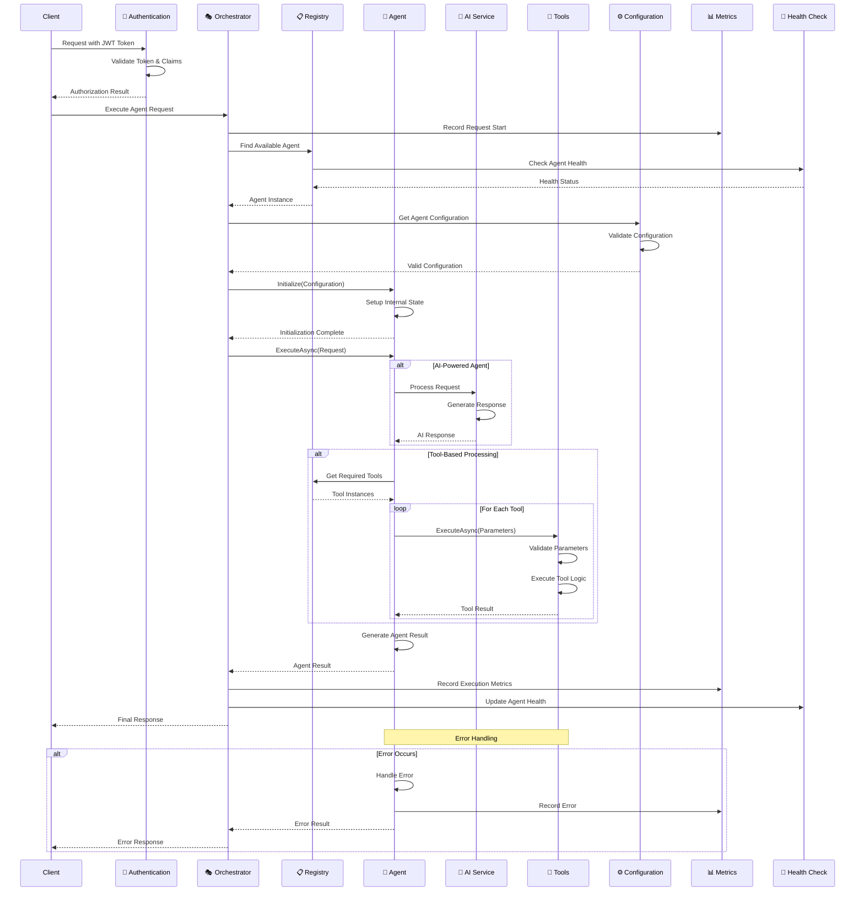

# Agent Execution Flow

This diagram illustrates the complete flow of an agent request from initiation through execution, showing all the key interactions and decision points.

## Flow Phases

### 🔐 **Phase 1: Authentication & Authorization**
- JWT token validation
- Claims extraction
- Permission verification
- Security context establishment

### 📋 **Phase 2: Agent Discovery & Health**
- Agent registry lookup
- Health status verification
- Load balancing (if multiple instances)
- Fallback agent selection

### ⚙️ **Phase 3: Configuration & Initialization**
- Configuration retrieval and validation
- Agent state initialization
- Resource allocation
- Dependency injection

### 🤖 **Phase 4: Agent Execution**
- Request processing logic
- AI integration (if applicable)
- Tool orchestration (if needed)
- Business logic execution

### 📊 **Phase 5: Monitoring & Response**
- Execution metrics collection
- Health status updates
- Response generation
- Error handling and reporting

## Key Design Patterns

### **Circuit Breaker**
- Health checks prevent requests to unhealthy agents
- Graceful degradation when components fail

### **Decorator Pattern**
- Metrics collection wraps core execution
- Authentication decorates request processing

### **Strategy Pattern**
- Different agent types handle requests differently
- AI vs. rule-based processing strategies

### **Observer Pattern**
- Metrics collection observes all operations
- Health monitoring tracks system state