# Module Dependency Graph

This diagram shows the detailed dependency relationships between all modules, highlighting the layered architecture and dependency direction.

```mermaid
graph TD
    %% Application Layer
    subgraph "🎯 Application Layer"
        Samples[Agent.Tools.Samples<br/>📦 Reference Implementations]
    end
    
    %% Service Layer
    subgraph "🔧 Service Layer"
        AI[Agent.AI<br/>🧠 Semantic Kernel Integration]
        Orchestration[Agent.Orchestration<br/>🎭 Workflow Engine]
        Security[Agent.Security<br/>🔐 Auth & Authorization]
        Observability[Agent.Observability<br/>📊 Metrics & Health]
        Communication[Agent.Communication<br/>📡 Protocol Abstraction]
    end
    
    %% Domain Layer
    subgraph "📋 Domain Layer"
        Registry[Agent.Registry<br/>📋 Tool Discovery]
        Configuration[Agent.Configuration<br/>⚙️ Settings & Validation]
    end
    
    %% Core Layer
    subgraph "🏗️ Core Layer"
        Tools[Agent.Tools<br/>🔧 Tool Framework]
        Core[Agent.Core<br/>🤖 Agent Abstractions]
    end
    
    %% Infrastructure Layer
    subgraph "⚡ Infrastructure Layer"
        DI[Agent.DI<br/>💉 Service Registration]
    end
    
    %% Dependencies - Application Layer
    Samples --> Tools
    
    %% Dependencies - Service Layer
    AI --> Core
    AI --> Tools
    AI --> Configuration
    
    Orchestration --> Core
    Orchestration --> AI
    Orchestration --> Registry
    Orchestration --> Configuration
    
    Security --> Configuration
    
    Observability --> Configuration
    
    Communication --> Configuration
    
    %% Dependencies - Domain Layer
    Registry --> Tools
    Registry --> Configuration
    
    %% Dependencies - Core Layer
    Tools --> Core
    
    %% Dependencies - Infrastructure Layer
    DI --> Core
    DI --> Tools
    DI --> Registry
    DI --> AI
    DI --> Security
    DI --> Observability
    DI --> Communication
    DI --> Configuration
    
    %% External Dependencies
    subgraph "🌐 External Dependencies"
        SK[Microsoft<br/>Semantic Kernel]
        DotNet[.NET 8<br/>Base Class Library]
        AspNet[ASP.NET Core<br/>Web Framework]
        JWT[JWT Libraries<br/>Authentication]
        Azure[Azure SDK<br/>Key Vault]
    end
    
    %% External Connections
    AI -.->|uses| SK
    Core -.->|uses| DotNet
    Security -.->|uses| AspNet
    Security -.->|uses| JWT
    Security -.->|uses| Azure
    DI -.->|uses| AspNet
    
    %% Styling
    classDef appLayer fill:#e3f2fd,stroke:#0277bd,stroke-width:3px
    classDef serviceLayer fill:#f3e5f5,stroke:#7b1fa2,stroke-width:2px
    classDef domainLayer fill:#e8f5e8,stroke:#388e3c,stroke-width:2px
    classDef coreLayer fill:#fff3e0,stroke:#f57c00,stroke-width:2px
    classDef infraLayer fill:#ffebee,stroke:#d32f2f,stroke-width:2px
    classDef external fill:#f5f5f5,stroke:#616161,stroke-width:1px,stroke-dasharray: 3 3
    
    class Samples appLayer
    class AI,Orchestration,Security,Observability,Communication serviceLayer
    class Registry,Configuration domainLayer
    class Tools,Core coreLayer
    class DI infraLayer
    class SK,DotNet,AspNet,JWT,Azure external
```

## Dependency Principles

### 📐 **Dependency Direction**
Dependencies flow **downward** through the layers:
- Application → Service → Domain → Core → Infrastructure
- No upward dependencies (Dependency Inversion Principle)
- Infrastructure layer provides cross-cutting concerns

### 🎯 **Layer Responsibilities**

#### **Application Layer (Agent.Tools.Samples)**
- Concrete tool implementations
- Reference examples and demonstrations
- Integration testing scenarios

#### **Service Layer**
- **Agent.AI**: AI model integration and processing
- **Agent.Orchestration**: Multi-agent workflow coordination  
- **Agent.Security**: Authentication, authorization, secrets
- **Agent.Observability**: Monitoring, metrics, health checks
- **Agent.Communication**: Protocol abstraction and messaging

#### **Domain Layer**
- **Agent.Registry**: Tool and agent discovery logic
- **Agent.Configuration**: Settings management and validation

#### **Core Layer**
- **Agent.Tools**: Tool execution framework and abstractions
- **Agent.Core**: Fundamental agent abstractions and models

#### **Infrastructure Layer**
- **Agent.DI**: Dependency injection and service registration

### 🔄 **Key Architectural Benefits**

#### **Modularity**
- Each module can be developed, tested, and deployed independently
- Clear separation of concerns reduces complexity
- Easy to understand and maintain

#### **Testability**
- Lower layers can be tested without upper layer dependencies
- Mocking interfaces enables isolated unit testing
- Integration testing focuses on specific layer interactions

#### **Extensibility**
- New services can be added to service layer without affecting core
- Tool implementations extend the application layer
- Infrastructure changes don't impact business logic

#### **Reusability**
- Core and domain layers can be reused in different contexts
- Service layer components are pluggable
- Clear interfaces enable alternative implementations