# Workflow Orchestration Engine

This diagram illustrates the sophisticated workflow orchestration capabilities, showing different execution modes and coordination patterns.

```mermaid
graph TB
    %% Workflow Definition
    subgraph "📋 Workflow Definition"
        WD[WorkflowDefinition<br/>• Name & Version<br/>• Execution Mode<br/>• Steps & Dependencies<br/>• Retry Policies]
    end
    
    %% Execution Modes
    subgraph "⚙️ Execution Modes"
        Sequential[🔄 Sequential<br/>Step by step execution<br/>Wait for completion]
        Parallel[⚡ Parallel<br/>Concurrent execution<br/>All steps together]
        Dependency[🌐 Dependency-Based<br/>DAG execution<br/>Based on prerequisites]
    end
    
    %% Orchestration Engine Core
    subgraph "🎭 Orchestration Engine"
        WE[WorkflowEngine<br/>• Execution Coordinator<br/>• State Management<br/>• Error Handling]
        
        SM[State Manager<br/>• Track Progress<br/>• Handle Failures<br/>• Retry Logic]
        
        AR[AgentRegistryEnhanced<br/>• Agent Discovery<br/>• Health Monitoring<br/>• Load Balancing]
    end
    
    %% Execution Flow
    WD --> WE
    WE --> Sequential
    WE --> Parallel
    WE --> Dependency
    WE <--> SM
    WE <--> AR
    
    %% Sequential Execution Detail
    subgraph "🔄 Sequential Flow"
        S1[Step 1<br/>Agent A] --> S2[Step 2<br/>Agent B]
        S2 --> S3[Step 3<br/>Agent C]
        S3 --> SR[Sequential Result]
    end
    
    %% Parallel Execution Detail  
    subgraph "⚡ Parallel Flow"
        P1[Step 1<br/>Agent A]
        P2[Step 2<br/>Agent B]
        P3[Step 3<br/>Agent C]
        
        P1 --> PR[Collect Results]
        P2 --> PR
        P3 --> PR
        PR --> PResult[Parallel Result]
    end
    
    %% Dependency Execution Detail
    subgraph "🌐 Dependency Flow"
        D1[Step 1<br/>Agent A<br/>No Dependencies]
        D2[Step 2<br/>Agent B<br/>Depends: Step 1]
        D3[Step 3<br/>Agent C<br/>Depends: Step 1]
        D4[Step 4<br/>Agent D<br/>Depends: Step 2,3]
        
        D1 --> D2
        D1 --> D3
        D2 --> D4
        D3 --> D4
        D4 --> DResult[Dependency Result]
    end
    
    Sequential --> S1
    Parallel --> P1
    Parallel --> P2
    Parallel --> P3
    Dependency --> D1
    
    %% Error Handling & Retry
    subgraph "🚨 Error Handling"
        RP[RetryPolicy<br/>• Max Attempts<br/>• Backoff Strategy<br/>• Retry Conditions]
        
        EH[Error Handler<br/>• Capture Failures<br/>• Apply Retry Logic<br/>• Circuit Breaker]
        
        FT[Failure Tracking<br/>• Error Metrics<br/>• Health Impact<br/>• Alerting]
    end
    
    SM <--> RP
    SM <--> EH
    EH --> FT
    
    %% Health & Monitoring Integration
    subgraph "💚 Health & Monitoring"
        HC[Health Checker<br/>• Agent Availability<br/>• Resource Status<br/>• Performance Metrics]
        
        MC[Metrics Collector<br/>• Execution Times<br/>• Success Rates<br/>• Resource Usage]
        
        AL[Alert Manager<br/>• SLA Violations<br/>• Error Thresholds<br/>• Escalation Rules]
    end
    
    AR <--> HC
    WE --> MC
    FT --> AL
    
    %% Styling
    classDef definition fill:#e1f5fe,stroke:#01579b,stroke-width:2px
    classDef execution fill:#f3e5f5,stroke:#4a148c,stroke-width:2px
    classDef core fill:#e8f5e8,stroke:#1b5e20,stroke-width:3px
    classDef flow fill:#fff3e0,stroke:#e65100,stroke-width:2px
    classDef error fill:#ffebee,stroke:#c62828,stroke-width:2px
    classDef monitoring fill:#f1f8e9,stroke:#33691e,stroke-width:2px
    
    class WD definition
    class Sequential,Parallel,Dependency execution
    class WE,SM,AR core
    class S1,S2,S3,P1,P2,P3,D1,D2,D3,D4 flow
    class RP,EH,FT error
    class HC,MC,AL monitoring
```

## Orchestration Patterns

### 🔄 **Sequential Execution**

### ⚡ **Parallel Execution**

### 🌐 **Dependency-Based Execution**

## Advanced Features

### 🔄 **Retry Mechanisms**
- **Exponential Backoff**: Increasing delays between retries
- **Circuit Breaker**: Stop retries when system is unhealthy
- **Selective Retry**: Only retry specific error types
- **Jitter**: Random variation to prevent thundering herd

### 📊 **State Management**
- **Progress Tracking**: Real-time workflow status
- **Checkpoint Recovery**: Resume from failure points
- **State Persistence**: Durable workflow state storage
- **Rollback Capability**: Undo partial workflow execution

### 🎯 **Load Balancing**
- **Agent Selection**: Choose healthy agents for execution
- **Resource Awareness**: Consider agent capacity and performance
- **Failover**: Automatic switching to backup agents
- **Geographic Distribution**: Route to nearest available agents