# Security & Authentication Flow

This diagram details the comprehensive security architecture including multi-provider authentication, RBAC authorization, and secret management.

```mermaid
sequenceDiagram
    participant Client
    participant Gateway as 🚪 API Gateway
    participant AuthMW as 🔐 Auth Middleware
    participant JWT as 🎫 JWT Provider
    participant IDP as 👤 Identity Provider
    participant AuthZ as 🛡️ Authorization
    participant Secret as 🔑 Secret Manager
    participant Agent as 🤖 Agent
    participant Audit as 📋 Audit Log
    
    %% Authentication Flow
    rect rgb(240, 248, 255)
        Note over Client,IDP: Authentication Phase
        Client->>Gateway: Request with Token
        Gateway->>AuthMW: Validate Request
        
        alt JWT Token Present
            AuthMW->>JWT: Validate Token
            
            alt Local JWT (Development)
                JWT->>JWT: Validate with Local Key
                JWT-->>AuthMW: Claims + Validation Result
            else External Provider (Production)
                JWT->>IDP: Validate with Okta/Azure AD
                IDP-->>JWT: User Info + Claims
                JWT-->>AuthMW: Claims + Validation Result
            end
            
        else No Token
            AuthMW-->>Client: 401 Unauthorized
        end
    end
    
    %% Authorization Flow
    rect rgb(248, 255, 248)
        Note over AuthMW,Audit: Authorization Phase
        AuthMW->>AuthZ: Check Permissions
        
        alt Role-Based Check
            AuthZ->>AuthZ: Verify Admin/User Role
        else Permission-Based Check
            AuthZ->>AuthZ: Check Specific Permission
            Note right of AuthZ: e.g., "workflow:execute"<br/>"agent:manage"
        else Resource-Based Check
            AuthZ->>AuthZ: Check Resource Access
            Note right of AuthZ: e.g., specific agent instance
        end
        
        AuthZ-->>AuthMW: Authorization Result
        AuthZ->>Audit: Log Authorization Decision
        
        alt Authorized
            AuthMW->>Agent: Forward Request
        else Unauthorized
            AuthMW-->>Client: 403 Forbidden
            AuthMW->>Audit: Log Unauthorized Attempt
        end
    end
    
    %% Secret Management Flow
    rect rgb(255, 248, 248)
        Note over Agent,Audit: Secret Access Phase
        Agent->>Secret: Request Secret
        
        alt Environment Variables (Development)
            Secret->>Secret: Read from Environment
        else Azure Key Vault (Production)
            Secret->>Secret: Retrieve from Key Vault
        else Cached Secret
            Secret->>Secret: Check Cache First
        end
        
        Secret-->>Agent: Secret Value
        Secret->>Audit: Log Secret Access
    end
```

## Security Architecture Components

### 🔐 **Multi-Provider Authentication**

```mermaid
graph TD
    subgraph "Authentication Providers"
        Local[🏠 LocalJwtTokenProvider<br/>• Development/Testing<br/>• Configurable Keys<br/>• Self-Signed Tokens]
        
        Okta[🌐 OktaJwtTokenProvider<br/>• Production SSO<br/>• Enterprise Integration<br/>• User Management]
        
        Azure[☁️ Azure AD Provider<br/>• Microsoft Ecosystem<br/>• Enterprise Features<br/>• Conditional Access]
    end
    
    subgraph "Token Validation"
        Interface[IJwtTokenProvider<br/>• Common Contract<br/>• Validation Logic<br/>• Claims Extraction]
        
        MW[JwtAuthenticationMiddleware<br/>• Request Interception<br/>• Token Processing<br/>• Security Context]
    end
    
    Local --> Interface
    Okta --> Interface
    Azure --> Interface
    Interface --> MW
    
    classDef provider fill:#e3f2fd,stroke:#1565c0,stroke-width:2px
    classDef validation fill:#f3e5f5,stroke:#7b1fa2,stroke-width:2px
    
    class Local,Okta,Azure provider
    class Interface,MW validation
```

### 🛡️ **Authorization Matrix**

| Role | Permissions | Description |
|------|------------|-------------|
| **Admin** | `*:*` | Full system access |
| **WorkflowManager** | `workflow:*`, `agent:read` | Workflow management |
| **AgentOperator** | `agent:execute`, `tool:use` | Agent operations |
| **Viewer** | `*:read` | Read-only access |

### 🔑 **Secret Management Tiers**

```mermaid
graph TB
    subgraph "Development"
        ENV[Environment Variables<br/>• .env files<br/>• Local development<br/>• Simple setup]
    end
    
    subgraph "Production"
        AKV[Azure Key Vault<br/>• Encrypted storage<br/>• Access policies<br/>• Audit logging]
    end
    
    subgraph "Performance Layer"
        Cache[CachedSecretManager<br/>• In-memory cache<br/>• TTL expiration<br/>• Background refresh]
    end
    
    Cache --> ENV
    Cache --> AKV
    
    subgraph "Application"
        App[Agent Application<br/>• ISecretManager<br/>• Configuration-driven<br/>• Environment agnostic]
    end
    
    App --> Cache
    
    classDef dev fill:#e8f5e8,stroke:#2e7d32,stroke-width:2px
    classDef prod fill:#e3f2fd,stroke:#1565c0,stroke-width:2px
    classDef perf fill:#fff3e0,stroke:#ef6c00,stroke-width:2px
    classDef app fill:#f3e5f5,stroke:#7b1fa2,stroke-width:2px
    
    class ENV dev
    class AKV prod
    class Cache perf
    class App app
```

## Security Patterns

### 🎯 **Defense in Depth**
1. **Network Security**: HTTPS/TLS encryption
2. **Authentication**: Token-based identity verification
3. **Authorization**: Role and permission-based access control
4. **Input Validation**: Request sanitization and validation
5. **Audit Logging**: Comprehensive security event tracking

### 🔄 **Zero Trust Architecture**
- **Never Trust, Always Verify**: Every request is authenticated
- **Least Privilege**: Minimal necessary permissions
- **Continuous Validation**: Regular token and permission checks
- **Micro-Segmentation**: Component-level access control

### 📊 **Security Monitoring**

```mermaid
graph LR
    subgraph "Security Events"
        Auth[Authentication Events]
        Authz[Authorization Decisions]
        Secret[Secret Access]
        Error[Security Errors]
    end
    
    subgraph "Monitoring"
        Audit[Audit Logging<br/>• Structured logs<br/>• Correlation IDs<br/>• Searchable format]
        
        Metrics[Security Metrics<br/>• Failed auth attempts<br/>• Permission denials<br/>• Secret access patterns]
        
        Alerts[Security Alerts<br/>• Suspicious activity<br/>• Threshold breaches<br/>• Real-time notifications]
    end
    
    Auth --> Audit
    Authz --> Audit
    Secret --> Audit
    Error --> Audit
    
    Audit --> Metrics
    Metrics --> Alerts
    
    classDef events fill:#ffebee,stroke:#c62828,stroke-width:2px
    classDef monitoring fill:#e8f5e8,stroke:#2e7d32,stroke-width:2px
    
    class Auth,Authz,Secret,Error events
    class Audit,Metrics,Alerts monitoring
```

