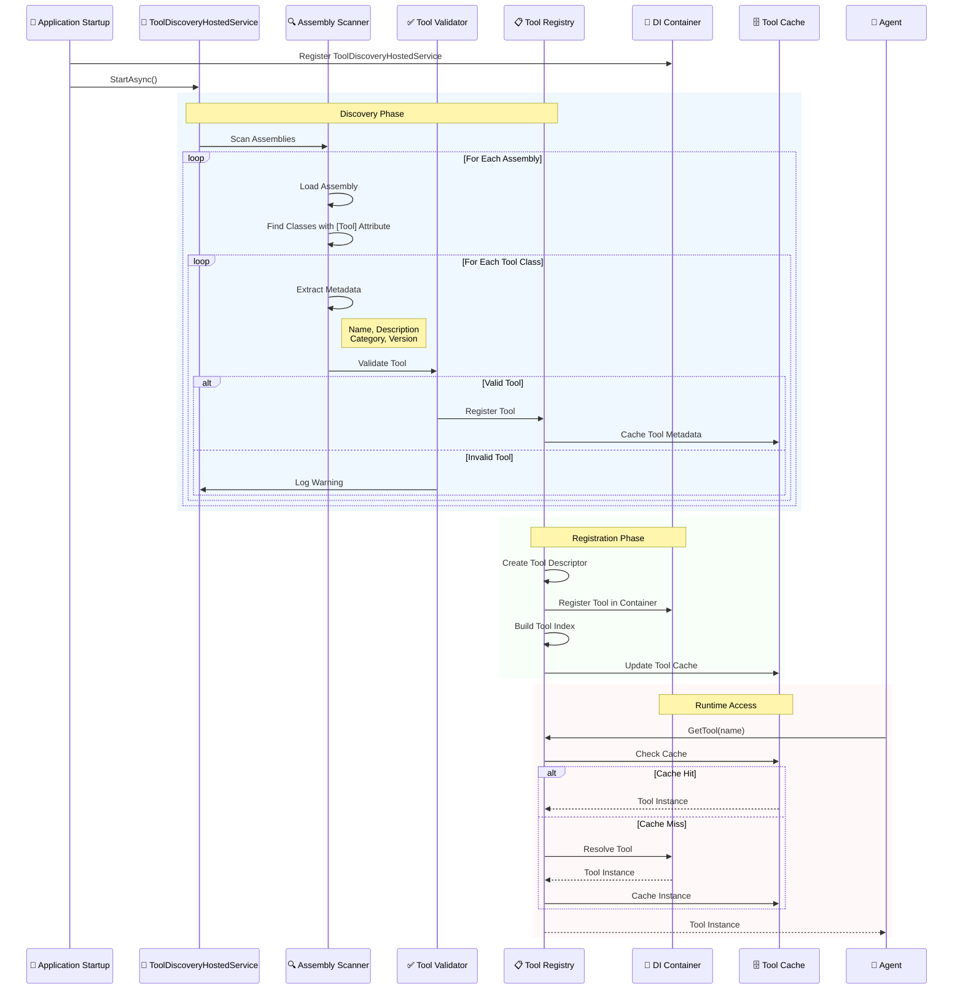
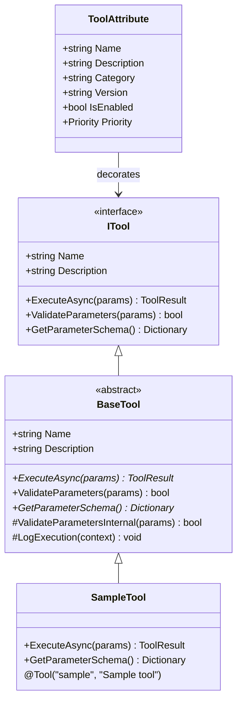
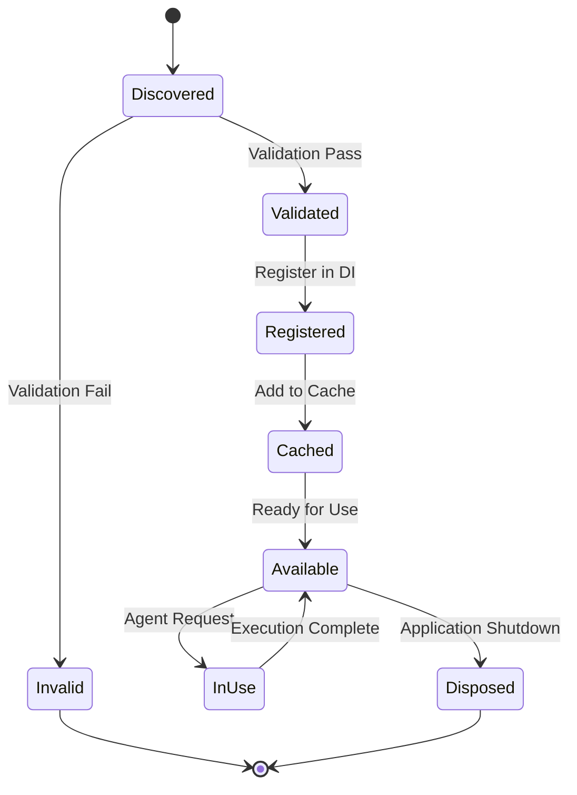

# Tool Discovery & Registration System

This diagram illustrates the sophisticated automatic tool discovery mechanism using attributes and reflection, showing how tools are found, validated, and registered.



## Tool Discovery Architecture

### 🏗️ **Tool Definition & Attributes**



### 🔍 **Discovery Process Flow**

```mermaid
flowchart TD
    Start([Application Startup]) --> LoadAssemblies[📁 Load All Assemblies]
    LoadAssemblies --> ScanTypes[🔍 Scan for [Tool] Attribute]
    ScanTypes --> ValidateInterface{🧪 Implements ITool?}
    
    ValidateInterface -->|Yes| ValidateConstructor{🏗️ Has Public Constructor?}
    ValidateInterface -->|No| LogError[❌ Log Error]
    
    ValidateConstructor -->|Yes| ExtractMetadata[📋 Extract Attribute Metadata]
    ValidateConstructor -->|No| LogError
    
    ExtractMetadata --> ValidateMetadata{✅ Valid Metadata?}
    ValidateMetadata -->|Yes| RegisterTool[📝 Register in Registry]
    ValidateMetadata -->|No| LogWarning[⚠️ Log Warning]
    
    RegisterTool --> CacheMetadata[🗄️ Cache Tool Info]
    CacheMetadata --> RegisterDI[💉 Register in DI Container]
    RegisterDI --> BuildIndex[📊 Build Search Index]
    
    LogError --> NextType{More Types?}
    LogWarning --> NextType
    BuildIndex --> NextType
    NextType -->|Yes| ScanTypes
    NextType -->|No| Complete([Discovery Complete])
    
    classDef success fill:#e8f5e8,stroke:#2e7d32,stroke-width:2px
    classDef error fill:#ffebee,stroke:#c62828,stroke-width:2px
    classDef process fill:#e3f2fd,stroke:#1565c0,stroke-width:2px
    
    class RegisterTool,CacheMetadata,RegisterDI,BuildIndex,Complete success
    class LogError,LogWarning error
    class LoadAssemblies,ScanTypes,ExtractMetadata,ValidateInterface,ValidateConstructor,ValidateMetadata process
```

### 📋 **Tool Registry Structure**

```mermaid
graph TB
    subgraph "🏪 Tool Registry"
        Registry[IToolRegistry<br/>• Tool Discovery<br/>• Metadata Storage<br/>• Instance Management]
        
        subgraph "📊 Storage Layers"
            MetadataStore[Tool Metadata<br/>• Name & Description<br/>• Parameter Schema<br/>• Category & Tags]
            
            InstanceCache[Instance Cache<br/>• Active Instances<br/>• Lifecycle Management<br/>• Performance Optimization]
            
            SearchIndex[Search Index<br/>• Name-based Lookup<br/>• Category Filtering<br/>• Full-text Search]
        end
        
        subgraph "🔍 Query Interface"
            GetTool[GetTool(name)]
            GetTools[GetToolsByCategory(category)]
            SearchTools[SearchTools(query)]
            GetSchema[GetParameterSchema(name)]
        end
    end
    
    Registry --> MetadataStore
    Registry --> InstanceCache
    Registry --> SearchIndex
    Registry --> GetTool
    Registry --> GetTools
    Registry --> SearchTools
    Registry --> GetSchema
    
    subgraph "🤖 Tool Implementations"
        FileSystem[📁 FileSystemTool<br/>@Tool("filesystem")]
        HttpClient[🌐 HttpClientTool<br/>@Tool("http")]
        TextManip[📝 TextManipulationTool<br/>@Tool("text")]
    end
    
    MetadataStore -.->|contains| FileSystem
    MetadataStore -.->|contains| HttpClient
    MetadataStore -.->|contains| TextManip
    
    classDef registry fill:#e3f2fd,stroke:#1565c0,stroke-width:3px
    classDef storage fill:#f3e5f5,stroke:#7b1fa2,stroke-width:2px
    classDef query fill:#e8f5e8,stroke:#2e7d32,stroke-width:2px
    classDef tools fill:#fff3e0,stroke:#ef6c00,stroke-width:2px
    
    class Registry registry
    class MetadataStore,InstanceCache,SearchIndex storage
    class GetTool,GetTools,SearchTools,GetSchema query
    class FileSystem,HttpClient,TextManip tools
```

## Discovery Patterns & Benefits

### 🎯 **Convention over Configuration**
```csharp
[Tool("file-reader", "Reads content from files", Category = "IO")]
public class FileReaderTool : BaseTool
{
    public override async Task<ToolResult> ExecuteAsync(
        Dictionary<string, object> parameters, 
        CancellationToken cancellationToken = default)
    {
        // Implementation automatically discovered and registered
    }
}
```

### 🚀 **Performance Optimizations**

#### **Assembly Scanning Caching**
- One-time assembly scan at startup
- Cached metadata prevents re-scanning
- Hot-path tool resolution bypasses reflection

#### **Lazy Loading**
- Tool instances created on-demand
- Singleton pattern for stateless tools
- Scoped instances for stateful tools

#### **Search Indexing**
- Pre-built search indices for fast lookups
- Category-based filtering
- Full-text search on descriptions

### 🔄 **Lifecycle Management**



### ✅ **Validation Rules**
- **Interface Compliance**: Must implement `ITool`
- **Constructor Access**: Public parameterless constructor required
- **Attribute Validity**: Required metadata fields present
- **Name Uniqueness**: No duplicate tool names
- **Parameter Schema**: Valid parameter definitions
- **Category Validation**: Recognized category values

### 📈 **Monitoring & Diagnostics**
- **Discovery Metrics**: Number of tools found, validation failures
- **Performance Tracking**: Resolution times, cache hit rates
- **Health Monitoring**: Tool availability, execution success rates
- **Usage Analytics**: Most/least used tools, performance patterns