# Configuration & Observability Architecture

This diagram shows the comprehensive configuration management and observability stack, illustrating how settings flow through the system and how monitoring data is collected and exposed.

```mermaid
graph TB
    %% Configuration Sources
    subgraph "📁 Configuration Sources"
        AppSettings[appsettings.json<br/>• Base Configuration<br/>• Default Values<br/>• Schema Definition]
        
        EnvSettings[Environment Specific<br/>• appsettings.Development.json<br/>• appsettings.Production.json<br/>• Override Values]
        
        EnvVars[Environment Variables<br/>• ASPNETCORE_ENVIRONMENT<br/>• Connection Strings<br/>• Feature Flags]
        
        Secrets[Secret Sources<br/>• Azure Key Vault<br/>• Local .env files<br/>• Kubernetes Secrets]
        
        CmdLine[Command Line<br/>• Runtime Overrides<br/>• Debug Settings<br/>• Feature Toggles]
    end
    
    %% Configuration Processing
    subgraph "⚙️ Configuration Processing"
        ConfigBuilder[Configuration Builder<br/>• Source Aggregation<br/>• Priority Resolution<br/>• Value Binding]
        
        Validator[Configuration Validator<br/>• Schema Validation<br/>• Business Rules<br/>• Dependency Checks]
        
        Provider[Configuration Provider<br/>• Typed Access<br/>• Change Monitoring<br/>• Hot Reload Support]
    end
    
    %% Application Configuration
    subgraph "🎯 Application Configuration"
        AgentConfig[Agent Configuration<br/>• Agent Settings<br/>• Timeout Values<br/>• Retry Policies]
        
        AIConfig[AI Configuration<br/>• Model Settings<br/>• API Keys<br/>• Rate Limits]
        
        SecurityConfig[Security Configuration<br/>• JWT Settings<br/>• Auth Providers<br/>• Permission Rules]
        
        ObservabilityConfig[Observability Config<br/>• Metrics Settings<br/>• Health Check Config<br/>• Logging Levels]
    end
    
    %% Configuration Flow
    AppSettings --> ConfigBuilder
    EnvSettings --> ConfigBuilder
    EnvVars --> ConfigBuilder
    Secrets --> ConfigBuilder
    CmdLine --> ConfigBuilder
    
    ConfigBuilder --> Validator
    Validator --> Provider
    
    Provider --> AgentConfig
    Provider --> AIConfig
    Provider --> SecurityConfig
    Provider --> ObservabilityConfig
    
    %% Observability Stack
    subgraph "📊 Observability Stack"
        subgraph "Metrics Collection"
            MetricsCollector[Metrics Collector<br/>• Custom Metrics<br/>• Performance Counters<br/>• Business KPIs]
            
            SystemMetrics[System Metrics<br/>• CPU & Memory<br/>• Network I/O<br/>• Disk Usage]
            
            AppMetrics[Application Metrics<br/>• Agent Execution Times<br/>• Tool Usage Stats<br/>• Error Rates]
        end
        
        subgraph "Health Monitoring"
            HealthService[Health Check Service<br/>• Component Health<br/>• Dependency Checks<br/>• System Resources]
            
            HealthChecks[Health Checks<br/>• Database Connectivity<br/>• External Services<br/>• Agent Availability]
        end
        
        subgraph "Logging System"
            StructuredLogs[Structured Logging<br/>• JSON Format<br/>• Correlation IDs<br/>• Context Enrichment]
            
            LogLevels[Log Levels<br/>• Trace/Debug<br/>• Info/Warning<br/>• Error/Critical]
        end
    end
    
    %% Metrics Flow
    AgentConfig --> MetricsCollector
    MetricsCollector --> SystemMetrics
    MetricsCollector --> AppMetrics
    
    %% Health Flow
    ObservabilityConfig --> HealthService
    HealthService --> HealthChecks
    
    %% Logging Flow
    ObservabilityConfig --> StructuredLogs
    StructuredLogs --> LogLevels
    
    %% External Integration
    subgraph "🌐 External Monitoring"
        Prometheus[Prometheus<br/>• Metrics Storage<br/>• Time Series DB<br/>• Alert Rules]
        
        Grafana[Grafana<br/>• Visualization<br/>• Dashboards<br/>• Alerting]
        
        ELK[ELK Stack<br/>• Log Aggregation<br/>• Search & Analysis<br/>• Kibana Dashboards]
    end
    
    SystemMetrics --> Prometheus
    AppMetrics --> Prometheus
    Prometheus --> Grafana
    
    StructuredLogs --> ELK
    LogLevels --> ELK
    
    classDef config fill:#e3f2fd,stroke:#1565c0,stroke-width:2px
    classDef processing fill:#f3e5f5,stroke:#7b1fa2,stroke-width:2px
    classDef application fill:#e8f5e8,stroke:#2e7d32,stroke-width:2px
    classDef observability fill:#fff3e0,stroke:#ef6c00,stroke-width:2px
    classDef external fill:#ffebee,stroke:#c62828,stroke-width:2px
    
    class AppSettings,EnvSettings,EnvVars,Secrets,CmdLine config
    class ConfigBuilder,Validator,Provider processing
    class AgentConfig,AIConfig,SecurityConfig,ObservabilityConfig application
    class MetricsCollector,SystemMetrics,AppMetrics,HealthService,HealthChecks,StructuredLogs,LogLevels observability
    class Prometheus,Grafana,ELK external
```

## Configuration Validation Flow

```mermaid
sequenceDiagram
    participant App as 🚀 Application
    participant Builder as 🏗️ Config Builder
    participant Validator as ✅ Validator
    participant Provider as 📋 Provider
    participant Services as ⚙️ Services
    
    App->>Builder: Build Configuration
    Builder->>Builder: Aggregate Sources
    Builder->>Builder: Apply Priority Rules
    Builder-->>Validator: Configuration Object
    
    Validator->>Validator: Schema Validation
    Validator->>Validator: Business Rule Validation
    Validator->>Validator: Dependency Validation
    
    alt Valid Configuration
        Validator-->>Provider: Validated Configuration
        Provider->>Provider: Create Typed Models
        Provider-->>Services: Inject Configuration
    else Invalid Configuration
        Validator-->>App: Validation Errors
        App->>App: Log Errors & Exit
    end
    
    Services->>Services: Use Configuration
    Services->>Provider: Request Config Updates
    Provider->>Provider: Monitor for Changes
    
    alt Configuration Changed
        Provider->>Validator: Re-validate
        Validator-->>Provider: Updated Configuration
        Provider->>Services: Notify Changes
    end
```

## Observability Data Flow

```mermaid
flowchart LR
    subgraph "🎯 Application Components"
        Agents[🤖 Agents]
        Tools[🔧 Tools]
        Workflows[🎭 Workflows]
        Security[🔐 Security]
    end
    
    subgraph "📊 Data Collection"
        Metrics[📈 Metrics Collector]
        Health[💚 Health Checker]
        Logs[📝 Logger]
        Traces[🔍 Tracer]
    end
    
    subgraph "🗄️ Storage & Processing"
        Prometheus[(Prometheus<br/>Metrics DB)]
        LogStore[(Log Storage<br/>ELK/Seq)]
        HealthDB[(Health History<br/>Time Series)]
    end
    
    subgraph "📈 Visualization & Alerting"
        Grafana[📊 Grafana<br/>Dashboards]
        Kibana[🔍 Kibana<br/>Log Analysis]
        Alerts[🚨 Alert Manager]
    end
    
    %% Data Flow
    Agents --> Metrics
    Tools --> Metrics
    Workflows --> Metrics
    Security --> Metrics
    
    Agents --> Health
    Tools --> Health
    Workflows --> Health
    Security --> Health
    
    Agents --> Logs
    Tools --> Logs
    Workflows --> Logs
    Security --> Logs
    
    Agents --> Traces
    Tools --> Traces
    Workflows --> Traces
    
    %% Storage
    Metrics --> Prometheus
    Health --> HealthDB
    Logs --> LogStore
    Traces --> LogStore
    
    %% Visualization
    Prometheus --> Grafana
    LogStore --> Kibana
    HealthDB --> Grafana
    
    %% Alerting
    Prometheus --> Alerts
    Grafana --> Alerts
    
    classDef app fill:#e3f2fd,stroke:#1565c0,stroke-width:2px
    classDef collection fill:#e8f5e8,stroke:#2e7d32,stroke-width:2px
    classDef storage fill:#fff3e0,stroke:#ef6c00,stroke-width:2px
    classDef viz fill:#f3e5f5,stroke:#7b1fa2,stroke-width:2px
    
    class Agents,Tools,Workflows,Security app
    class Metrics,Health,Logs,Traces collection
    class Prometheus,LogStore,HealthDB storage
    class Grafana,Kibana,Alerts viz
```

## Key Monitoring Dashboards

### 🎯 **System Health Dashboard**
- **Component Health**: All modules status
- **Resource Usage**: CPU, Memory, Disk
- **Network Metrics**: Latency, throughput
- **Error Rates**: By component and time

### 🤖 **Agent Performance Dashboard**
- **Execution Times**: P50, P90, P99 percentiles
- **Success Rates**: By agent type
- **Queue Depths**: Pending requests
- **Resource Utilization**: Per agent instance

### 🔧 **Tool Usage Dashboard**
- **Tool Popularity**: Most/least used tools
- **Performance Metrics**: Execution times by tool
- **Error Analysis**: Tool-specific failures
- **Parameter Validation**: Schema compliance

### 🔐 **Security Dashboard**
- **Authentication Events**: Success/failure rates
- **Authorization Decisions**: Permission grants/denials
- **Secret Access**: Key vault access patterns
- **Security Alerts**: Suspicious activities

## Configuration Best Practices

### 🏗️ **Configuration Hierarchy**
1. **Default Values**: In appsettings.json
2. **Environment Overrides**: Environment-specific files
3. **Environment Variables**: Runtime configuration
4. **Secrets**: Secure credential storage
5. **Command Line**: Final overrides

### ✅ **Validation Strategy**
- **Schema Validation**: Type safety and structure
- **Business Rules**: Domain-specific constraints
- **Dependency Validation**: Component compatibility
- **Runtime Validation**: Periodic health checks