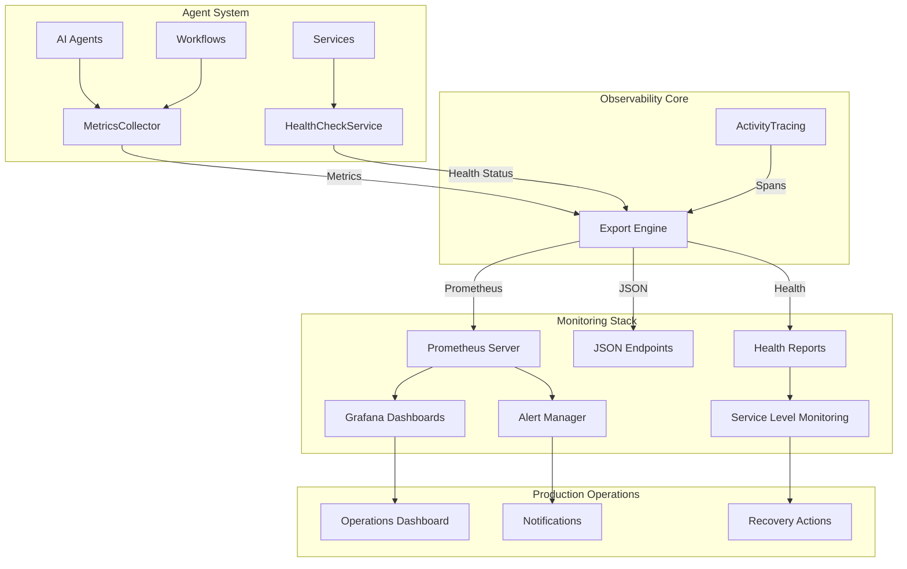

# Agent.Observability - Production Monitoring Guide

The Agent.Observability package provides comprehensive monitoring, metrics collection, and health check capabilities for AI agent systems. This guide demonstrates production-ready observability patterns for monitoring agent performance, system health, and operational metrics.

## Table of Contents

1. [Package Overview](#package-overview)
2. [Visual Architecture](#visual-architecture)
3. [Quick Start](#quick-start)
4. [Metrics Collection Mastery](#metrics-collection-mastery)
5. [Health Check Implementation](#health-check-implementation)
6. [Production Monitoring Patterns](#production-monitoring-patterns)
7. [Distributed Tracing](#distributed-tracing)
8. [Alert Configuration](#alert-configuration)
9. [Dashboard Creation](#dashboard-creation)
10. [Troubleshooting](#troubleshooting)

## Package Overview

Agent.Observability delivers enterprise-grade monitoring capabilities:

- **Comprehensive Metrics**: Counter, gauge, histogram metrics with Prometheus export
- **Health Monitoring**: System and component health checks with automatic recovery
- **Distributed Tracing**: Activity tracking across agent operations
- **Performance Analytics**: Agent and workflow execution metrics
- **Alert Integration**: Event-driven monitoring with customizable thresholds
- **Export Flexibility**: Multiple output formats (Prometheus, JSON, OpenTelemetry)

```
Agent.Observability Architecture:
┌─────────────────────────────────────────────────────────────┐
│                   Observability Layer                       │
├─────────────────────┬─────────────────────┬─────────────────┤
│   MetricsCollector  │  HealthCheckService │ ActivityTracing │
│   ┌─────────────┐   │   ┌─────────────┐   │ ┌─────────────┐ │
│   │ Counters    │   │   │ System      │   │ │ Distributed │ │
│   │ Gauges      │   │   │ Component   │   │ │ Operations  │ │
│   │ Histograms  │   │   │ Custom      │   │ │ Spans       │ │
│   └─────────────┘   │   └─────────────┘   │ └─────────────┘ │
├─────────────────────┴─────────────────────┴─────────────────┤
│                    Export Formats                           │
│  Prometheus │ JSON │ OpenTelemetry │ Health Reports         │
└─────────────────────────────────────────────────────────────┘
```

## Visual Architecture



## Quick Start

### 1. Basic Setup

```csharp
using Agent.Observability;
using Agent.Observability.Models;
using Microsoft.Extensions.DependencyInjection;
using Microsoft.Extensions.Hosting;

// Configure observability services
var builder = Host.CreateApplicationBuilder(args);

builder.Services.AddSingleton<IMetricsCollector, MetricsCollector>();
builder.Services.AddSingleton<IHealthCheckService, HealthCheckService>();

// Add built-in health checks
builder.Services.AddHealthChecks()
    .AddCheck<DatabaseHealthCheck>("database")
    .AddCheck<ExternalApiHealthCheck>("external-api");

var app = builder.Build();
```

### 2. Simple Metrics Collection

```csharp
public class CustomerServiceAgent : BaseAgent
{
    private readonly IMetricsCollector _metrics;
    
    public CustomerServiceAgent(IMetricsCollector metrics)
    {
        _metrics = metrics;
    }
    
    public override async Task<AgentResult> ExecuteAsync(AgentRequest request, CancellationToken cancellationToken = default)
    {
        using var activity = _metrics.StartActivity("customer-service-execution");
        var stopwatch = Stopwatch.StartNew();
        
        try
        {
            // Increment request counter
            _metrics.IncrementCounter("customer_service.requests.total", 1, new Dictionary<string, object>
            {
                ["agent_id"] = Id,
                ["operation"] = request.Action
            });
            
            var result = await ProcessCustomerRequest(request, cancellationToken);
            
            // Record success metrics
            _metrics.IncrementCounter("customer_service.requests.success", 1);
            _metrics.RecordValue("customer_service.response_time", stopwatch.ElapsedMilliseconds);
            
            return result;
        }
        catch (Exception ex)
        {
            // Record failure metrics
            _metrics.IncrementCounter("customer_service.requests.failure", 1, new Dictionary<string, object>
            {
                ["error_type"] = ex.GetType().Name
            });
            
            activity.SetError("Request processing failed", ex);
            throw;
        }
        finally
        {
            stopwatch.Stop();
        }
    }
}
```

### 3. Health Check Integration

```csharp
public class ProductionHealthController : ControllerBase
{
    private readonly IHealthCheckService _healthCheck;
    
    public ProductionHealthController(IHealthCheckService healthCheck)
    {
        _healthCheck = healthCheck;
    }
    
    [HttpGet("/health")]
    public async Task<IActionResult> GetHealth()
    {
        var health = await _healthCheck.CheckSystemHealthAsync(TimeSpan.FromSeconds(10));
        
        var response = new
        {
            status = health.IsHealthy ? "healthy" : "unhealthy",
            timestamp = health.Timestamp,
            checks = health.ComponentHealth.ToDictionary(
                kvp => kvp.Key,
                kvp => new
                {
                    status = kvp.Value.IsHealthy ? "healthy" : "unhealthy",
                    duration = kvp.Value.ResponseTime.TotalMilliseconds,
                    description = kvp.Value.Message
                }
            )
        };
        
        return health.IsHealthy ? Ok(response) : StatusCode(503, response);
    }
    
    [HttpGet("/health/report")]
    public async Task<IActionResult> GetHealthReport()
    {
        var report = await _healthCheck.GetHealthReportAsync();
        return Ok(report);
    }
}
```

## Metrics Collection Mastery

### Advanced Agent Performance Tracking

```csharp
public class SmartAnalyticsAgent : BaseAgent
{
    private readonly IMetricsCollector _metrics;
    
    public SmartAnalyticsAgent(IMetricsCollector metrics)
    {
        _metrics = metrics;
    }
    
    public override async Task<AgentResult> ExecuteAsync(AgentRequest request, CancellationToken cancellationToken = default)
    {
        var startTime = DateTime.UtcNow;
        var memoryBefore = GC.GetTotalMemory(false);
        
        using var activity = _metrics.StartActivity("analytics-processing", new Dictionary<string, object>
        {
            ["agent_type"] = "SmartAnalytics",
            ["request_size"] = request.Payload?.ToString()?.Length ?? 0,
            ["priority"] = request.Priority
        });
        
        try
        {
            var result = await ProcessAnalyticsRequest(request, cancellationToken);
            
            // Comprehensive performance metrics
            var executionTime = DateTime.UtcNow - startTime;
            var memoryAfter = GC.GetTotalMemory(false);
            var memoryUsed = memoryAfter - memoryBefore;
            
            var performanceMetrics = new AgentPerformanceMetrics
            {
                AgentId = Id,
                ExecutionTime = executionTime,
                Success = result.IsSuccess,
                MemoryUsage = memoryUsed,
                CpuUsage = GetCurrentCpuUsage(),
                CustomMetrics = new Dictionary<string, object>
                {
                    ["data_points_processed"] = result.ProcessedRecords,
                    ["cache_hit_rate"] = result.CacheEfficiency,
                    ["ai_model_calls"] = result.ModelInvocations
                }
            };
            
            _metrics.RecordAgentMetrics(performanceMetrics);
            
            // Business-specific metrics
            _metrics.IncrementCounter("analytics.data_points.processed", result.ProcessedRecords);
            _metrics.RecordValue("analytics.processing.efficiency", result.EfficiencyScore);
            _metrics.SetGaugeValue("analytics.active_sessions", GetActiveSessionCount());
            
            return result;
        }
        catch (Exception ex)
        {
            activity.SetError($"Analytics processing failed: {ex.Message}", ex);
            
            _metrics.IncrementCounter("analytics.errors.total", 1, new Dictionary<string, object>
            {
                ["error_category"] = CategorizeError(ex),
                ["agent_id"] = Id
            });
            
            throw;
        }
    }
    
    private double GetCurrentCpuUsage()
    {
        // Implementation would use performance counters
        // This is a simplified example
        return Process.GetCurrentProcess().TotalProcessorTime.TotalMilliseconds / Environment.TickCount;
    }
    
    private string CategorizeError(Exception ex)
    {
        return ex switch
        {
            TimeoutException => "timeout",
            UnauthorizedAccessException => "authorization",
            HttpRequestException => "network",
            JsonException => "data_format",
            _ => "unknown"
        };
    }
}
```

### Workflow Monitoring

```csharp
public class MonitoredWorkflowOrchestrator
{
    private readonly IWorkflowOrchestrator _orchestrator;
    private readonly IMetricsCollector _metrics;
    
    public MonitoredWorkflowOrchestrator(
        IWorkflowOrchestrator orchestrator, 
        IMetricsCollector metrics)
    {
        _orchestrator = orchestrator;
        _metrics = metrics;
    }
    
    public async Task<WorkflowResult> ExecuteWorkflowAsync(WorkflowDefinition workflow, CancellationToken cancellationToken = default)
    {
        var workflowId = Guid.NewGuid();
        var startTime = DateTime.UtcNow;
        
        using var activity = _metrics.StartActivity("workflow-execution", new Dictionary<string, object>
        {
            ["workflow_id"] = workflowId.ToString(),
            ["workflow_type"] = workflow.Type,
            ["step_count"] = workflow.Steps.Count,
            ["parallel_execution"] = workflow.AllowParallelExecution
        });
        
        var workflowMetrics = new WorkflowMetrics
        {
            WorkflowId = workflowId,
            TotalSteps = workflow.Steps.Count,
            StartTime = startTime
        };
        
        try
        {
            // Execute workflow with step-by-step monitoring
            var result = await ExecuteWithMonitoring(workflow, workflowMetrics, cancellationToken);
            
            // Final metrics recording
            workflowMetrics.EndTime = DateTime.UtcNow;
            workflowMetrics.ExecutionTime = workflowMetrics.EndTime.Value - workflowMetrics.StartTime;
            workflowMetrics.Success = result.IsSuccess;
            
            _metrics.RecordWorkflowMetrics(workflowMetrics);
            
            // Workflow-level business metrics
            _metrics.IncrementCounter("workflows.completed.total", 1, new Dictionary<string, object>
            {
                ["workflow_type"] = workflow.Type,
                ["success"] = result.IsSuccess.ToString().ToLower()
            });
            
            if (result.IsSuccess)
            {
                _metrics.RecordValue("workflows.success.duration", workflowMetrics.ExecutionTime.TotalSeconds);
            }
            
            return result;
        }
        catch (Exception ex)
        {
            workflowMetrics.Success = false;
            workflowMetrics.EndTime = DateTime.UtcNow;
            workflowMetrics.ExecutionTime = workflowMetrics.EndTime.Value - workflowMetrics.StartTime;
            
            _metrics.RecordWorkflowMetrics(workflowMetrics);
            
            activity.SetError("Workflow execution failed", ex);
            
            _metrics.IncrementCounter("workflows.failed.total", 1, new Dictionary<string, object>
            {
                ["workflow_type"] = workflow.Type,
                ["failure_reason"] = ex.GetType().Name
            });
            
            throw;
        }
    }
    
    private async Task<WorkflowResult> ExecuteWithMonitoring(
        WorkflowDefinition workflow, 
        WorkflowMetrics metrics, 
        CancellationToken cancellationToken)
    {
        var stepResults = new List<AgentResult>();
        
        foreach (var (step, index) in workflow.Steps.Select((s, i) => (s, i)))
        {
            using var stepActivity = _metrics.StartActivity($"workflow-step-{index}", new Dictionary<string, object>
            {
                ["step_name"] = step.Name,
                ["agent_type"] = step.AgentType,
                ["step_index"] = index
            });
            
            var stepStartTime = DateTime.UtcNow;
            
            try
            {
                var stepResult = await _orchestrator.ExecuteStepAsync(step, cancellationToken);
                var stepDuration = DateTime.UtcNow - stepStartTime;
                
                if (stepResult.IsSuccess)
                {
                    metrics.CompletedSteps++;
                    _metrics.RecordValue("workflow.step.duration", stepDuration.TotalMilliseconds, new Dictionary<string, object>
                    {
                        ["step_name"] = step.Name,
                        ["agent_type"] = step.AgentType
                    });
                }
                else
                {
                    metrics.FailedSteps++;
                    stepActivity.SetError($"Step failed: {stepResult.ErrorMessage}");
                }
                
                stepResults.Add(stepResult);
                
                // Real-time step metrics
                _metrics.SetGaugeValue("workflow.current_step", index + 1);
                _metrics.SetGaugeValue("workflow.progress_percentage", 
                    (double)(index + 1) / workflow.Steps.Count * 100);
                
            }
            catch (Exception ex)
            {
                metrics.FailedSteps++;
                stepActivity.SetError($"Step execution error: {ex.Message}", ex);
                
                _metrics.IncrementCounter("workflow.step.errors", 1, new Dictionary<string, object>
                {
                    ["step_name"] = step.Name,
                    ["error_type"] = ex.GetType().Name
                });
                
                // Decide whether to continue or abort workflow
                if (!step.ContinueOnError)
                {
                    throw;
                }
            }
        }
        
        return WorkflowResult.FromStepResults(stepResults);
    }
}
```

## Health Check Implementation

### Custom Health Checks

```csharp
public class DatabaseHealthCheck : BaseHealthCheck
{
    private readonly IDbConnection _connection;
    
    public DatabaseHealthCheck(IDbConnection connection)
    {
        _connection = connection;
    }
    
    public override string Name => "Database Connectivity";
    public override string Description => "Checks database connection and basic query performance";
    public override TimeSpan Timeout => TimeSpan.FromSeconds(15);
    
    public override async Task<HealthCheckResult> CheckHealthAsync(CancellationToken cancellationToken = default)
    {
        try
        {
            var stopwatch = Stopwatch.StartNew();
            
            // Test basic connectivity
            if (_connection.State != ConnectionState.Open)
            {
                await _connection.OpenAsync(cancellationToken);
            }
            
            // Test query performance
            var queryStopwatch = Stopwatch.StartNew();
            using var command = _connection.CreateCommand();
            command.CommandText = "SELECT 1";
            await command.ExecuteScalarAsync(cancellationToken);
            queryStopwatch.Stop();
            
            stopwatch.Stop();
            
            // Health criteria
            var isHealthy = queryStopwatch.ElapsedMilliseconds < 1000; // 1 second threshold
            
            return new HealthCheckResult
            {
                IsHealthy = isHealthy,
                Message = isHealthy ? "Database is responsive" : "Database is slow to respond",
                Data = new Dictionary<string, object>
                {
                    ["connection_state"] = _connection.State.ToString(),
                    ["query_time_ms"] = queryStopwatch.ElapsedMilliseconds,
                    ["total_check_time_ms"] = stopwatch.ElapsedMilliseconds,
                    ["database_name"] = _connection.Database
                }
            };
        }
        catch (Exception ex)
        {
            return Unhealthy($"Database connection failed: {ex.Message}", ex, new Dictionary<string, object>
            {
                ["connection_state"] = _connection.State.ToString(),
                ["error_type"] = ex.GetType().Name
            });
        }
    }
}

public class ExternalApiHealthCheck : BaseHealthCheck
{
    private readonly HttpClient _httpClient;
    private readonly string _apiEndpoint;
    
    public ExternalApiHealthCheck(HttpClient httpClient, IConfiguration configuration)
    {
        _httpClient = httpClient;
        _apiEndpoint = configuration["HealthChecks:ExternalApi:Endpoint"];
    }
    
    public override string Name => "External API Services";
    public override string Description => "Validates connectivity to critical external APIs";
    public override TimeSpan Timeout => TimeSpan.FromSeconds(10);
    
    public override async Task<HealthCheckResult> CheckHealthAsync(CancellationToken cancellationToken = default)
    {
        var healthData = new Dictionary<string, object>();
        var allServicesHealthy = true;
        var messages = new List<string>();
        
        // Check multiple API endpoints
        var endpoints = new[]
        {
            ($"{_apiEndpoint}/health", "Core API"),
            ($"{_apiEndpoint}/auth/status", "Authentication Service"),
            ($"{_apiEndpoint}/ai/models/status", "AI Model Service")
        };
        
        foreach (var (url, serviceName) in endpoints)
        {
            try
            {
                var stopwatch = Stopwatch.StartNew();
                var response = await _httpClient.GetAsync(url, cancellationToken);
                stopwatch.Stop();
                
                var isHealthy = response.IsSuccessStatusCode && stopwatch.ElapsedMilliseconds < 5000;
                healthData[$"{serviceName.ToLower().Replace(" ", "_")}_status"] = response.StatusCode.ToString();
                healthData[$"{serviceName.ToLower().Replace(" ", "_")}_response_time"] = stopwatch.ElapsedMilliseconds;
                
                if (isHealthy)
                {
                    messages.Add($"{serviceName}: OK ({stopwatch.ElapsedMilliseconds}ms)");
                }
                else
                {
                    allServicesHealthy = false;
                    messages.Add($"{serviceName}: {response.StatusCode} ({stopwatch.ElapsedMilliseconds}ms)");
                }
            }
            catch (Exception ex)
            {
                allServicesHealthy = false;
                messages.Add($"{serviceName}: {ex.Message}");
                healthData[$"{serviceName.ToLower().Replace(" ", "_")}_error"] = ex.GetType().Name;
            }
        }
        
        return new HealthCheckResult
        {
            IsHealthy = allServicesHealthy,
            Message = string.Join("; ", messages),
            Data = healthData
        };
    }
}
```

### Comprehensive System Health Monitoring

```csharp
public class ProductionHealthMonitor
{
    private readonly IHealthCheckService _healthService;
    private readonly IMetricsCollector _metrics;
    private readonly ILogger<ProductionHealthMonitor> _logger;
    
    public ProductionHealthMonitor(
        IHealthCheckService healthService,
        IMetricsCollector metrics,
        ILogger<ProductionHealthMonitor> logger)
    {
        _healthService = healthService;
        _metrics = metrics;
        _logger = logger;
        
        // Subscribe to health events
        _healthService.HealthStatusChanged += OnHealthStatusChanged;
        _healthService.HealthCheckCompleted += OnHealthCheckCompleted;
    }
    
    public async Task StartContinuousMonitoringAsync(CancellationToken cancellationToken = default)
    {
        // Start periodic health checks every 30 seconds
        await _healthService.StartPeriodicHealthChecksAsync(TimeSpan.FromSeconds(30), cancellationToken);
        
        _logger.LogInformation("Continuous health monitoring started");
    }
    
    private void OnHealthStatusChanged(object sender, HealthStatusChangedEventArgs args)
    {
        var currentStatus = args.CurrentStatus;
        var previousStatus = args.PreviousStatus;
        
        // Log significant health changes
        if (currentStatus.OverallStatus != previousStatus.OverallStatus)
        {
            var logLevel = currentStatus.OverallStatus switch
            {
                SystemHealthLevel.Healthy => LogLevel.Information,
                SystemHealthLevel.Warning => LogLevel.Warning,
                SystemHealthLevel.Degraded => LogLevel.Warning,
                SystemHealthLevel.Critical => LogLevel.Error,
                _ => LogLevel.Information
            };
            
            _logger.Log(logLevel, 
                "System health status changed from {PreviousStatus} to {CurrentStatus}. Changed components: {ChangedComponents}",
                previousStatus.OverallStatus, currentStatus.OverallStatus, 
                string.Join(", ", args.ChangedComponents));
        }
        
        // Update health status metrics
        _metrics.SetGaugeValue("system.health.overall", (int)currentStatus.OverallStatus);
        _metrics.SetGaugeValue("system.health.healthy_components", 
            currentStatus.ComponentHealth.Count(c => c.Value.IsHealthy));
        _metrics.SetGaugeValue("system.health.total_components", 
            currentStatus.ComponentHealth.Count);
        
        // Component-specific health metrics
        foreach (var component in currentStatus.ComponentHealth)
        {
            _metrics.SetGaugeValue($"component.health.{component.Key}", 
                component.Value.IsHealthy ? 1 : 0,
                new Dictionary<string, object>
                {
                    ["component_name"] = component.Key,
                    ["response_time"] = component.Value.ResponseTime.TotalMilliseconds
                });
        }
        
        // Trigger alerts for critical health changes
        if (currentStatus.OverallStatus == SystemHealthLevel.Critical)
        {
            TriggerCriticalHealthAlert(currentStatus);
        }
    }
    
    private void OnHealthCheckCompleted(object sender, HealthCheckCompletedEventArgs args)
    {
        // Record health check performance metrics
        _metrics.RecordValue($"healthcheck.{args.HealthCheckName}.duration", 
            args.Result.ResponseTime.TotalMilliseconds);
        
        _metrics.IncrementCounter($"healthcheck.{args.HealthCheckName}.executions", 1, 
            new Dictionary<string, object>
            {
                ["status"] = args.Result.IsHealthy ? "success" : "failure"
            });
    }
    
    private void TriggerCriticalHealthAlert(SystemHealthStatus healthStatus)
    {
        var failedComponents = healthStatus.ComponentHealth
            .Where(c => !c.Value.IsHealthy)
            .Select(c => $"{c.Key}: {c.Value.Message}")
            .ToList();
        
        var alertData = new
        {
            Severity = "Critical",
            Timestamp = DateTime.UtcNow,
            FailedComponents = failedComponents,
            SystemInfo = new
            {
                TotalComponents = healthStatus.ComponentHealth.Count,
                HealthyComponents = healthStatus.ComponentHealth.Count(c => c.Value.IsHealthy),
                CheckDuration = healthStatus.TotalCheckTime
            }
        };
        
        _logger.LogCritical("CRITICAL SYSTEM HEALTH ALERT: {AlertData}", 
            System.Text.Json.JsonSerializer.Serialize(alertData, new JsonSerializerOptions { WriteIndented = true }));
        
        // Here you would integrate with your alerting system (PagerDuty, Slack, etc.)
        // await _alertingService.SendCriticalAlertAsync(alertData);
    }
}
```

## Production Monitoring Patterns

### Metrics Export Configuration

```csharp
public class ProductionMetricsService : BackgroundService
{
    private readonly IMetricsCollector _metrics;
    private readonly IConfiguration _configuration;
    private readonly ILogger<ProductionMetricsService> _logger;
    
    public ProductionMetricsService(
        IMetricsCollector metrics,
        IConfiguration configuration,
        ILogger<ProductionMetricsService> logger)
    {
        _metrics = metrics;
        _configuration = configuration;
        _logger = logger;
    }
    
    protected override async Task ExecuteAsync(CancellationToken stoppingToken)
    {
        var exportInterval = _configuration.GetValue<int>("Monitoring:ExportIntervalSeconds", 15);
        
        using var timer = new PeriodicTimer(TimeSpan.FromSeconds(exportInterval));
        
        while (!stoppingToken.IsCancellationToken && await timer.WaitForNextTickAsync(stoppingToken))
        {
            try
            {
                await ExportMetricsAsync(stoppingToken);
            }
            catch (Exception ex)
            {
                _logger.LogError(ex, "Failed to export metrics");
            }
        }
    }
    
    private async Task ExportMetricsAsync(CancellationToken cancellationToken)
    {
        // Export to Prometheus
        var prometheusMetrics = _metrics.ExportMetrics(MetricsFormat.Prometheus);
        await WriteMetricsToFile("/tmp/metrics.prom", prometheusMetrics, cancellationToken);
        
        // Export to JSON for custom dashboards
        var jsonMetrics = _metrics.ExportMetrics(MetricsFormat.Json);
        await WriteMetricsToFile("/tmp/metrics.json", jsonMetrics, cancellationToken);
        
        // Log summary metrics
        var summary = _metrics.GetMetricsSummary();
        _logger.LogInformation("Metrics Summary - Requests: {TotalRequests}, Success Rate: {SuccessRate:F2}%, Avg Response: {AvgResponse:F2}ms",
            summary.TotalRequests, summary.SuccessRate, summary.AverageResponseTime);
    }
    
    private async Task WriteMetricsToFile(string filePath, string content, CancellationToken cancellationToken)
    {
        await File.WriteAllTextAsync(filePath, content, cancellationToken);
    }
}

// Prometheus metrics endpoint
[ApiController]
[Route("[controller]")]
public class MetricsController : ControllerBase
{
    private readonly IMetricsCollector _metrics;
    
    public MetricsController(IMetricsCollector metrics)
    {
        _metrics = metrics;
    }
    
    [HttpGet]
    [Produces("text/plain")]
    public IActionResult GetPrometheusMetrics()
    {
        var metrics = _metrics.ExportMetrics(MetricsFormat.Prometheus);
        return Content(metrics, "text/plain; version=0.0.4; charset=utf-8");
    }
    
    [HttpGet("json")]
    public IActionResult GetJsonMetrics()
    {
        var metrics = _metrics.ExportMetrics(MetricsFormat.Json);
        return Content(metrics, "application/json");
    }
    
    [HttpGet("summary")]
    public IActionResult GetMetricsSummary()
    {
        var summary = _metrics.GetMetricsSummary();
        return Ok(summary);
    }
}
```

### Docker Configuration

```dockerfile
# Dockerfile for monitored agent service
FROM mcr.microsoft.com/dotnet/aspnet:8.0
WORKDIR /app

COPY bin/Release/net8.0/publish/ .

# Expose application and metrics ports
EXPOSE 8080 8081

# Health check configuration
HEALTHCHECK --interval=30s --timeout=10s --start-period=5s --retries=3 \
  CMD curl -f http://localhost:8080/health || exit 1

# Metrics and logging volumes
VOLUME ["/app/logs", "/tmp/metrics"]

ENTRYPOINT ["dotnet", "AgentService.dll"]
```

```yaml
# docker-compose.yml with monitoring stack
version: '3.8'

services:
  agent-service:
    build: .
    ports:
      - "8080:8080"
      - "8081:8081"
    environment:
      - ASPNETCORE_ENVIRONMENT=Production
      - Monitoring__ExportIntervalSeconds=15
      - Logging__LogLevel__Default=Information
    volumes:
      - ./logs:/app/logs
      - metrics-data:/tmp/metrics
    healthcheck:
      test: ["CMD", "curl", "-f", "http://localhost:8080/health"]
      interval: 30s
      timeout: 10s
      retries: 3

  prometheus:
    image: prom/prometheus:latest
    ports:
      - "9090:9090"
    volumes:
      - ./prometheus.yml:/etc/prometheus/prometheus.yml
      - metrics-data:/tmp/metrics
    command:
      - '--config.file=/etc/prometheus/prometheus.yml'
      - '--storage.tsdb.path=/prometheus'
      - '--web.console.libraries=/etc/prometheus/console_libraries'
      - '--web.console.templates=/etc/prometheus/consoles'

  grafana:
    image: grafana/grafana:latest
    ports:
      - "3000:3000"
    volumes:
      - grafana-data:/var/lib/grafana
      - ./dashboards:/etc/grafana/provisioning/dashboards
    environment:
      - GF_SECURITY_ADMIN_PASSWORD=admin123

volumes:
  metrics-data:
  grafana-data:
```

```yaml
# prometheus.yml
global:
  scrape_interval: 15s

scrape_configs:
  - job_name: 'agent-service'
    static_configs:
      - targets: ['agent-service:8081']
    scrape_interval: 10s
    metrics_path: /metrics
    
  - job_name: 'agent-health'
    static_configs:
      - targets: ['agent-service:8080']
    scrape_interval: 30s
    metrics_path: /health
```

## Distributed Tracing

### Activity-Based Tracing

```csharp
public class TracedAgentOrchestrator
{
    private readonly IMetricsCollector _metrics;
    private readonly ILogger<TracedAgentOrchestrator> _logger;
    
    public TracedAgentOrchestrator(IMetricsCollector metrics, ILogger<TracedAgentOrchestrator> logger)
    {
        _metrics = metrics;
        _logger = logger;
    }
    
    public async Task<OrchestrationResult> ExecuteMultiAgentWorkflowAsync(
        string workflowId, 
        IEnumerable<AgentRequest> requests, 
        CancellationToken cancellationToken = default)
    {
        using var workflowActivity = _metrics.StartActivity("multi-agent-orchestration", new Dictionary<string, object>
        {
            ["workflow_id"] = workflowId,
            ["agent_count"] = requests.Count(),
            ["execution_mode"] = "parallel"
        });
        
        var correlationId = Guid.NewGuid().ToString();
        var results = new List<AgentResult>();
        
        try
        {
            var tasks = requests.Select(async (request, index) =>
            {
                using var agentActivity = _metrics.StartActivity($"agent-execution-{index}", new Dictionary<string, object>
                {
                    ["agent_id"] = request.AgentId,
                    ["correlation_id"] = correlationId,
                    ["request_index"] = index,
                    ["parent_workflow"] = workflowId
                });
                
                try
                {
                    var agent = await GetAgentAsync(request.AgentId, cancellationToken);
                    var result = await agent.ExecuteAsync(request, cancellationToken);
                    
                    // Record successful agent execution
                    agentActivity.AddTag("result_status", "success");
                    agentActivity.AddTag("execution_time", result.ExecutionTime.TotalMilliseconds);
                    
                    return result;
                }
                catch (Exception ex)
                {
                    agentActivity.SetError($"Agent execution failed: {ex.Message}", ex);
                    
                    _logger.LogError(ex, "Agent {AgentId} failed in workflow {WorkflowId} (correlation: {CorrelationId})",
                        request.AgentId, workflowId, correlationId);
                    
                    return AgentResult.CreateError($"Agent execution failed: {ex.Message}");
                }
            });
            
            var agentResults = await Task.WhenAll(tasks);
            results.AddRange(agentResults);
            
            // Aggregate workflow metrics
            var successCount = results.Count(r => r.IsSuccess);
            var totalExecutionTime = results.Sum(r => r.ExecutionTime.TotalMilliseconds);
            
            workflowActivity.AddTag("successful_agents", successCount);
            workflowActivity.AddTag("failed_agents", results.Count - successCount);
            workflowActivity.AddTag("total_execution_time", totalExecutionTime);
            workflowActivity.AddTag("workflow_success", successCount == results.Count);
            
            return new OrchestrationResult
            {
                WorkflowId = workflowId,
                CorrelationId = correlationId,
                Results = results,
                IsSuccess = successCount == results.Count,
                TotalExecutionTime = TimeSpan.FromMilliseconds(totalExecutionTime)
            };
        }
        catch (Exception ex)
        {
            workflowActivity.SetError("Workflow orchestration failed", ex);
            
            _logger.LogError(ex, "Multi-agent workflow {WorkflowId} failed (correlation: {CorrelationId})",
                workflowId, correlationId);
            
            throw;
        }
    }
    
    private async Task<IAgent> GetAgentAsync(string agentId, CancellationToken cancellationToken)
    {
        using var activity = _metrics.StartActivity("agent-resolution", new Dictionary<string, object>
        {
            ["agent_id"] = agentId
        });
        
        // Implementation would resolve agent from registry
        // This is simplified for demonstration
        await Task.Delay(10, cancellationToken);
        
        return new MockAgent(agentId);
    }
}
```

## Alert Configuration

### Automated Alert System

```csharp
public class AlertingService
{
    private readonly IMetricsCollector _metrics;
    private readonly IHealthCheckService _healthService;
    private readonly ILogger<AlertingService> _logger;
    private readonly IConfiguration _configuration;
    
    public AlertingService(
        IMetricsCollector metrics,
        IHealthCheckService healthService,
        ILogger<AlertingService> logger,
        IConfiguration configuration)
    {
        _metrics = metrics;
        _healthService = healthService;
        _logger = logger;
        _configuration = configuration;
        
        SetupMetricAlerts();
        SetupHealthAlerts();
    }
    
    private void SetupMetricAlerts()
    {
        _metrics.MetricsCollected += async (sender, args) =>
        {
            await ProcessMetricAlert(args);
        };
    }
    
    private void SetupHealthAlerts()
    {
        _healthService.HealthStatusChanged += async (sender, args) =>
        {
            await ProcessHealthAlert(args);
        };
    }
    
    private async Task ProcessMetricAlert(MetricsCollectedEventArgs args)
    {
        var alertRules = GetAlertRules();
        
        foreach (var rule in alertRules.Where(r => r.MetricName == args.MetricName))
        {
            if (ShouldTriggerAlert(args, rule))
            {
                var alert = new AlertEvent
                {
                    Id = Guid.NewGuid().ToString(),
                    Timestamp = DateTime.UtcNow,
                    Severity = rule.Severity,
                    Source = "Metrics",
                    Title = $"Metric Alert: {args.MetricName}",
                    Description = $"{args.MetricName} value {args.Value} {rule.Operator} threshold {rule.Threshold}",
                    MetricName = args.MetricName,
                    MetricValue = args.Value,
                    Threshold = rule.Threshold,
                    Tags = args.Tags
                };
                
                await SendAlertAsync(alert);
            }
        }
    }
    
    private async Task ProcessHealthAlert(HealthStatusChangedEventArgs args)
    {
        if (args.CurrentStatus.OverallStatus == SystemHealthLevel.Critical ||
            args.CurrentStatus.OverallStatus == SystemHealthLevel.Degraded)
        {
            var failedComponents = args.CurrentStatus.ComponentHealth
                .Where(c => !c.Value.IsHealthy)
                .ToList();
            
            var alert = new AlertEvent
            {
                Id = Guid.NewGuid().ToString(),
                Timestamp = DateTime.UtcNow,
                Severity = args.CurrentStatus.OverallStatus == SystemHealthLevel.Critical ? AlertSeverity.Critical : AlertSeverity.Warning,
                Source = "Health Check",
                Title = $"System Health Alert: {args.CurrentStatus.OverallStatus}",
                Description = $"System health degraded. Failed components: {string.Join(", ", failedComponents.Select(c => c.Key))}",
                Tags = new Dictionary<string, object>
                {
                    ["health_level"] = args.CurrentStatus.OverallStatus.ToString(),
                    ["failed_component_count"] = failedComponents.Count,
                    ["changed_components"] = args.ChangedComponents
                }
            };
            
            await SendAlertAsync(alert);
        }
    }
    
    private bool ShouldTriggerAlert(MetricsCollectedEventArgs args, AlertRule rule)
    {
        return rule.Operator switch
        {
            ">" => args.Value > rule.Threshold,
            "<" => args.Value < rule.Threshold,
            ">=" => args.Value >= rule.Threshold,
            "<=" => args.Value <= rule.Threshold,
            "==" => Math.Abs(args.Value - rule.Threshold) < 0.001,
            _ => false
        };
    }
    
    private async Task SendAlertAsync(AlertEvent alert)
    {
        _logger.LogWarning("ALERT TRIGGERED: {AlertTitle} - {AlertDescription}", alert.Title, alert.Description);
        
        var alertPayload = new
        {
            alert.Id,
            alert.Timestamp,
            Severity = alert.Severity.ToString(),
            alert.Source,
            alert.Title,
            alert.Description,
            alert.Tags,
            Environment = _configuration["Environment"] ?? "Unknown",
            Service = "AgentSystem"
        };
        
        // Send to monitoring systems (examples)
        await SendToSlackAsync(alertPayload);
        await SendToPagerDutyAsync(alertPayload);
        await LogToElasticsearchAsync(alertPayload);
    }
    
    private List<AlertRule> GetAlertRules()
    {
        return new List<AlertRule>
        {
            new AlertRule
            {
                MetricName = "agent.execution.failure",
                Operator = ">",
                Threshold = 5,
                Severity = AlertSeverity.Warning,
                Description = "High agent failure rate"
            },
            new AlertRule
            {
                MetricName = "system.memory.usage",
                Operator = ">",
                Threshold = 1024 * 1024 * 1024, // 1GB
                Severity = AlertSeverity.Critical,
                Description = "High memory usage detected"
            },
            new AlertRule
            {
                MetricName = "agent.execution.duration",
                Operator = ">",
                Threshold = 30000, // 30 seconds
                Severity = AlertSeverity.Warning,
                Description = "Slow agent execution detected"
            }
        };
    }
    
    private async Task SendToSlackAsync(object alertPayload)
    {
        // Slack integration implementation
        await Task.Delay(1); // Placeholder
    }
    
    private async Task SendToPagerDutyAsync(object alertPayload)
    {
        // PagerDuty integration implementation
        await Task.Delay(1); // Placeholder
    }
    
    private async Task LogToElasticsearchAsync(object alertPayload)
    {
        // Elasticsearch logging implementation
        await Task.Delay(1); // Placeholder
    }
}

public class AlertRule
{
    public string MetricName { get; set; } = string.Empty;
    public string Operator { get; set; } = string.Empty;
    public double Threshold { get; set; }
    public AlertSeverity Severity { get; set; }
    public string Description { get; set; } = string.Empty;
}

public class AlertEvent
{
    public string Id { get; set; } = string.Empty;
    public DateTime Timestamp { get; set; }
    public AlertSeverity Severity { get; set; }
    public string Source { get; set; } = string.Empty;
    public string Title { get; set; } = string.Empty;
    public string Description { get; set; } = string.Empty;
    public string MetricName { get; set; } = string.Empty;
    public double MetricValue { get; set; }
    public double Threshold { get; set; }
    public Dictionary<string, object> Tags { get; set; } = new();
}

public enum AlertSeverity
{
    Info,
    Warning,
    Critical
}
```

## Dashboard Creation

### Grafana Dashboard Configuration

```json
{
  "dashboard": {
    "id": null,
    "title": "AI Agent System Monitoring",
    "tags": ["ai", "agents", "monitoring"],
    "timezone": "browser",
    "panels": [
      {
        "id": 1,
        "title": "Agent Request Rate",
        "type": "graph",
        "targets": [
          {
            "expr": "rate(agent_execution_requests_total[5m])",
            "legendFormat": "{{agent_id}}"
          }
        ],
        "yAxes": [
          {
            "label": "Requests/sec"
          }
        ]
      },
      {
        "id": 2,
        "title": "Agent Success Rate",
        "type": "stat",
        "targets": [
          {
            "expr": "(sum(rate(agent_execution_success_total[5m])) / sum(rate(agent_execution_requests_total[5m]))) * 100",
            "legendFormat": "Success Rate %"
          }
        ],
        "fieldConfig": {
          "defaults": {
            "unit": "percent",
            "min": 0,
            "max": 100,
            "thresholds": {
              "steps": [
                {"color": "red", "value": 0},
                {"color": "yellow", "value": 80},
                {"color": "green", "value": 95}
              ]
            }
          }
        }
      },
      {
        "id": 3,
        "title": "Response Time Distribution",
        "type": "heatmap",
        "targets": [
          {
            "expr": "histogram_quantile(0.95, rate(agent_execution_duration_bucket[5m]))",
            "legendFormat": "95th percentile"
          },
          {
            "expr": "histogram_quantile(0.50, rate(agent_execution_duration_bucket[5m]))",
            "legendFormat": "50th percentile"
          }
        ]
      },
      {
        "id": 4,
        "title": "System Health Status",
        "type": "table",
        "targets": [
          {
            "expr": "system_health_overall",
            "format": "table"
          }
        ]
      }
    ]
  }
}
```

## Troubleshooting

### Common Monitoring Issues

#### 1. **Metrics Not Appearing in Prometheus**

```csharp
// Debug metrics export
public class MetricsDebugController : ControllerBase
{
    private readonly IMetricsCollector _metrics;
    
    [HttpGet("debug/metrics")]
    public IActionResult DebugMetrics()
    {
        try
        {
            var summary = _metrics.GetMetricsSummary();
            var prometheusData = _metrics.ExportMetrics(MetricsFormat.Prometheus);
            
            return Ok(new
            {
                Summary = summary,
                PrometheusLength = prometheusData.Length,
                FirstLines = prometheusData.Split('\n').Take(10),
                MetricsEnabled = true // Check if metrics collection is enabled
            });
        }
        catch (Exception ex)
        {
            return Ok(new { Error = ex.Message, StackTrace = ex.StackTrace });
        }
    }
}

// Fix: Ensure metrics collection is enabled and endpoints are accessible
_metrics.SetEnabled(true);
```

#### 2. **Health Checks Timing Out**

```csharp
// Configure appropriate timeouts
public class HealthCheckConfiguration
{
    public static void ConfigureHealthChecks(IServiceCollection services)
    {
        services.AddHealthChecks(options =>
        {
            options.Timeout = TimeSpan.FromSeconds(30);
        })
        .AddCheck<DatabaseHealthCheck>("database", timeout: TimeSpan.FromSeconds(15))
        .AddCheck<ExternalApiHealthCheck>("external-api", timeout: TimeSpan.FromSeconds(10));
    }
}
```

#### 3. **High Memory Usage from Metrics Collection**

```csharp
// Implement metrics rotation and cleanup
public class OptimizedMetricsCollector : MetricsCollector
{
    private readonly Timer _cleanupTimer;
    
    public OptimizedMetricsCollector()
    {
        // Clean up old metrics every 5 minutes
        _cleanupTimer = new Timer(CleanupOldMetrics, null, TimeSpan.FromMinutes(5), TimeSpan.FromMinutes(5));
    }
    
    private void CleanupOldMetrics(object state)
    {
        // Keep only last 1000 histogram values per metric
        lock (_metricsLock)
        {
            foreach (var histogram in _histograms.ToList())
            {
                if (histogram.Value.Count > 1000)
                {
                    var keepCount = 800; // Keep 80% of values
                    var toRemove = histogram.Value.Count - keepCount;
                    histogram.Value.RemoveRange(0, toRemove);
                }
            }
        }
    }
}
```

#### 4. **Performance Impact from Extensive Monitoring**

```csharp
// Implement sampling and conditional monitoring
public class SampledMetricsCollector : IMetricsCollector
{
    private readonly IMetricsCollector _innerCollector;
    private readonly double _sampleRate;
    private readonly Random _random = new();
    
    public SampledMetricsCollector(IMetricsCollector innerCollector, double sampleRate = 0.1)
    {
        _innerCollector = innerCollector;
        _sampleRate = sampleRate; // Sample 10% of metrics
    }
    
    public void IncrementCounter(string name, double value = 1.0, Dictionary<string, object>? tags = null)
    {
        if (_random.NextDouble() < _sampleRate)
        {
            _innerCollector.IncrementCounter(name, value, tags);
        }
    }
    
    // Implement other methods similarly...
}
```

### Production Monitoring Checklist

```markdown
## Agent Observability Production Checklist

### Pre-Deployment
- [ ] Metrics collection enabled and configured
- [ ] Health checks implemented for all critical components
- [ ] Alert thresholds configured appropriately
- [ ] Dashboard templates created and tested
- [ ] Log aggregation configured
- [ ] Performance baseline established

### Deployment
- [ ] Prometheus scraping agent metrics endpoints
- [ ] Grafana dashboards importing correctly
- [ ] Health check endpoints responding
- [ ] Alert manager receiving notifications
- [ ] Distributed tracing configured (if using)

### Post-Deployment
- [ ] Monitor initial metrics for anomalies
- [ ] Verify alert thresholds are appropriate
- [ ] Check dashboard accuracy
- [ ] Validate health check coverage
- [ ] Review performance impact of monitoring
- [ ] Document any monitoring blind spots

### Ongoing Maintenance
- [ ] Regular review of alert noise and accuracy
- [ ] Dashboard updates as system evolves
- [ ] Metrics retention policy enforcement
- [ ] Health check timeout adjustments
- [ ] Performance optimization of monitoring overhead
```

## Conclusion

Agent.Observability provides comprehensive monitoring capabilities essential for production AI agent systems. The combination of detailed metrics collection, proactive health monitoring, and distributed tracing enables operators to maintain high system reliability and performance.

Key implementation patterns include:
- **Comprehensive Metrics**: Track both system and business metrics
- **Proactive Health Monitoring**: Automated health checks with intelligent alerting
- **Performance Optimization**: Efficient metrics collection with minimal overhead
- **Production Integration**: Seamless integration with monitoring infrastructure
- **Actionable Insights**: Metrics and alerts that enable rapid problem resolution

This observability foundation ensures your AI agent systems remain reliable, performant, and maintainable in production environments.