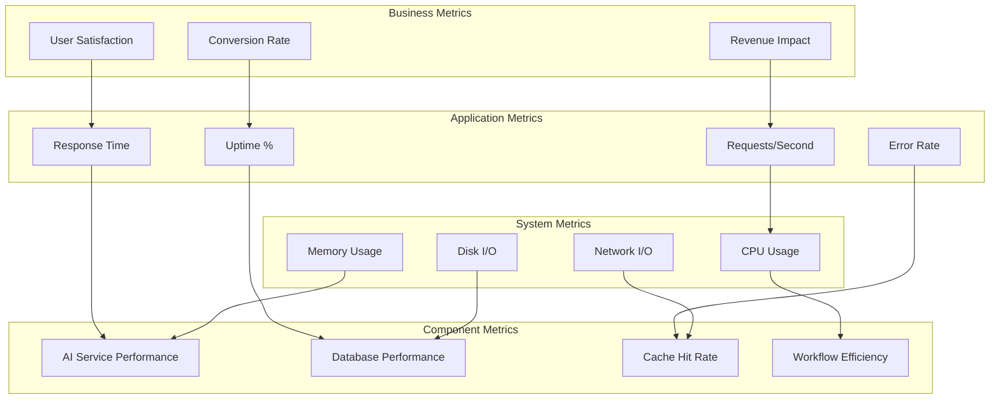

# GenericAiAgents - Performance Optimization Guide

This comprehensive guide provides proven strategies, techniques, and tools to optimize GenericAiAgents applications for maximum performance, scalability, and efficiency in production environments.

## Table of Contents

1. [Performance Optimization Framework](#performance-optimization-framework)
2. [Application-Level Optimizations](#application-level-optimizations)
3. [AI Service Performance](#ai-service-performance)
4. [Database Performance Tuning](#database-performance-tuning)
5. [Memory Management](#memory-management)
6. [Caching Strategies](#caching-strategies)
7. [Workflow Optimization](#workflow-optimization)
8. [Network and I/O Optimization](#network-and-io-optimization)
9. [Monitoring and Profiling](#monitoring-and-profiling)
10. [Scaling Patterns](#scaling-patterns)

## Performance Optimization Framework

### Performance Metrics Hierarchy



### Baseline Performance Targets

| Metric | Target | Good | Excellent |
|--------|--------|------|-----------|
| **API Response Time** | < 500ms | < 200ms | < 100ms |
| **AI Request Processing** | < 5000ms | < 2000ms | < 1000ms |
| **Workflow Execution** | < 30s | < 10s | < 5s |
| **Database Query Time** | < 100ms | < 50ms | < 25ms |
| **Memory Usage** | < 80% | < 60% | < 40% |
| **CPU Usage** | < 70% | < 50% | < 30% |
| **Cache Hit Rate** | > 70% | > 85% | > 95% |
| **Error Rate** | < 1% | < 0.1% | < 0.01% |

### Performance Testing Framework

```csharp
using NBomber;
using NBomber.CSharp;

public class PerformanceTestSuite
{
    public static void RunPerformanceTests()
    {
        // Scenario 1: API Load Test
        var apiScenario = Scenario.Create("api_load_test", async context =>
        {
            var httpClient = new HttpClient();
            var response = await httpClient.GetAsync("https://api.genericagents.com/agents");
            
            return response.IsSuccessStatusCode ? Response.Ok() : Response.Fail();
        })
        .WithLoadSimulations(
            Simulation.InjectPerSec(rate: 100, during: TimeSpan.FromMinutes(5)),
            Simulation.KeepConstant(copies: 50, during: TimeSpan.FromMinutes(10))
        );

        // Scenario 2: AI Processing Load Test
        var aiScenario = Scenario.Create("ai_processing_test", async context =>
        {
            var request = new AgentRequest
            {
                Action = "analyze",
                Payload = GenerateTestData(),
                Priority = Random.Shared.Next(1, 5)
            };

            var httpClient = new HttpClient();
            var jsonContent = JsonContent.Create(request);
            var response = await httpClient.PostAsync("https://api.genericagents.com/agents/execute", jsonContent);
            
            return response.IsSuccessStatusCode ? Response.Ok() : Response.Fail();
        })
        .WithLoadSimulations(
            Simulation.InjectPerSec(rate: 20, during: TimeSpan.FromMinutes(10))
        );

        // Scenario 3: Database Stress Test
        var dbScenario = Scenario.Create("database_stress_test", async context =>
        {
            var queries = new[]
            {
                "/agents",
                "/workflows/active",
                "/metrics/summary",
                "/health/detailed"
            };

            var httpClient = new HttpClient();
            var randomQuery = queries[Random.Shared.Next(queries.Length)];
            var response = await httpClient.GetAsync($"https://api.genericagents.com{randomQuery}");
            
            return response.IsSuccessStatusCode ? Response.Ok() : Response.Fail();
        })
        .WithLoadSimulations(
            Simulation.InjectPerSec(rate: 200, during: TimeSpan.FromMinutes(3))
        );

        // Run all scenarios
        NBomberRunner
            .RegisterScenarios(apiScenario, aiScenario, dbScenario)
            .WithReportFormats(ReportFormat.Html, ReportFormat.Csv, ReportFormat.Md)
            .WithReportFolder("performance-reports")
            .Run();
    }

    private static object GenerateTestData()
    {
        return new
        {
            text = "This is a test prompt for AI processing performance testing",
            complexity = Random.Shared.Next(1, 10),
            expectedResponseLength = Random.Shared.Next(100, 1000)
        };
    }
}
```

## Application-Level Optimizations

### High-Performance Agent Implementation

```csharp
[Agent("optimized-agent")]
[Description("High-performance agent with advanced optimization techniques")]
public class OptimizedAgent : BaseAgent
{
    private readonly IMemoryPool<byte> _memoryPool;
    private readonly ObjectPool<StringBuilder> _stringBuilderPool;
    private readonly IAIService _aiService;
    private readonly IMetricsCollector _metrics;
    private readonly ArrayPool<char> _charArrayPool;

    // Use object pooling to reduce allocations
    private static readonly ObjectPool<AgentProcessingContext> _contextPool =
        new DefaultObjectPool<AgentProcessingContext>(new AgentProcessingContextPolicy());

    public OptimizedAgent(
        IMemoryPool<byte> memoryPool,
        ObjectPool<StringBuilder> stringBuilderPool,
        IAIService aiService,
        IMetricsCollector metrics)
    {
        _memoryPool = memoryPool;
        _stringBuilderPool = stringBuilderPool;
        _aiService = aiService;
        _metrics = metrics;
        _charArrayPool = ArrayPool<char>.Shared;
    }

    public override async Task<AgentResult> ExecuteAsync(AgentRequest request, CancellationToken cancellationToken = default)
    {
        // Use object pooling for processing context
        var context = _contextPool.Get();
        try
        {
            context.Initialize(request);
            
            // Use value types and stack allocation where possible
            Span<char> processingBuffer = stackalloc char[1024];
            
            using var activity = _metrics.StartActivity("optimized-agent-execution");
            var stopwatch = ValueStopwatch.StartNew();

            // Pre-validate request to fail fast
            if (!IsValidRequest(request, out var validationError))
            {
                return AgentResult.CreateError(validationError, stopwatch.Elapsed);
            }

            // Process with memory-efficient techniques
            var result = await ProcessOptimizedAsync(context, processingBuffer, cancellationToken);

            // Record performance metrics
            _metrics.RecordValue("agent.execution.duration", stopwatch.ElapsedMilliseconds);
            _metrics.IncrementCounter("agent.executions.completed", 1);

            return result;
        }
        finally
        {
            _contextPool.Return(context);
        }
    }

    private async Task<AgentResult> ProcessOptimizedAsync(
        AgentProcessingContext context, 
        Span<char> buffer,
        CancellationToken cancellationToken)
    {
        // Use StringBuilder pooling for string operations
        var stringBuilder = _stringBuilderPool.Get();
        try
        {
            // Build prompt efficiently
            BuildPromptOptimized(context, stringBuilder, buffer);
            var prompt = stringBuilder.ToString();

            // Use ConfigureAwait(false) to avoid context switching
            var aiResponse = await _aiService.ProcessRequestAsync(prompt, cancellationToken)
                .ConfigureAwait(false);

            // Process response with minimal allocations
            return ProcessResponseOptimized(aiResponse, buffer);
        }
        finally
        {
            _stringBuilderPool.Return(stringBuilder);
        }
    }

    private void BuildPromptOptimized(AgentProcessingContext context, StringBuilder sb, Span<char> buffer)
    {
        // Use span-based string operations to reduce allocations
        sb.Clear();
        sb.EnsureCapacity(2048); // Pre-allocate expected capacity

        sb.Append("Process this request: ");
        
        // Use ReadOnlySpan<char> for efficient string manipulation
        var payloadSpan = context.Request.Payload?.ToString().AsSpan() ?? ReadOnlySpan<char>.Empty;
        if (payloadSpan.Length > buffer.Length)
        {
            // Use memory pool for large data
            using var rental = _memoryPool.Rent(payloadSpan.Length * 2);
            var largeBuffer = rental.Memory.Span.Slice(0, payloadSpan.Length);
            payloadSpan.CopyTo(largeBuffer);
            sb.Append(largeBuffer);
        }
        else
        {
            payloadSpan.CopyTo(buffer);
            sb.Append(buffer.Slice(0, payloadSpan.Length));
        }
    }

    private AgentResult ProcessResponseOptimized(AIResponse aiResponse, Span<char> buffer)
    {
        // Process response using span-based operations
        var responseSpan = aiResponse.Content.AsSpan();
        
        // Use stack allocation for small operations
        Span<char> processedData = stackalloc char[512];
        
        // Efficient string processing without allocations
        var processedLength = ProcessResponseData(responseSpan, processedData);
        
        return AgentResult.CreateSuccess(
            new string(processedData.Slice(0, processedLength)),
            TimeSpan.Zero // Will be set by caller
        );
    }

    private int ProcessResponseData(ReadOnlySpan<char> input, Span<char> output)
    {
        var outputIndex = 0;
        
        // Example: Remove whitespace efficiently
        for (int i = 0; i < input.Length && outputIndex < output.Length - 1; i++)
        {
            if (!char.IsWhiteSpace(input[i]))
            {
                output[outputIndex++] = input[i];
            }
        }
        
        return outputIndex;
    }

    private bool IsValidRequest(AgentRequest request, out string error)
    {
        error = string.Empty;
        
        if (request == null)
        {
            error = "Request cannot be null";
            return false;
        }
        
        if (string.IsNullOrWhiteSpace(request.Action))
        {
            error = "Action cannot be empty";
            return false;
        }
        
        return true;
    }
}

// Object pooling policy for processing context
public class AgentProcessingContextPolicy : IPooledObjectPolicy<AgentProcessingContext>
{
    public AgentProcessingContext Create() => new AgentProcessingContext();

    public bool Return(AgentProcessingContext obj)
    {
        obj.Reset();
        return true;
    }
}

// Reusable processing context
public class AgentProcessingContext
{
    public AgentRequest Request { get; private set; }
    public Dictionary<string, object> Metadata { get; private set; } = new();
    
    public void Initialize(AgentRequest request)
    {
        Request = request;
        // Initialize other properties
    }
    
    public void Reset()
    {
        Request = null;
        Metadata.Clear();
    }
}

// High-precision timing without allocations
public readonly struct ValueStopwatch
{
    private readonly long _startTimestamp;
    
    private ValueStopwatch(long startTimestamp)
    {
        _startTimestamp = startTimestamp;
    }
    
    public static ValueStopwatch StartNew() => new(Stopwatch.GetTimestamp());
    
    public TimeSpan Elapsed => 
        new((long)((Stopwatch.GetTimestamp() - _startTimestamp) * (10_000_000.0 / Stopwatch.Frequency)));
    
    public long ElapsedMilliseconds => 
        (long)((Stopwatch.GetTimestamp() - _startTimestamp) * (1000.0 / Stopwatch.Frequency));
}
```

### Dependency Injection Optimizations

```csharp
// High-performance service registration
public static class OptimizedServiceExtensions
{
    public static IServiceCollection AddOptimizedAgentServices(this IServiceCollection services)
    {
        // Use singleton pattern for expensive-to-create services
        services.AddSingleton<IMemoryPool<byte>>(provider => 
            MemoryPool<byte>.Shared);
        
        services.AddSingleton<ObjectPool<StringBuilder>>(provider =>
        {
            var policy = new StringBuilderPooledObjectPolicy
            {
                InitialCapacity = 1024,
                MaximumRetainedCapacity = 8192
            };
            return new DefaultObjectPool<StringBuilder>(policy);
        });

        // Use scoped services appropriately
        services.AddScoped<IAgentExecutor, OptimizedAgentExecutor>();
        
        // Use transient only when necessary
        services.AddTransient<IAgentValidator, FastAgentValidator>();

        // Configure HTTP clients for performance
        services.AddHttpClient<AIServiceClient>()
            .ConfigurePrimaryHttpMessageHandler(() => new HttpClientHandler
            {
                MaxConnectionsPerServer = 20,
                PooledConnectionLifetime = TimeSpan.FromMinutes(5)
            })
            .AddPolicyHandler(GetRetryPolicy())
            .AddPolicyHandler(GetTimeoutPolicy());

        return services;
    }

    private static IAsyncPolicy<HttpResponseMessage> GetRetryPolicy()
    {
        return HttpPolicyExtensions
            .HandleTransientHttpError()
            .WaitAndRetryAsync(
                retryCount: 3,
                sleepDurationProvider: retryAttempt => TimeSpan.FromSeconds(Math.Pow(2, retryAttempt))
            );
    }

    private static IAsyncPolicy<HttpResponseMessage> GetTimeoutPolicy()
    {
        return Policy.TimeoutAsync<HttpResponseMessage>(30);
    }
}
```

## AI Service Performance

### Request Batching and Optimization

```csharp
public class BatchedAIService : IAIService
{
    private readonly IAIService _innerService;
    private readonly IMemoryCache _cache;
    private readonly SemaphoreSlim _batchSemaphore;
    private readonly Timer _batchTimer;
    private readonly ConcurrentQueue<AIRequestBatch> _pendingRequests;
    private readonly ILogger<BatchedAIService> _logger;

    // Batching configuration
    private readonly int _maxBatchSize = 10;
    private readonly TimeSpan _maxBatchWaitTime = TimeSpan.FromMilliseconds(100);

    public BatchedAIService(IAIService innerService, IMemoryCache cache, ILogger<BatchedAIService> logger)
    {
        _innerService = innerService;
        _cache = cache;
        _logger = logger;
        _batchSemaphore = new SemaphoreSlim(1, 1);
        _pendingRequests = new ConcurrentQueue<AIRequestBatch>();
        
        // Process batches every 100ms or when batch is full
        _batchTimer = new Timer(ProcessPendingBatches, null, _maxBatchWaitTime, _maxBatchWaitTime);
    }

    public async Task<AIResponse> ProcessRequestAsync(string prompt, CancellationToken cancellationToken = default)
    {
        // Check cache first
        var cacheKey = $"ai_response_{prompt.GetHashCode():X}";
        if (_cache.TryGetValue(cacheKey, out AIResponse cachedResponse))
        {
            return cachedResponse;
        }

        // Create batch request
        var batchItem = new AIRequestBatch
        {
            Prompt = prompt,
            CancellationToken = cancellationToken,
            CompletionSource = new TaskCompletionSource<AIResponse>()
        };

        _pendingRequests.Enqueue(batchItem);

        // If batch is full, process immediately
        if (_pendingRequests.Count >= _maxBatchSize)
        {
            _ = Task.Run(async () => await ProcessPendingBatches(null));
        }

        var response = await batchItem.CompletionSource.Task;

        // Cache successful responses
        if (response.IsSuccess)
        {
            _cache.Set(cacheKey, response, TimeSpan.FromHours(1));
        }

        return response;
    }

    private async Task ProcessPendingBatches(object state)
    {
        if (_pendingRequests.IsEmpty) return;

        await _batchSemaphore.WaitAsync();
        try
        {
            var batchItems = new List<AIRequestBatch>();
            
            // Collect items for batch processing
            while (batchItems.Count < _maxBatchSize && _pendingRequests.TryDequeue(out var item))
            {
                batchItems.Add(item);
            }

            if (!batchItems.Any()) return;

            // Group similar requests
            var groupedRequests = batchItems
                .GroupBy(item => GetRequestCategory(item.Prompt))
                .ToList();

            // Process each group optimally
            var processingTasks = groupedRequests.Select(ProcessRequestGroup);
            await Task.WhenAll(processingTasks);
        }
        finally
        {
            _batchSemaphore.Release();
        }
    }

    private async Task ProcessRequestGroup(IGrouping<string, AIRequestBatch> group)
    {
        try
        {
            // Optimize similar requests together
            if (group.Count() == 1)
            {
                // Single request - process normally
                var item = group.First();
                var response = await _innerService.ProcessRequestAsync(item.Prompt, item.CancellationToken);
                item.CompletionSource.SetResult(response);
            }
            else
            {
                // Multiple similar requests - batch optimize
                await ProcessSimilarRequestsBatch(group);
            }
        }
        catch (Exception ex)
        {
            _logger.LogError(ex, "Failed to process request group");
            foreach (var item in group)
            {
                item.CompletionSource.SetException(ex);
            }
        }
    }

    private async Task ProcessSimilarRequestsBatch(IEnumerable<AIRequestBatch> similarRequests)
    {
        // Combine similar prompts for more efficient processing
        var requests = similarRequests.ToList();
        var combinedPrompt = BuildCombinedPrompt(requests);

        var response = await _innerService.ProcessRequestAsync(combinedPrompt, CancellationToken.None);
        
        if (response.IsSuccess)
        {
            // Split response and distribute to individual requests
            var individualResponses = SplitCombinedResponse(response.Content, requests.Count);
            
            for (int i = 0; i < requests.Count && i < individualResponses.Count; i++)
            {
                var individualResponse = new AIResponse
                {
                    Content = individualResponses[i],
                    IsSuccess = true,
                    Confidence = response.Confidence
                };
                requests[i].CompletionSource.SetResult(individualResponse);
            }
        }
        else
        {
            // If combined request fails, process individually
            foreach (var request in requests)
            {
                try
                {
                    var individualResponse = await _innerService.ProcessRequestAsync(request.Prompt, request.CancellationToken);
                    request.CompletionSource.SetResult(individualResponse);
                }
                catch (Exception ex)
                {
                    request.CompletionSource.SetException(ex);
                }
            }
        }
    }

    private string GetRequestCategory(string prompt)
    {
        // Categorize requests for optimal batching
        if (prompt.Contains("analyze", StringComparison.OrdinalIgnoreCase))
            return "analysis";
        if (prompt.Contains("summarize", StringComparison.OrdinalIgnoreCase))
            return "summary";
        if (prompt.Contains("translate", StringComparison.OrdinalIgnoreCase))
            return "translation";
        
        return "general";
    }

    private string BuildCombinedPrompt(List<AIRequestBatch> requests)
    {
        var sb = new StringBuilder();
        sb.AppendLine("Process these requests in order and provide numbered responses:");
        
        for (int i = 0; i < requests.Count; i++)
        {
            sb.AppendLine($"{i + 1}. {requests[i].Prompt}");
        }
        
        sb.AppendLine("Provide responses in the format: '1. [response] 2. [response]' etc.");
        return sb.ToString();
    }

    private List<string> SplitCombinedResponse(string combinedResponse, int expectedCount)
    {
        var responses = new List<string>();
        var lines = combinedResponse.Split('\n', StringSplitOptions.RemoveEmptyEntries);
        
        foreach (var line in lines)
        {
            if (Regex.IsMatch(line, @"^\d+\."))
            {
                var response = Regex.Replace(line, @"^\d+\.\s*", "").Trim();
                responses.Add(response);
            }
        }
        
        // Ensure we have the expected number of responses
        while (responses.Count < expectedCount)
        {
            responses.Add("Response processing failed");
        }
        
        return responses.Take(expectedCount).ToList();
    }
}

public class AIRequestBatch
{
    public string Prompt { get; set; } = string.Empty;
    public CancellationToken CancellationToken { get; set; }
    public TaskCompletionSource<AIResponse> CompletionSource { get; set; } = new();
}
```

### Token Usage Optimization

```csharp
public class TokenOptimizedAIService : IAIService
{
    private readonly IAIService _innerService;
    private readonly ITokenCounter _tokenCounter;
    private readonly ILogger<TokenOptimizedAIService> _logger;

    // Token optimization settings
    private readonly int _maxTokensPerRequest = 4000;
    private readonly int _targetResponseTokens = 1000;

    public async Task<AIResponse> ProcessRequestAsync(string prompt, CancellationToken cancellationToken = default)
    {
        // Optimize prompt before sending
        var optimizedPrompt = await OptimizePromptAsync(prompt);
        
        // Calculate optimal token distribution
        var promptTokens = _tokenCounter.CountTokens(optimizedPrompt);
        var maxResponseTokens = Math.Min(_targetResponseTokens, _maxTokensPerRequest - promptTokens - 100); // Leave buffer

        if (maxResponseTokens < 100)
        {
            // Prompt is too long, need to truncate
            optimizedPrompt = await TruncatePromptIntelligently(optimizedPrompt, _maxTokensPerRequest - _targetResponseTokens - 100);
            promptTokens = _tokenCounter.CountTokens(optimizedPrompt);
            maxResponseTokens = _maxTokensPerRequest - promptTokens - 100;
        }

        // Create optimized request
        var optimizedRequest = new AIRequest
        {
            Prompt = optimizedPrompt,
            MaxTokens = maxResponseTokens,
            Temperature = 0.3, // Lower temperature for consistency
            TopP = 0.95,
            PresencePenalty = 0.1,
            FrequencyPenalty = 0.1
        };

        var response = await _innerService.ProcessRequestAsync(optimizedRequest.Prompt, cancellationToken);

        // Log token usage for monitoring
        if (response.TokenUsage != null)
        {
            _logger.LogDebug("Token usage - Prompt: {PromptTokens}, Response: {ResponseTokens}, Total: {TotalTokens}",
                response.TokenUsage.PromptTokens, response.TokenUsage.CompletionTokens, response.TokenUsage.TotalTokens);
        }

        return response;
    }

    private async Task<string> OptimizePromptAsync(string originalPrompt)
    {
        // Remove redundant whitespace
        var optimized = Regex.Replace(originalPrompt, @"\s+", " ").Trim();
        
        // Remove redundant phrases
        var redundantPhrases = new[]
        {
            "please",
            "could you",
            "I would like you to",
            "if possible",
            "thank you"
        };

        foreach (var phrase in redundantPhrases)
        {
            optimized = optimized.Replace(phrase, "", StringComparison.OrdinalIgnoreCase);
        }

        // Optimize instruction format
        if (optimized.Contains("instructions:", StringComparison.OrdinalIgnoreCase))
        {
            optimized = OptimizeInstructionFormat(optimized);
        }

        return optimized.Trim();
    }

    private string OptimizeInstructionFormat(string prompt)
    {
        // Convert verbose instructions to concise bullet points
        var lines = prompt.Split('\n');
        var optimizedLines = new List<string>();
        
        var inInstructionSection = false;
        foreach (var line in lines)
        {
            if (line.Contains("instructions:", StringComparison.OrdinalIgnoreCase))
            {
                inInstructionSection = true;
                optimizedLines.Add("Instructions:");
                continue;
            }

            if (inInstructionSection && string.IsNullOrWhiteSpace(line))
            {
                inInstructionSection = false;
            }

            if (inInstructionSection)
            {
                // Convert to bullet point format
                var trimmed = line.Trim();
                if (!trimmed.StartsWith("-") && !trimmed.StartsWith("•"))
                {
                    trimmed = "- " + trimmed;
                }
                optimizedLines.Add(trimmed);
            }
            else
            {
                optimizedLines.Add(line);
            }
        }

        return string.Join("\n", optimizedLines);
    }

    private async Task<string> TruncatePromptIntelligently(string prompt, int maxTokens)
    {
        // Try to preserve important sections while truncating
        var sections = IdentifyPromptSections(prompt);
        var essentialSections = sections.Where(s => s.IsEssential).ToList();
        var optionalSections = sections.Where(s => !s.IsEssential).ToList();

        // Always keep essential sections
        var result = string.Join("\n", essentialSections.Select(s => s.Content));
        var currentTokens = _tokenCounter.CountTokens(result);

        // Add optional sections if space allows
        foreach (var section in optionalSections.OrderByDescending(s => s.Priority))
        {
            var sectionTokens = _tokenCounter.CountTokens(section.Content);
            if (currentTokens + sectionTokens <= maxTokens)
            {
                result += "\n" + section.Content;
                currentTokens += sectionTokens;
            }
        }

        return result;
    }

    private List<PromptSection> IdentifyPromptSections(string prompt)
    {
        var sections = new List<PromptSection>();
        var lines = prompt.Split('\n');
        
        var currentSection = new PromptSection();
        foreach (var line in lines)
        {
            if (IsNewSection(line))
            {
                if (!string.IsNullOrEmpty(currentSection.Content))
                {
                    sections.Add(currentSection);
                }
                
                currentSection = new PromptSection
                {
                    Title = line.Trim(),
                    IsEssential = IsEssentialSection(line),
                    Priority = GetSectionPriority(line)
                };
            }
            else
            {
                currentSection.Content += line + "\n";
            }
        }
        
        if (!string.IsNullOrEmpty(currentSection.Content))
        {
            sections.Add(currentSection);
        }

        return sections;
    }

    private bool IsNewSection(string line)
    {
        return line.EndsWith(":") || 
               line.StartsWith("##") || 
               line.StartsWith("**") && line.EndsWith("**");
    }

    private bool IsEssentialSection(string sectionTitle)
    {
        var essentialKeywords = new[] { "task", "objective", "goal", "requirement", "must", "critical" };
        return essentialKeywords.Any(keyword => 
            sectionTitle.Contains(keyword, StringComparison.OrdinalIgnoreCase));
    }

    private int GetSectionPriority(string sectionTitle)
    {
        if (sectionTitle.Contains("example", StringComparison.OrdinalIgnoreCase)) return 3;
        if (sectionTitle.Contains("context", StringComparison.OrdinalIgnoreCase)) return 2;
        if (sectionTitle.Contains("background", StringComparison.OrdinalIgnoreCase)) return 1;
        return 5; // Default high priority for unknown sections
    }
}

public class PromptSection
{
    public string Title { get; set; } = string.Empty;
    public string Content { get; set; } = string.Empty;
    public bool IsEssential { get; set; }
    public int Priority { get; set; }
}
```

## Database Performance Tuning

### Advanced Query Optimization

```csharp
public class OptimizedAgentRepository : IAgentRepository
{
    private readonly AgentDbContext _context;
    private readonly IMemoryCache _cache;
    private readonly ILogger<OptimizedAgentRepository> _logger;

    // Compiled queries for better performance
    private static readonly Func<AgentDbContext, string, Task<Agent?>> GetAgentByIdCompiledQuery =
        EF.CompileAsyncQuery((AgentDbContext context, string id) =>
            context.Agents.FirstOrDefault(a => a.Id == id));

    private static readonly Func<AgentDbContext, IAsyncEnumerable<Agent>> GetActiveAgentsCompiledQuery =
        EF.CompileAsyncQuery((AgentDbContext context) =>
            context.Agents.Where(a => a.IsActive).AsAsyncEnumerable());

    public async Task<Agent?> GetAgentAsync(string id, CancellationToken cancellationToken = default)
    {
        // Try cache first
        var cacheKey = $"agent_{id}";
        if (_cache.TryGetValue(cacheKey, out Agent cachedAgent))
        {
            return cachedAgent;
        }

        // Use compiled query for better performance
        var agent = await GetAgentByIdCompiledQuery(_context, id);
        
        if (agent != null)
        {
            _cache.Set(cacheKey, agent, TimeSpan.FromMinutes(5));
        }

        return agent;
    }

    public async Task<List<AgentSummaryDto>> GetAgentSummariesAsync(
        int page = 1, 
        int pageSize = 50,
        CancellationToken cancellationToken = default)
    {
        // Use projection to reduce data transfer
        return await _context.Agents
            .Where(a => a.IsActive)
            .OrderBy(a => a.Name)
            .Skip((page - 1) * pageSize)
            .Take(pageSize)
            .Select(a => new AgentSummaryDto
            {
                Id = a.Id,
                Name = a.Name,
                Type = a.Type,
                Status = a.Status,
                LastActivity = a.LastActivity,
                ExecutionCount = a.ExecutionCount,
                AverageExecutionTime = a.TotalExecutionTime / (a.ExecutionCount > 0 ? a.ExecutionCount : 1)
            })
            .AsNoTracking()
            .ToListAsync(cancellationToken);
    }

    public async Task<List<Agent>> GetAgentsByTypeAsync(
        string agentType, 
        CancellationToken cancellationToken = default)
    {
        // Use index hint for better query plan
        return await _context.Agents
            .FromSqlRaw("SELECT * FROM agents WHERE agent_type = {0} AND is_active = true", agentType)
            .AsNoTracking()
            .ToListAsync(cancellationToken);
    }

    public async Task UpdateAgentMetricsBatchAsync(
        IEnumerable<AgentMetricsUpdate> updates,
        CancellationToken cancellationToken = default)
    {
        const int batchSize = 1000;
        var updatesList = updates.ToList();

        using var transaction = await _context.Database.BeginTransactionAsync(cancellationToken);
        try
        {
            for (int i = 0; i < updatesList.Count; i += batchSize)
            {
                var batch = updatesList.Skip(i).Take(batchSize);
                
                // Use bulk update with raw SQL for better performance
                var updateCases = new StringBuilder();
                var whereClauses = new StringBuilder();
                var parameters = new List<object>();
                
                int paramIndex = 0;
                foreach (var update in batch)
                {
                    updateCases.AppendLine($"WHEN id = @p{paramIndex} THEN @p{paramIndex + 1}");
                    whereClauses.Append(paramIndex == 0 ? $"@p{paramIndex}" : $", @p{paramIndex}");
                    
                    parameters.Add(update.AgentId);
                    parameters.Add(update.ExecutionCount);
                    paramIndex += 2;
                }

                var sql = $@"
                    UPDATE agents 
                    SET execution_count = CASE 
                        {updateCases}
                        ELSE execution_count 
                    END,
                    last_activity = NOW()
                    WHERE id IN ({whereClauses})";

                await _context.Database.ExecuteSqlRawAsync(sql, parameters.ToArray(), cancellationToken);
            }

            await transaction.CommitAsync(cancellationToken);
        }
        catch
        {
            await transaction.RollbackAsync(cancellationToken);
            throw;
        }
    }

    // Efficient aggregation queries
    public async Task<Dictionary<string, int>> GetAgentCountsByStatusAsync(CancellationToken cancellationToken = default)
    {
        return await _context.Agents
            .GroupBy(a => a.Status)
            .Select(g => new { Status = g.Key, Count = g.Count() })
            .ToDictionaryAsync(x => x.Status, x => x.Count, cancellationToken);
    }

    // Read-only queries for reporting
    public async Task<List<AgentPerformanceReport>> GetPerformanceReportAsync(
        DateTime fromDate,
        DateTime toDate,
        CancellationToken cancellationToken = default)
    {
        // Use read-only connection for reporting queries
        return await _context.Database
            .SqlQueryRaw<AgentPerformanceReport>($@"
                SELECT 
                    a.id,
                    a.name,
                    a.type,
                    COUNT(ae.id) as execution_count,
                    AVG(ae.execution_time) as avg_execution_time,
                    MAX(ae.execution_time) as max_execution_time,
                    MIN(ae.execution_time) as min_execution_time,
                    SUM(CASE WHEN ae.success = true THEN 1 ELSE 0 END) as success_count
                FROM agents a
                LEFT JOIN agent_executions ae ON a.id = ae.agent_id
                WHERE ae.created_at >= {fromDate} AND ae.created_at <= {toDate}
                GROUP BY a.id, a.name, a.type
                ORDER BY execution_count DESC")
            .ToListAsync(cancellationToken);
    }
}

// Database connection optimization
public static class DatabaseOptimizationExtensions
{
    public static IServiceCollection AddOptimizedDatabase(
        this IServiceCollection services, 
        string connectionString)
    {
        services.AddDbContext<AgentDbContext>(options =>
        {
            options.UseNpgsql(connectionString, npgsqlOptions =>
            {
                // Connection pooling optimization
                npgsqlOptions.EnableRetryOnFailure(
                    maxRetryCount: 3,
                    maxRetryDelay: TimeSpan.FromSeconds(10),
                    errorCodesToAdd: null);

                // Command timeout
                npgsqlOptions.CommandTimeout(30);

                // Enable connection pooling
                npgsqlOptions.EnableServiceProviderCaching();
                npgsqlOptions.EnableSensitiveDataLogging(false);
            });

            // Query optimization
            options.EnableSensitiveDataLogging(false);
            options.EnableServiceProviderCaching();
            options.ConfigureWarnings(warnings =>
                warnings.Ignore(RelationalEventId.MultipleCollectionIncludeWarning));

        }, ServiceLifetime.Scoped);

        // Add read-only context for reporting
        services.AddDbContext<ReadOnlyAgentDbContext>(options =>
        {
            var readOnlyConnectionString = connectionString.Replace("genericagents", "genericagents_readonly");
            options.UseNpgsql(readOnlyConnectionString, npgsqlOptions =>
            {
                npgsqlOptions.CommandTimeout(120); // Longer timeout for reporting queries
            });
        }, ServiceLifetime.Scoped);

        return services;
    }
}
```

### Database Index Optimization

```sql
-- Performance-optimized indexes for GenericAiAgents

-- Core agent queries
CREATE INDEX CONCURRENTLY IF NOT EXISTS idx_agents_active_type 
ON agents(is_active, agent_type) 
WHERE is_active = true;

CREATE INDEX CONCURRENTLY IF NOT EXISTS idx_agents_status_activity 
ON agents(status, last_activity DESC) 
WHERE is_active = true;

-- Workflow execution queries
CREATE INDEX CONCURRENTLY IF NOT EXISTS idx_workflows_status_created 
ON workflows(status, created_at DESC);

CREATE INDEX CONCURRENTLY IF NOT EXISTS idx_workflow_steps_workflow_status 
ON workflow_steps(workflow_id, status, step_order);

-- Execution history for performance analysis
CREATE INDEX CONCURRENTLY IF NOT EXISTS idx_agent_executions_agent_created 
ON agent_executions(agent_id, created_at DESC);

CREATE INDEX CONCURRENTLY IF NOT EXISTS idx_agent_executions_performance 
ON agent_executions(agent_id, execution_time, success) 
WHERE created_at >= NOW() - INTERVAL '30 days';

-- Composite index for complex queries
CREATE INDEX CONCURRENTLY IF NOT EXISTS idx_agents_complex_query 
ON agents(agent_type, status, is_active, last_activity DESC)
INCLUDE (name, execution_count);

-- Partial indexes for specific use cases
CREATE INDEX CONCURRENTLY IF NOT EXISTS idx_agents_failed_recent 
ON agents(last_activity DESC, error_count)
WHERE status = 'failed' AND last_activity >= NOW() - INTERVAL '1 hour';

-- Full-text search index for agent descriptions
CREATE INDEX CONCURRENTLY IF NOT EXISTS idx_agents_description_fts 
ON agents USING gin(to_tsvector('english', description));

-- Analyze tables for query planner optimization
ANALYZE agents;
ANALYZE workflows;
ANALYZE workflow_steps;
ANALYZE agent_executions;

-- Database maintenance
VACUUM ANALYZE agents;
VACUUM ANALYZE workflows;
```

## Memory Management

### Advanced Memory Optimization

```csharp
public class MemoryOptimizedWorkflowEngine : IWorkflowEngine
{
    private readonly IMemoryPool<byte> _memoryPool;
    private readonly ObjectPool<WorkflowExecutionContext> _contextPool;
    private readonly ArrayPool<WorkflowStep> _stepArrayPool;
    private readonly ILogger<MemoryOptimizedWorkflowEngine> _logger;

    // Memory management configuration
    private readonly int _maxConcurrentWorkflows;
    private readonly SemaphoreSlim _concurrencyLimiter;
    private readonly Timer _memoryCleanupTimer;

    public MemoryOptimizedWorkflowEngine(
        IMemoryPool<byte> memoryPool,
        ILogger<MemoryOptimizedWorkflowEngine> logger,
        IConfiguration configuration)
    {
        _memoryPool = memoryPool;
        _logger = logger;
        
        _maxConcurrentWorkflows = configuration.GetValue<int>("Workflows:MaxConcurrent", 50);
        _concurrencyLimiter = new SemaphoreSlim(_maxConcurrentWorkflows, _maxConcurrentWorkflows);

        // Object pooling for workflow contexts
        _contextPool = new DefaultObjectPool<WorkflowExecutionContext>(
            new WorkflowExecutionContextPolicy(), maximumRetained: _maxConcurrentWorkflows);

        _stepArrayPool = ArrayPool<WorkflowStep>.Create(maxArrayLength: 100, maxArraysPerBucket: 10);

        // Periodic memory cleanup
        _memoryCleanupTimer = new Timer(PerformMemoryCleanup, null, 
            TimeSpan.FromMinutes(5), TimeSpan.FromMinutes(5));
    }

    public async Task<WorkflowResult> ExecuteWorkflowAsync(
        WorkflowDefinition workflow, 
        CancellationToken cancellationToken = default)
    {
        // Check memory pressure before starting
        var memoryBefore = GC.GetTotalMemory(false);
        if (memoryBefore > 2_000_000_000) // 2GB threshold
        {
            // Force garbage collection under memory pressure
            GC.Collect(2, GCCollectionMode.Optimized, true);
            GC.WaitForPendingFinalizers();
            
            var memoryAfter = GC.GetTotalMemory(false);
            _logger.LogInformation("Memory cleanup: {MemoryBefore} -> {MemoryAfter} bytes", 
                memoryBefore, memoryAfter);
        }

        await _concurrencyLimiter.WaitAsync(cancellationToken);
        
        var context = _contextPool.Get();
        WorkflowStep[] stepArray = null;
        
        try
        {
            // Use object pooling for workflow context
            context.Initialize(workflow);

            // Use array pooling for steps
            stepArray = _stepArrayPool.Rent(workflow.Steps.Count);
            workflow.Steps.CopyTo(stepArray, 0);

            using var activity = Activity.StartActivity("ExecuteWorkflow");
            activity?.SetTag("workflow.steps", workflow.Steps.Count);

            // Execute with memory-efficient patterns
            return await ExecuteWorkflowOptimizedAsync(context, stepArray, workflow.Steps.Count, cancellationToken);
        }
        finally
        {
            // Return pooled objects
            if (stepArray != null)
                _stepArrayPool.Return(stepArray, clearArray: true);
            
            _contextPool.Return(context);
            _concurrencyLimiter.Release();
        }
    }

    private async Task<WorkflowResult> ExecuteWorkflowOptimizedAsync(
        WorkflowExecutionContext context,
        WorkflowStep[] steps,
        int stepCount,
        CancellationToken cancellationToken)
    {
        var results = new List<StepResult>(stepCount);
        using var stepMemory = _memoryPool.Rent(1024 * stepCount); // Allocate buffer for step data
        
        // Process steps with memory optimization
        for (int i = 0; i < stepCount; i++)
        {
            var step = steps[i];
            using var stepActivity = Activity.StartActivity($"ExecuteStep:{step.Name}");
            
            try
            {
                // Use span for step-local data
                var stepBuffer = stepMemory.Memory.Span.Slice(i * 1024, 1024);
                var result = await ExecuteStepOptimizedAsync(step, stepBuffer, cancellationToken);
                
                results.Add(result);
                
                // Clear step data to prevent memory leaks
                step.Input = null;
                step.Output = null;
                
            }
            catch (Exception ex)
            {
                _logger.LogError(ex, "Step {StepName} failed: {Error}", step.Name, ex.Message);
                results.Add(StepResult.CreateError(step.Name, ex.Message));
            }
        }

        return new WorkflowResult
        {
            WorkflowId = context.WorkflowId,
            IsSuccess = results.All(r => r.IsSuccess),
            StepResults = results,
            ExecutionTime = context.GetExecutionTime()
        };
    }

    private async Task<StepResult> ExecuteStepOptimizedAsync(
        WorkflowStep step,
        Span<byte> stepBuffer,
        CancellationToken cancellationToken)
    {
        // Use span-based operations for step execution
        var inputSpan = SerializeInputToSpan(step.Input, stepBuffer);
        
        // Execute step with minimal allocations
        var agent = await GetAgentAsync(step.AgentType);
        var request = new AgentRequest
        {
            Action = step.Name,
            Payload = DeserializeFromSpan(inputSpan)
        };

        var result = await agent.ExecuteAsync(request, cancellationToken);

        return new StepResult
        {
            StepName = step.Name,
            IsSuccess = result.IsSuccess,
            Output = result.IsSuccess ? result.Data : null,
            ErrorMessage = result.IsSuccess ? null : result.ErrorMessage,
            ExecutionTime = result.ExecutionTime
        };
    }

    private ReadOnlySpan<byte> SerializeInputToSpan(object input, Span<byte> buffer)
    {
        if (input == null) return ReadOnlySpan<byte>.Empty;

        // Use System.Text.Json with span-based serialization
        var jsonBytes = JsonSerializer.SerializeToUtf8Bytes(input);
        if (jsonBytes.Length <= buffer.Length)
        {
            jsonBytes.AsSpan().CopyTo(buffer);
            return buffer.Slice(0, jsonBytes.Length);
        }
        
        // Fallback for large objects (should be rare)
        return jsonBytes.AsSpan();
    }

    private object DeserializeFromSpan(ReadOnlySpan<byte> span)
    {
        if (span.IsEmpty) return null;
        
        // Deserialize directly from span
        var reader = new Utf8JsonReader(span);
        return JsonSerializer.Deserialize<object>(ref reader);
    }

    private void PerformMemoryCleanup(object state)
    {
        // Aggressive memory cleanup under pressure
        var gen2Before = GC.CollectionCount(2);
        var memoryBefore = GC.GetTotalMemory(false);
        
        if (memoryBefore > 1_500_000_000) // 1.5GB threshold
        {
            _logger.LogInformation("Performing memory cleanup - current usage: {MemoryUsage} bytes", memoryBefore);
            
            // Force full garbage collection
            GC.Collect();
            GC.WaitForPendingFinalizers();
            GC.Collect();
            
            var memoryAfter = GC.GetTotalMemory(true);
            var gen2After = GC.CollectionCount(2);
            
            _logger.LogInformation("Memory cleanup completed: {MemoryBefore} -> {MemoryAfter} bytes, Gen2 collections: {Gen2Collections}",
                memoryBefore, memoryAfter, gen2After - gen2Before);
        }
    }
}

// Memory-efficient workflow execution context
public class WorkflowExecutionContext
{
    private readonly Stopwatch _stopwatch = new();
    
    public Guid WorkflowId { get; private set; }
    public string WorkflowName { get; private set; } = string.Empty;
    public Dictionary<string, object> SharedData { get; private set; } = new();
    
    public void Initialize(WorkflowDefinition workflow)
    {
        WorkflowId = workflow.Id;
        WorkflowName = workflow.Name;
        SharedData.Clear();
        _stopwatch.Restart();
    }
    
    public void Reset()
    {
        WorkflowId = Guid.Empty;
        WorkflowName = string.Empty;
        SharedData.Clear();
        _stopwatch.Reset();
    }
    
    public TimeSpan GetExecutionTime() => _stopwatch.Elapsed;
}

public class WorkflowExecutionContextPolicy : IPooledObjectPolicy<WorkflowExecutionContext>
{
    public WorkflowExecutionContext Create() => new();
    
    public bool Return(WorkflowExecutionContext obj)
    {
        obj.Reset();
        return true;
    }
}
```

This performance optimization guide provides comprehensive strategies to maximize the performance, scalability, and efficiency of GenericAiAgents applications. The techniques cover application-level optimizations, memory management, database tuning, and advanced monitoring approaches that ensure optimal performance in production environments.