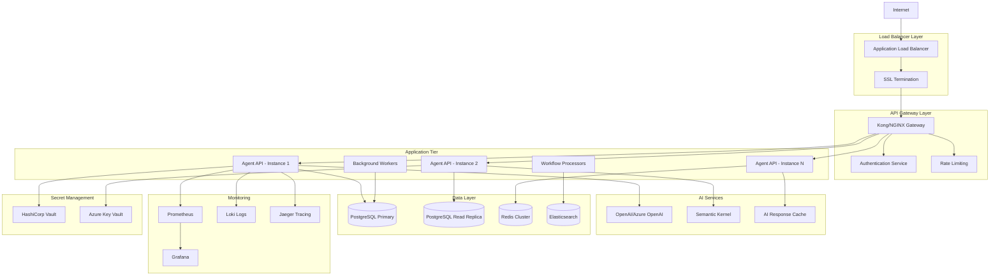

# GenericAiAgents - Production Deployment Guide

This comprehensive guide covers production deployment strategies, infrastructure patterns, scaling considerations, and operational best practices for GenericAiAgents-based applications.

## Table of Contents

1. [Deployment Architecture Overview](#deployment-architecture-overview)
2. [Infrastructure Requirements](#infrastructure-requirements)
3. [Container Orchestration](#container-orchestration)
4. [Cloud Provider Deployments](#cloud-provider-deployments)
5. [CI/CD Pipeline Setup](#cicd-pipeline-setup)
6. [Security Hardening](#security-hardening)
7. [Monitoring & Observability](#monitoring--observability)
8. [Scaling Strategies](#scaling-strategies)
9. [Disaster Recovery](#disaster-recovery)
10. [Cost Optimization](#cost-optimization)

## Deployment Architecture Overview

### Production-Ready Architecture Pattern



### Deployment Patterns

#### 1. **Microservices Pattern** (Recommended for Enterprise)

```
GenericAiAgents-Microservices/
├── services/
│   ├── agent-api/                    # Main API service
│   ├── workflow-engine/              # Workflow processing
│   ├── ai-service/                   # AI integration service
│   ├── notification-service/         # Communication service
│   └── analytics-service/            # Analytics and reporting
├── infrastructure/
│   ├── kubernetes/                   # K8s manifests
│   ├── terraform/                    # Infrastructure as Code
│   └── helm-charts/                  # Helm deployments
├── monitoring/
│   ├── prometheus/                   # Metrics configuration
│   ├── grafana/                      # Dashboard definitions
│   └── alerts/                       # Alert configurations
└── scripts/
    ├── deploy.sh                     # Deployment automation
    └── rollback.sh                   # Rollback procedures
```

#### 2. **Monolithic Pattern** (Suitable for smaller deployments)

```
GenericAiAgents-Monolith/
├── src/
│   └── AgentPlatform.API/            # Single application
├── docker/
│   ├── Dockerfile                    # Application container
│   └── docker-compose.yml            # Local/simple deployments
├── infrastructure/
│   ├── azure-arm/                    # ARM templates
│   └── aws-cloudformation/           # CloudFormation templates
└── deployment/
    ├── production.yml                # Production configuration
    └── staging.yml                   # Staging configuration
```

## Infrastructure Requirements

### Minimum Production Requirements

| Component | CPU | Memory | Storage | Network |
|-----------|-----|--------|---------|---------|
| **API Instances** | 4 vCPU | 8 GB RAM | 50 GB SSD | 1 Gbps |
| **Database** | 8 vCPU | 16 GB RAM | 200 GB SSD | 10 Gbps |
| **Redis Cache** | 2 vCPU | 4 GB RAM | 20 GB SSD | 1 Gbps |
| **Background Workers** | 2 vCPU | 4 GB RAM | 20 GB SSD | 1 Gbps |
| **Monitoring** | 4 vCPU | 8 GB RAM | 100 GB SSD | 1 Gbps |

### Recommended Production Specifications

| Component | Specification | Justification |
|-----------|---------------|---------------|
| **API Tier** | 3+ instances behind load balancer | High availability, horizontal scaling |
| **Database** | PostgreSQL 15+ with read replicas | ACID compliance, reporting separation |
| **Cache** | Redis 7+ cluster mode | Session state, AI response caching |
| **Load Balancer** | Application LB with SSL termination | SSL offloading, traffic distribution |
| **Storage** | Premium SSD with backup | Performance and durability |
| **Network** | VPC with private subnets | Security isolation |

### Environment-Specific Configurations

#### Development Environment
```yaml
# docker-compose.dev.yml
version: '3.8'
services:
  agent-api:
    image: genericagents/api:dev
    replicas: 1
    resources:
      limits:
        memory: 2G
        cpus: 1
    environment:
      - ASPNETCORE_ENVIRONMENT=Development
      - AI__Provider=OpenAI
      - AI__MaxTokens=1000
      
  postgres:
    image: postgres:15-alpine
    environment:
      - POSTGRES_DB=agents_dev
    volumes:
      - postgres_dev_data:/var/lib/postgresql/data
      
  redis:
    image: redis:7-alpine
    volumes:
      - redis_dev_data:/data
```

#### Staging Environment
```yaml
# docker-compose.staging.yml
version: '3.8'
services:
  agent-api:
    image: genericagents/api:${BUILD_NUMBER}
    replicas: 2
    resources:
      limits:
        memory: 4G
        cpus: 2
    environment:
      - ASPNETCORE_ENVIRONMENT=Staging
      - AI__Provider=AzureOpenAI
      - AI__MaxTokens=2000
      
  postgres:
    image: postgres:15
    environment:
      - POSTGRES_DB=agents_staging
    volumes:
      - postgres_staging_data:/var/lib/postgresql/data
    
  redis:
    image: redis:7
    volumes:
      - redis_staging_data:/data
```

#### Production Environment
```yaml
# docker-compose.prod.yml
version: '3.8'
services:
  agent-api:
    image: genericagents/api:${RELEASE_TAG}
    replicas: 3
    resources:
      limits:
        memory: 8G
        cpus: 4
      reservations:
        memory: 4G
        cpus: 2
    environment:
      - ASPNETCORE_ENVIRONMENT=Production
      - AI__Provider=AzureOpenAI
      - AI__MaxTokens=4000
    deploy:
      update_config:
        parallelism: 1
        delay: 30s
        order: start-first
      restart_policy:
        condition: any
        delay: 10s
        max_attempts: 3
        
  postgres:
    image: postgres:15
    environment:
      - POSTGRES_DB=agents_production
    volumes:
      - postgres_prod_data:/var/lib/postgresql/data
    deploy:
      resources:
        limits:
          memory: 16G
          cpus: 8
        reservations:
          memory: 8G
          cpus: 4
```

## Container Orchestration

### Kubernetes Deployment

#### Namespace and Resource Quotas
```yaml
# k8s/namespace.yml
apiVersion: v1
kind: Namespace
metadata:
  name: genericagents-prod
  labels:
    name: genericagents-prod
    environment: production
---
apiVersion: v1
kind: ResourceQuota
metadata:
  name: genericagents-quota
  namespace: genericagents-prod
spec:
  hard:
    requests.cpu: "20"
    requests.memory: 40Gi
    limits.cpu: "40"
    limits.memory: 80Gi
    persistentvolumeclaims: "10"
    services.loadbalancers: "2"
```

#### Application Deployment
```yaml
# k8s/agent-api-deployment.yml
apiVersion: apps/v1
kind: Deployment
metadata:
  name: agent-api
  namespace: genericagents-prod
  labels:
    app: agent-api
    version: v1
spec:
  replicas: 3
  strategy:
    type: RollingUpdate
    rollingUpdate:
      maxUnavailable: 1
      maxSurge: 1
  selector:
    matchLabels:
      app: agent-api
  template:
    metadata:
      labels:
        app: agent-api
        version: v1
      annotations:
        prometheus.io/scrape: "true"
        prometheus.io/port: "8081"
        prometheus.io/path: "/metrics"
    spec:
      serviceAccountName: agent-api-sa
      securityContext:
        runAsNonRoot: true
        runAsUser: 1000
        fsGroup: 2000
      containers:
      - name: agent-api
        image: genericagents/api:1.2.0
        imagePullPolicy: IfNotPresent
        ports:
        - containerPort: 8080
          name: http
        - containerPort: 8081
          name: metrics
        env:
        - name: ASPNETCORE_ENVIRONMENT
          value: "Production"
        - name: ConnectionStrings__DefaultConnection
          valueFrom:
            secretKeyRef:
              name: database-secrets
              key: connection-string
        - name: AI__ApiKey
          valueFrom:
            secretKeyRef:
              name: ai-secrets
              key: openai-api-key
        resources:
          requests:
            memory: "2Gi"
            cpu: "1"
          limits:
            memory: "4Gi"
            cpu: "2"
        livenessProbe:
          httpGet:
            path: /health/live
            port: 8080
          initialDelaySeconds: 30
          periodSeconds: 10
          timeoutSeconds: 5
          failureThreshold: 3
        readinessProbe:
          httpGet:
            path: /health/ready
            port: 8080
          initialDelaySeconds: 15
          periodSeconds: 5
          timeoutSeconds: 3
          failureThreshold: 3
        startupProbe:
          httpGet:
            path: /health/startup
            port: 8080
          initialDelaySeconds: 20
          periodSeconds: 10
          timeoutSeconds: 5
          failureThreshold: 30
        volumeMounts:
        - name: app-logs
          mountPath: /app/logs
        - name: temp-storage
          mountPath: /tmp
      volumes:
      - name: app-logs
        emptyDir: {}
      - name: temp-storage
        emptyDir:
          sizeLimit: 1Gi
      nodeSelector:
        kubernetes.io/os: linux
        node-type: application
      tolerations:
      - key: "application-workload"
        operator: "Equal"
        value: "true"
        effect: "NoSchedule"
      affinity:
        podAntiAffinity:
          preferredDuringSchedulingIgnoredDuringExecution:
          - weight: 100
            podAffinityTerm:
              labelSelector:
                matchExpressions:
                - key: app
                  operator: In
                  values:
                  - agent-api
              topologyKey: kubernetes.io/hostname
```

#### Service and Ingress
```yaml
# k8s/agent-api-service.yml
apiVersion: v1
kind: Service
metadata:
  name: agent-api-service
  namespace: genericagents-prod
  labels:
    app: agent-api
spec:
  selector:
    app: agent-api
  ports:
  - name: http
    port: 80
    targetPort: 8080
    protocol: TCP
  - name: metrics
    port: 8081
    targetPort: 8081
    protocol: TCP
  type: ClusterIP
---
apiVersion: networking.k8s.io/v1
kind: Ingress
metadata:
  name: agent-api-ingress
  namespace: genericagents-prod
  annotations:
    kubernetes.io/ingress.class: nginx
    nginx.ingress.kubernetes.io/ssl-redirect: "true"
    nginx.ingress.kubernetes.io/rate-limit: "100"
    nginx.ingress.kubernetes.io/rate-limit-window: "1m"
    cert-manager.io/cluster-issuer: "letsencrypt-prod"
spec:
  tls:
  - hosts:
    - api.genericagents.com
    secretName: agent-api-tls
  rules:
  - host: api.genericagents.com
    http:
      paths:
      - path: /
        pathType: Prefix
        backend:
          service:
            name: agent-api-service
            port:
              number: 80
```

#### Database Deployment
```yaml
# k8s/postgres-deployment.yml
apiVersion: apps/v1
kind: StatefulSet
metadata:
  name: postgres
  namespace: genericagents-prod
spec:
  serviceName: postgres-service
  replicas: 1
  selector:
    matchLabels:
      app: postgres
  template:
    metadata:
      labels:
        app: postgres
    spec:
      containers:
      - name: postgres
        image: postgres:15
        env:
        - name: POSTGRES_DB
          value: "agents_production"
        - name: POSTGRES_USER
          valueFrom:
            secretKeyRef:
              name: database-secrets
              key: username
        - name: POSTGRES_PASSWORD
          valueFrom:
            secretKeyRef:
              name: database-secrets
              key: password
        - name: PGDATA
          value: /var/lib/postgresql/data/pgdata
        ports:
        - containerPort: 5432
        resources:
          requests:
            memory: "4Gi"
            cpu: "2"
          limits:
            memory: "8Gi"
            cpu: "4"
        volumeMounts:
        - name: postgres-storage
          mountPath: /var/lib/postgresql/data
        livenessProbe:
          exec:
            command:
            - pg_isready
            - -U
            - $(POSTGRES_USER)
            - -d
            - $(POSTGRES_DB)
          initialDelaySeconds: 30
          periodSeconds: 10
        readinessProbe:
          exec:
            command:
            - pg_isready
            - -U
            - $(POSTGRES_USER)
            - -d
            - $(POSTGRES_DB)
          initialDelaySeconds: 5
          periodSeconds: 5
      securityContext:
        runAsUser: 999
        runAsGroup: 999
        fsGroup: 999
  volumeClaimTemplates:
  - metadata:
      name: postgres-storage
    spec:
      accessModes: ["ReadWriteOnce"]
      storageClassName: fast-ssd
      resources:
        requests:
          storage: 200Gi
```

### Helm Chart Deployment

#### Chart.yaml
```yaml
# helm/Chart.yaml
apiVersion: v2
name: genericagents
description: A Helm chart for GenericAiAgents platform
type: application
version: 1.2.0
appVersion: "1.2.0"
home: https://github.com/ThomasGooch/GenericAiAgents
sources:
  - https://github.com/ThomasGooch/GenericAiAgents
maintainers:
  - name: Thomas Gooch
    email: thomas@genericagents.com
keywords:
  - ai
  - agents
  - automation
  - workflow
dependencies:
  - name: postgresql
    version: 12.x.x
    repository: https://charts.bitnami.com/bitnami
    condition: postgresql.enabled
  - name: redis
    version: 17.x.x
    repository: https://charts.bitnami.com/bitnami
    condition: redis.enabled
```

#### Values.yaml
```yaml
# helm/values.yaml
# Global settings
global:
  imageRegistry: "genericagents"
  imageTag: "1.2.0"
  pullPolicy: IfNotPresent
  storageClass: "fast-ssd"

# Application settings
app:
  name: agent-api
  replicas: 3
  
  image:
    repository: genericagents/api
    tag: "1.2.0"
    pullPolicy: IfNotPresent
  
  resources:
    requests:
      memory: "2Gi"
      cpu: "1"
    limits:
      memory: "4Gi"
      cpu: "2"
  
  # Environment configuration
  environment: production
  
  # Health check configuration
  healthCheck:
    livenessProbe:
      enabled: true
      path: /health/live
      initialDelaySeconds: 30
      periodSeconds: 10
    readinessProbe:
      enabled: true
      path: /health/ready
      initialDelaySeconds: 15
      periodSeconds: 5
    startupProbe:
      enabled: true
      path: /health/startup
      initialDelaySeconds: 20
      periodSeconds: 10
      failureThreshold: 30

# Service configuration
service:
  type: ClusterIP
  port: 80
  targetPort: 8080
  metricsPort: 8081

# Ingress configuration
ingress:
  enabled: true
  className: nginx
  annotations:
    nginx.ingress.kubernetes.io/ssl-redirect: "true"
    nginx.ingress.kubernetes.io/rate-limit: "100"
    cert-manager.io/cluster-issuer: "letsencrypt-prod"
  hosts:
    - host: api.genericagents.com
      paths:
        - path: /
          pathType: Prefix
  tls:
    - secretName: agent-api-tls
      hosts:
        - api.genericagents.com

# PostgreSQL configuration
postgresql:
  enabled: true
  auth:
    existingSecret: database-secrets
  primary:
    resources:
      requests:
        memory: 4Gi
        cpu: 2
      limits:
        memory: 8Gi
        cpu: 4
    persistence:
      enabled: true
      storageClass: "fast-ssd"
      size: 200Gi

# Redis configuration
redis:
  enabled: true
  auth:
    enabled: false
  master:
    resources:
      requests:
        memory: 1Gi
        cpu: 500m
      limits:
        memory: 2Gi
        cpu: 1
    persistence:
      enabled: true
      storageClass: "fast-ssd"
      size: 20Gi

# Monitoring configuration
monitoring:
  enabled: true
  serviceMonitor:
    enabled: true
    interval: 30s
    path: /metrics
    port: metrics

# Security configuration
security:
  podSecurityContext:
    runAsNonRoot: true
    runAsUser: 1000
    fsGroup: 2000
  securityContext:
    allowPrivilegeEscalation: false
    readOnlyRootFilesystem: true
    capabilities:
      drop:
        - ALL

# Autoscaling
autoscaling:
  enabled: true
  minReplicas: 3
  maxReplicas: 10
  targetCPUUtilizationPercentage: 70
  targetMemoryUtilizationPercentage: 80
```

#### Deployment Commands
```bash
#!/bin/bash
# deploy.sh - Production deployment script

set -e

NAMESPACE="genericagents-prod"
RELEASE_NAME="genericagents"
CHART_PATH="./helm"
VALUES_FILE="values-production.yaml"

echo "🚀 Starting GenericAiAgents production deployment..."

# 1. Create namespace if it doesn't exist
kubectl create namespace $NAMESPACE --dry-run=client -o yaml | kubectl apply -f -

# 2. Install or upgrade Helm release
helm upgrade --install $RELEASE_NAME $CHART_PATH \
  --namespace $NAMESPACE \
  --values $VALUES_FILE \
  --wait \
  --timeout=600s \
  --atomic

# 3. Verify deployment
echo "🔍 Verifying deployment..."
kubectl rollout status deployment/agent-api -n $NAMESPACE
kubectl get pods -n $NAMESPACE -l app=agent-api

# 4. Run health checks
echo "🏥 Running health checks..."
kubectl wait --for=condition=ready pod -l app=agent-api -n $NAMESPACE --timeout=300s

# 5. Test endpoints
API_URL=$(kubectl get ingress agent-api-ingress -n $NAMESPACE -o jsonpath='{.spec.rules[0].host}')
echo "🌐 Testing API endpoint: https://$API_URL/health"

curl -f "https://$API_URL/health" || {
  echo "❌ Health check failed!"
  exit 1
}

echo "✅ Deployment completed successfully!"
echo "📊 API URL: https://$API_URL"
echo "📈 Metrics: https://$API_URL/metrics"
```

## Cloud Provider Deployments

### Azure Deployment (Azure Container Apps)

#### Azure ARM Template
```json
{
  "$schema": "https://schema.management.azure.com/schemas/2019-04-01/deploymentTemplate.json#",
  "contentVersion": "1.0.0.0",
  "parameters": {
    "environmentName": {
      "type": "string",
      "defaultValue": "genericagents-prod"
    },
    "containerAppName": {
      "type": "string",
      "defaultValue": "agent-api"
    },
    "containerImage": {
      "type": "string",
      "defaultValue": "genericagents/api:1.2.0"
    },
    "targetPort": {
      "type": "int",
      "defaultValue": 8080
    }
  },
  "variables": {
    "workspaceName": "[concat('logs-', parameters('environmentName'))]",
    "appInsightsName": "[concat('ai-', parameters('environmentName'))]"
  },
  "resources": [
    {
      "type": "Microsoft.OperationalInsights/workspaces",
      "apiVersion": "2021-12-01-preview",
      "name": "[variables('workspaceName')]",
      "location": "[resourceGroup().location]",
      "properties": {
        "sku": {
          "name": "pergb2018"
        },
        "retentionInDays": 30,
        "workspaceCapping": {
          "dailyQuotaGb": 1
        }
      }
    },
    {
      "type": "Microsoft.Insights/components",
      "apiVersion": "2020-02-02",
      "name": "[variables('appInsightsName')]",
      "location": "[resourceGroup().location]",
      "kind": "web",
      "dependsOn": [
        "[resourceId('Microsoft.OperationalInsights/workspaces', variables('workspaceName'))]"
      ],
      "properties": {
        "Application_Type": "web",
        "WorkspaceResourceId": "[resourceId('Microsoft.OperationalInsights/workspaces', variables('workspaceName'))]"
      }
    },
    {
      "type": "Microsoft.App/managedEnvironments",
      "apiVersion": "2022-03-01",
      "name": "[parameters('environmentName')]",
      "location": "[resourceGroup().location]",
      "dependsOn": [
        "[resourceId('Microsoft.OperationalInsights/workspaces', variables('workspaceName'))]",
        "[resourceId('Microsoft.Insights/components', variables('appInsightsName'))]"
      ],
      "properties": {
        "appLogsConfiguration": {
          "destination": "log-analytics",
          "logAnalyticsConfiguration": {
            "customerId": "[reference(resourceId('Microsoft.OperationalInsights/workspaces', variables('workspaceName'))).customerId]",
            "sharedKey": "[listKeys(resourceId('Microsoft.OperationalInsights/workspaces', variables('workspaceName')), '2021-12-01-preview').primarySharedKey]"
          }
        }
      }
    },
    {
      "type": "Microsoft.App/containerApps",
      "apiVersion": "2022-03-01",
      "name": "[parameters('containerAppName')]",
      "location": "[resourceGroup().location]",
      "dependsOn": [
        "[resourceId('Microsoft.App/managedEnvironments', parameters('environmentName'))]"
      ],
      "properties": {
        "managedEnvironmentId": "[resourceId('Microsoft.App/managedEnvironments', parameters('environmentName'))]",
        "configuration": {
          "ingress": {
            "external": true,
            "targetPort": "[parameters('targetPort')]",
            "allowInsecure": false,
            "traffic": [
              {
                "weight": 100,
                "latestRevision": true
              }
            ]
          },
          "secrets": [
            {
              "name": "connection-string",
              "keyVaultUrl": "[concat('https://kv-', parameters('environmentName'), '.vault.azure.net/secrets/ConnectionString')]",
              "identity": "system"
            },
            {
              "name": "openai-api-key",
              "keyVaultUrl": "[concat('https://kv-', parameters('environmentName'), '.vault.azure.net/secrets/OpenAIApiKey')]",
              "identity": "system"
            }
          ]
        },
        "template": {
          "containers": [
            {
              "name": "agent-api",
              "image": "[parameters('containerImage')]",
              "env": [
                {
                  "name": "ASPNETCORE_ENVIRONMENT",
                  "value": "Production"
                },
                {
                  "name": "ConnectionStrings__DefaultConnection",
                  "secretRef": "connection-string"
                },
                {
                  "name": "AI__ApiKey",
                  "secretRef": "openai-api-key"
                },
                {
                  "name": "APPLICATIONINSIGHTS_CONNECTION_STRING",
                  "value": "[reference(resourceId('Microsoft.Insights/components', variables('appInsightsName'))).ConnectionString]"
                }
              ],
              "resources": {
                "cpu": 2,
                "memory": "4Gi"
              },
              "probes": [
                {
                  "type": "Liveness",
                  "httpGet": {
                    "path": "/health/live",
                    "port": "[parameters('targetPort')]"
                  },
                  "initialDelaySeconds": 30,
                  "periodSeconds": 10
                },
                {
                  "type": "Readiness",
                  "httpGet": {
                    "path": "/health/ready",
                    "port": "[parameters('targetPort')]"
                  },
                  "initialDelaySeconds": 15,
                  "periodSeconds": 5
                }
              ]
            }
          ],
          "scale": {
            "minReplicas": 3,
            "maxReplicas": 10,
            "rules": [
              {
                "name": "http-scaler",
                "http": {
                  "metadata": {
                    "concurrentRequests": "100"
                  }
                }
              },
              {
                "name": "cpu-scaler",
                "custom": {
                  "type": "cpu",
                  "metadata": {
                    "type": "Utilization",
                    "value": "70"
                  }
                }
              }
            ]
          }
        }
      },
      "identity": {
        "type": "SystemAssigned"
      }
    }
  ],
  "outputs": {
    "containerAppUrl": {
      "type": "string",
      "value": "[concat('https://', reference(resourceId('Microsoft.App/containerApps', parameters('containerAppName'))).configuration.ingress.fqdn)]"
    }
  }
}
```

#### Azure Deployment Script
```bash
#!/bin/bash
# azure-deploy.sh

set -e

RESOURCE_GROUP="rg-genericagents-prod"
LOCATION="East US 2"
TEMPLATE_FILE="azuredeploy.json"
PARAMETERS_FILE="azuredeploy.parameters.json"

echo "🚀 Deploying GenericAiAgents to Azure Container Apps..."

# 1. Create resource group
az group create --name $RESOURCE_GROUP --location "$LOCATION"

# 2. Deploy ARM template
DEPLOYMENT_NAME="genericagents-$(date +%Y%m%d-%H%M%S)"
az deployment group create \
  --resource-group $RESOURCE_GROUP \
  --template-file $TEMPLATE_FILE \
  --parameters @$PARAMETERS_FILE \
  --name $DEPLOYMENT_NAME

# 3. Get deployment outputs
APP_URL=$(az deployment group show \
  --resource-group $RESOURCE_GROUP \
  --name $DEPLOYMENT_NAME \
  --query 'properties.outputs.containerAppUrl.value' \
  --output tsv)

echo "✅ Deployment completed!"
echo "🌐 Application URL: $APP_URL"
echo "📊 Health Check: $APP_URL/health"

# 4. Test deployment
curl -f "$APP_URL/health" && echo "✅ Health check passed!" || echo "❌ Health check failed!"
```

### AWS Deployment (ECS Fargate)

#### ECS Task Definition
```json
{
  "family": "genericagents-prod",
  "networkMode": "awsvpc",
  "requiresCompatibilities": ["FARGATE"],
  "cpu": "2048",
  "memory": "4096",
  "executionRoleArn": "arn:aws:iam::123456789012:role/ecsTaskExecutionRole",
  "taskRoleArn": "arn:aws:iam::123456789012:role/ecsTaskRole",
  "containerDefinitions": [
    {
      "name": "agent-api",
      "image": "genericagents/api:1.2.0",
      "portMappings": [
        {
          "containerPort": 8080,
          "protocol": "tcp"
        },
        {
          "containerPort": 8081,
          "protocol": "tcp"
        }
      ],
      "environment": [
        {
          "name": "ASPNETCORE_ENVIRONMENT",
          "value": "Production"
        }
      ],
      "secrets": [
        {
          "name": "ConnectionStrings__DefaultConnection",
          "valueFrom": "arn:aws:secretsmanager:us-east-1:123456789012:secret:prod/database/connection"
        },
        {
          "name": "AI__ApiKey",
          "valueFrom": "arn:aws:secretsmanager:us-east-1:123456789012:secret:prod/openai/apikey"
        }
      ],
      "logConfiguration": {
        "logDriver": "awslogs",
        "options": {
          "awslogs-group": "/ecs/genericagents-prod",
          "awslogs-region": "us-east-1",
          "awslogs-stream-prefix": "ecs"
        }
      },
      "healthCheck": {
        "command": [
          "CMD-SHELL",
          "curl -f http://localhost:8080/health/live || exit 1"
        ],
        "interval": 30,
        "timeout": 5,
        "retries": 3,
        "startPeriod": 60
      },
      "essential": true
    }
  ]
}
```

#### CloudFormation Template
```yaml
# cloudformation/infrastructure.yml
AWSTemplateFormatVersion: '2010-09-09'
Description: 'GenericAiAgents Production Infrastructure'

Parameters:
  Environment:
    Type: String
    Default: prod
    AllowedValues: [dev, staging, prod]
  
  ImageTag:
    Type: String
    Default: latest
    Description: Docker image tag to deploy

  VpcCIDR:
    Type: String
    Default: 10.0.0.0/16
    Description: CIDR block for VPC

Resources:
  # VPC Infrastructure
  VPC:
    Type: AWS::EC2::VPC
    Properties:
      CidrBlock: !Ref VpcCIDR
      EnableDnsHostnames: true
      EnableDnsSupport: true
      Tags:
        - Key: Name
          Value: !Sub ${AWS::StackName}-VPC

  PublicSubnet1:
    Type: AWS::EC2::Subnet
    Properties:
      VpcId: !Ref VPC
      AvailabilityZone: !Select [0, !GetAZs '']
      CidrBlock: 10.0.1.0/24
      MapPublicIpOnLaunch: true

  PublicSubnet2:
    Type: AWS::EC2::Subnet
    Properties:
      VpcId: !Ref VPC
      AvailabilityZone: !Select [1, !GetAZs '']
      CidrBlock: 10.0.2.0/24
      MapPublicIpOnLaunch: true

  PrivateSubnet1:
    Type: AWS::EC2::Subnet
    Properties:
      VpcId: !Ref VPC
      AvailabilityZone: !Select [0, !GetAZs '']
      CidrBlock: 10.0.11.0/24

  PrivateSubnet2:
    Type: AWS::EC2::Subnet
    Properties:
      VpcId: !Ref VPC
      AvailabilityZone: !Select [1, !GetAZs '']
      CidrBlock: 10.0.12.0/24

  # Internet Gateway
  InternetGateway:
    Type: AWS::EC2::InternetGateway

  InternetGatewayAttachment:
    Type: AWS::EC2::VPCGatewayAttachment
    Properties:
      InternetGatewayId: !Ref InternetGateway
      VpcId: !Ref VPC

  # Application Load Balancer
  ApplicationLoadBalancer:
    Type: AWS::ElasticLoadBalancingV2::LoadBalancer
    Properties:
      Name: !Sub ${AWS::StackName}-ALB
      Scheme: internet-facing
      Type: application
      Subnets:
        - !Ref PublicSubnet1
        - !Ref PublicSubnet2
      SecurityGroups:
        - !Ref LoadBalancerSecurityGroup

  LoadBalancerSecurityGroup:
    Type: AWS::EC2::SecurityGroup
    Properties:
      GroupDescription: Security group for Application Load Balancer
      VpcId: !Ref VPC
      SecurityGroupIngress:
        - IpProtocol: tcp
          FromPort: 80
          ToPort: 80
          CidrIp: 0.0.0.0/0
        - IpProtocol: tcp
          FromPort: 443
          ToPort: 443
          CidrIp: 0.0.0.0/0

  # ECS Cluster
  ECSCluster:
    Type: AWS::ECS::Cluster
    Properties:
      ClusterName: !Sub ${AWS::StackName}
      CapacityProviders:
        - FARGATE
        - FARGATE_SPOT
      DefaultCapacityProviderStrategy:
        - CapacityProvider: FARGATE
          Weight: 1
        - CapacityProvider: FARGATE_SPOT
          Weight: 4

  # ECS Service
  ECSService:
    Type: AWS::ECS::Service
    DependsOn: LoadBalancerListener
    Properties:
      ServiceName: agent-api
      Cluster: !Ref ECSCluster
      TaskDefinition: !Ref TaskDefinition
      DesiredCount: 3
      LaunchType: FARGATE
      NetworkConfiguration:
        AwsvpcConfiguration:
          AssignPublicIp: DISABLED
          Subnets:
            - !Ref PrivateSubnet1
            - !Ref PrivateSubnet2
          SecurityGroups:
            - !Ref ECSSecurityGroup
      LoadBalancers:
        - ContainerName: agent-api
          ContainerPort: 8080
          TargetGroupArn: !Ref TargetGroup
      HealthCheckGracePeriodSeconds: 120
      DeploymentConfiguration:
        MaximumPercent: 200
        MinimumHealthyPercent: 50
        DeploymentCircuitBreaker:
          Enable: true
          Rollback: true

  # Task Definition
  TaskDefinition:
    Type: AWS::ECS::TaskDefinition
    Properties:
      Family: !Sub ${AWS::StackName}-task
      Cpu: 2048
      Memory: 4096
      NetworkMode: awsvpc
      RequiresCompatibilities:
        - FARGATE
      ExecutionRoleArn: !Ref ECSTaskExecutionRole
      TaskRoleArn: !Ref ECSTaskRole
      ContainerDefinitions:
        - Name: agent-api
          Image: !Sub genericagents/api:${ImageTag}
          PortMappings:
            - ContainerPort: 8080
            - ContainerPort: 8081
          Environment:
            - Name: ASPNETCORE_ENVIRONMENT
              Value: Production
          Secrets:
            - Name: ConnectionStrings__DefaultConnection
              ValueFrom: !Ref DatabaseSecrets
            - Name: AI__ApiKey
              ValueFrom: !Ref AISecrets
          LogConfiguration:
            LogDriver: awslogs
            Options:
              awslogs-group: !Ref CloudWatchLogsGroup
              awslogs-region: !Ref AWS::Region
              awslogs-stream-prefix: ecs
          HealthCheck:
            Command:
              - CMD-SHELL
              - curl -f http://localhost:8080/health/live || exit 1
            Interval: 30
            Timeout: 5
            Retries: 3
            StartPeriod: 60

  # Target Group
  TargetGroup:
    Type: AWS::ElasticLoadBalancingV2::TargetGroup
    Properties:
      Name: !Sub ${AWS::StackName}-TG
      Port: 8080
      Protocol: HTTP
      TargetType: ip
      VpcId: !Ref VPC
      HealthCheckPath: /health/ready
      HealthCheckIntervalSeconds: 30
      HealthCheckTimeoutSeconds: 5
      HealthyThresholdCount: 2
      UnhealthyThresholdCount: 5

  # Load Balancer Listener
  LoadBalancerListener:
    Type: AWS::ElasticLoadBalancingV2::Listener
    Properties:
      DefaultActions:
        - Type: forward
          TargetGroupArn: !Ref TargetGroup
      LoadBalancerArn: !Ref ApplicationLoadBalancer
      Port: 80
      Protocol: HTTP

  # Auto Scaling
  ServiceScalingTarget:
    Type: AWS::ApplicationAutoScaling::ScalableTarget
    Properties:
      MaxCapacity: 10
      MinCapacity: 3
      ResourceId: !Sub service/${ECSCluster}/agent-api
      RoleARN: !Sub arn:aws:iam::${AWS::AccountId}:role/aws-service-role/ecs.application-autoscaling.amazonaws.com/AWSServiceRoleForApplicationAutoScaling_ECSService
      ScalableDimension: ecs:service:DesiredCount
      ServiceNamespace: ecs

  ServiceScalingPolicy:
    Type: AWS::ApplicationAutoScaling::ScalingPolicy
    Properties:
      PolicyName: !Sub ${AWS::StackName}-scaling-policy
      PolicyType: TargetTrackingScaling
      ScalingTargetId: !Ref ServiceScalingTarget
      TargetTrackingScalingPolicyConfiguration:
        PredefinedMetricSpecification:
          PredefinedMetricType: ECSServiceAverageCPUUtilization
        ScaleOutCooldown: 300
        ScaleInCooldown: 300
        TargetValue: 70.0

Outputs:
  LoadBalancerDNS:
    Description: DNS name of the load balancer
    Value: !GetAtt ApplicationLoadBalancer.DNSName
    Export:
      Name: !Sub ${AWS::StackName}-LoadBalancerDNS

  ClusterName:
    Description: ECS Cluster Name
    Value: !Ref ECSCluster
    Export:
      Name: !Sub ${AWS::StackName}-ClusterName
```

#### AWS Deployment Script
```bash
#!/bin/bash
# aws-deploy.sh

set -e

STACK_NAME="genericagents-prod"
TEMPLATE_FILE="cloudformation/infrastructure.yml"
PARAMETERS_FILE="cloudformation/parameters-prod.json"
REGION="us-east-1"

echo "🚀 Deploying GenericAiAgents to AWS ECS Fargate..."

# 1. Validate CloudFormation template
aws cloudformation validate-template \
  --template-body file://$TEMPLATE_FILE \
  --region $REGION

# 2. Deploy or update stack
if aws cloudformation describe-stacks --stack-name $STACK_NAME --region $REGION > /dev/null 2>&1; then
  echo "📝 Updating existing stack..."
  aws cloudformation update-stack \
    --stack-name $STACK_NAME \
    --template-body file://$TEMPLATE_FILE \
    --parameters file://$PARAMETERS_FILE \
    --capabilities CAPABILITY_IAM \
    --region $REGION
  
  aws cloudformation wait stack-update-complete \
    --stack-name $STACK_NAME \
    --region $REGION
else
  echo "🆕 Creating new stack..."
  aws cloudformation create-stack \
    --stack-name $STACK_NAME \
    --template-body file://$TEMPLATE_FILE \
    --parameters file://$PARAMETERS_FILE \
    --capabilities CAPABILITY_IAM \
    --region $REGION
  
  aws cloudformation wait stack-create-complete \
    --stack-name $STACK_NAME \
    --region $REGION
fi

# 3. Get stack outputs
LOAD_BALANCER_DNS=$(aws cloudformation describe-stacks \
  --stack-name $STACK_NAME \
  --query 'Stacks[0].Outputs[?OutputKey==`LoadBalancerDNS`].OutputValue' \
  --output text \
  --region $REGION)

echo "✅ Deployment completed!"
echo "🌐 Application URL: http://$LOAD_BALANCER_DNS"
echo "📊 Health Check: http://$LOAD_BALANCER_DNS/health"

# 4. Wait for service to be ready
echo "⏳ Waiting for service to be ready..."
sleep 30

# 5. Test deployment
curl -f "http://$LOAD_BALANCER_DNS/health" && echo "✅ Health check passed!" || echo "❌ Health check failed!"
```

## CI/CD Pipeline Setup

### GitHub Actions Workflow

```yaml
# .github/workflows/production-deploy.yml
name: Production Deployment

on:
  push:
    tags:
      - 'v*.*.*'
  workflow_dispatch:
    inputs:
      environment:
        description: 'Deployment environment'
        required: true
        default: 'production'
        type: choice
        options:
        - staging
        - production

env:
  REGISTRY: ghcr.io
  IMAGE_NAME: genericagents/api

jobs:
  # Build and test
  build-and-test:
    runs-on: ubuntu-latest
    outputs:
      image-digest: ${{ steps.build.outputs.digest }}
      image-tag: ${{ steps.meta.outputs.tags }}
    
    steps:
    - name: Checkout code
      uses: actions/checkout@v4

    - name: Setup .NET
      uses: actions/setup-dotnet@v4
      with:
        dotnet-version: '8.0.x'

    - name: Restore dependencies
      run: dotnet restore

    - name: Build application
      run: dotnet build --configuration Release --no-restore

    - name: Run tests
      run: |
        dotnet test --configuration Release --no-build \
          --collect:"XPlat Code Coverage" \
          --results-directory ./coverage

    - name: Upload test results
      uses: actions/upload-artifact@v4
      with:
        name: test-results
        path: ./coverage

    - name: SonarQube analysis
      uses: sonarqube-quality-gate-action@master
      env:
        SONAR_TOKEN: ${{ secrets.SONAR_TOKEN }}

    - name: Security scan
      run: |
        dotnet list package --vulnerable
        dotnet tool install --global dotnet-retired
        dotnet retired

    - name: Set up Docker Buildx
      uses: docker/setup-buildx-action@v3

    - name: Log in to Container Registry
      uses: docker/login-action@v3
      with:
        registry: ${{ env.REGISTRY }}
        username: ${{ github.actor }}
        password: ${{ secrets.GITHUB_TOKEN }}

    - name: Extract metadata
      id: meta
      uses: docker/metadata-action@v5
      with:
        images: ${{ env.REGISTRY }}/${{ env.IMAGE_NAME }}
        tags: |
          type=ref,event=tag
          type=sha,prefix={{branch}}-
          type=raw,value=latest,enable={{is_default_branch}}

    - name: Build and push Docker image
      id: build
      uses: docker/build-push-action@v5
      with:
        context: .
        push: true
        tags: ${{ steps.meta.outputs.tags }}
        labels: ${{ steps.meta.outputs.labels }}
        platforms: linux/amd64,linux/arm64
        cache-from: type=gha
        cache-to: type=gha,mode=max

    - name: Run container security scan
      uses: aquasecurity/trivy-action@master
      with:
        image-ref: ${{ env.REGISTRY }}/${{ env.IMAGE_NAME }}:${{ steps.meta.outputs.version }}
        format: 'sarif'
        output: 'trivy-results.sarif'

    - name: Upload security scan results
      uses: github/codeql-action/upload-sarif@v3
      with:
        sarif_file: 'trivy-results.sarif'

  # Deploy to staging
  deploy-staging:
    needs: build-and-test
    runs-on: ubuntu-latest
    environment: staging
    if: github.ref == 'refs/heads/main' || github.event.inputs.environment == 'staging'
    
    steps:
    - name: Checkout code
      uses: actions/checkout@v4

    - name: Setup kubectl
      uses: azure/setup-kubectl@v3
      with:
        version: 'latest'

    - name: Configure AWS credentials
      uses: aws-actions/configure-aws-credentials@v4
      with:
        aws-access-key-id: ${{ secrets.AWS_ACCESS_KEY_ID }}
        aws-secret-access-key: ${{ secrets.AWS_SECRET_ACCESS_KEY }}
        aws-region: us-east-1

    - name: Update kubeconfig
      run: |
        aws eks update-kubeconfig --region us-east-1 --name genericagents-staging

    - name: Deploy to staging
      run: |
        helm upgrade --install genericagents-staging ./helm \
          --namespace genericagents-staging \
          --create-namespace \
          --values ./helm/values-staging.yaml \
          --set image.tag=${{ github.sha }} \
          --wait \
          --timeout=600s

    - name: Run integration tests
      run: |
        kubectl wait --for=condition=ready pod -l app=agent-api -n genericagents-staging --timeout=300s
        ./scripts/integration-tests.sh staging

    - name: Performance tests
      run: |
        ./scripts/performance-tests.sh staging

  # Deploy to production
  deploy-production:
    needs: [build-and-test, deploy-staging]
    runs-on: ubuntu-latest
    environment: production
    if: startsWith(github.ref, 'refs/tags/v') || github.event.inputs.environment == 'production'
    
    steps:
    - name: Checkout code
      uses: actions/checkout@v4

    - name: Setup kubectl
      uses: azure/setup-kubectl@v3
      with:
        version: 'latest'

    - name: Configure AWS credentials
      uses: aws-actions/configure-aws-credentials@v4
      with:
        aws-access-key-id: ${{ secrets.AWS_ACCESS_KEY_ID_PROD }}
        aws-secret-access-key: ${{ secrets.AWS_SECRET_ACCESS_KEY_PROD }}
        aws-region: us-east-1

    - name: Update kubeconfig
      run: |
        aws eks update-kubeconfig --region us-east-1 --name genericagents-production

    - name: Pre-deployment checks
      run: |
        # Check cluster health
        kubectl get nodes
        kubectl top nodes
        
        # Check existing deployment
        kubectl get deployments -n genericagents-prod
        
        # Verify secrets are present
        kubectl get secrets -n genericagents-prod

    - name: Deploy to production
      run: |
        helm upgrade --install genericagents ./helm \
          --namespace genericagents-prod \
          --values ./helm/values-production.yaml \
          --set image.tag=${{ github.ref_name }} \
          --wait \
          --timeout=900s \
          --atomic

    - name: Post-deployment verification
      run: |
        # Wait for rollout to complete
        kubectl rollout status deployment/agent-api -n genericagents-prod --timeout=600s
        
        # Verify all pods are ready
        kubectl wait --for=condition=ready pod -l app=agent-api -n genericagents-prod --timeout=300s
        
        # Check service endpoints
        kubectl get endpoints -n genericagents-prod
        
        # Run health checks
        ./scripts/health-checks.sh production

    - name: Run smoke tests
      run: |
        ./scripts/smoke-tests.sh production

    - name: Update deployment status
      run: |
        # Create deployment record
        kubectl annotate deployment agent-api -n genericagents-prod \
          deployment.kubernetes.io/revision-history-limit=10
        
        # Send notification
        curl -X POST "${{ secrets.SLACK_WEBHOOK }}" \
          -H 'Content-type: application/json' \
          --data '{
            "text": "✅ GenericAiAgents production deployment completed successfully!",
            "blocks": [
              {
                "type": "section",
                "text": {
                  "type": "mrkdwn",
                  "text": "*GenericAiAgents Production Deployment* ✅\n\n*Version:* `${{ github.ref_name }}`\n*Environment:* Production\n*Status:* Success\n*Deployed by:* ${{ github.actor }}"
                }
              }
            ]
          }'

  # Rollback capability
  rollback:
    runs-on: ubuntu-latest
    environment: production
    if: failure()
    
    steps:
    - name: Setup kubectl
      uses: azure/setup-kubectl@v3
      with:
        version: 'latest'

    - name: Configure AWS credentials
      uses: aws-actions/configure-aws-credentials@v4
      with:
        aws-access-key-id: ${{ secrets.AWS_ACCESS_KEY_ID_PROD }}
        aws-secret-access-key: ${{ secrets.AWS_SECRET_ACCESS_KEY_PROD }}
        aws-region: us-east-1

    - name: Update kubeconfig
      run: |
        aws eks update-kubeconfig --region us-east-1 --name genericagents-production

    - name: Rollback deployment
      run: |
        kubectl rollout undo deployment/agent-api -n genericagents-prod
        kubectl rollout status deployment/agent-api -n genericagents-prod --timeout=300s

    - name: Notify rollback
      run: |
        curl -X POST "${{ secrets.SLACK_WEBHOOK }}" \
          -H 'Content-type: application/json' \
          --data '{
            "text": "⚠️ GenericAiAgents production deployment failed and was rolled back!",
            "blocks": [
              {
                "type": "section",
                "text": {
                  "type": "mrkdwn",
                  "text": "*GenericAiAgents Production Rollback* ⚠️\n\n*Version:* `${{ github.ref_name }}`\n*Environment:* Production\n*Status:* Rolled back\n*Triggered by:* ${{ github.actor }}"
                }
              }
            ]
          }'
```

This production deployment guide provides:

1. **Complete Infrastructure Patterns**: From simple Docker Compose to enterprise Kubernetes
2. **Multi-Cloud Support**: Azure Container Apps, AWS ECS Fargate, and Kubernetes
3. **Production-Ready Configurations**: Security, monitoring, scaling, and reliability
4. **Automated CI/CD Pipelines**: Testing, security scanning, and deployment automation
5. **Rollback Capabilities**: Automated failure detection and recovery
6. **Comprehensive Monitoring**: Health checks, metrics, and alerting

The guide ensures that GenericAiAgents applications are deployed with enterprise-grade reliability, security, and scalability in production environments.