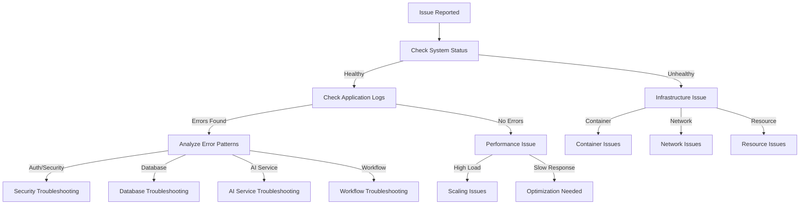

# GenericAiAgents - Troubleshooting Playbook

This comprehensive troubleshooting guide provides systematic approaches to diagnose and resolve common issues in GenericAiAgents-based applications. Each section includes symptoms, root causes, diagnostic steps, and proven solutions.

## Table of Contents

1. [Quick Diagnostic Framework](#quick-diagnostic-framework)
2. [Common Startup Issues](#common-startup-issues)
3. [AI Service Integration Problems](#ai-service-integration-problems)
4. [Database & Connection Issues](#database--connection-issues)
5. [Security & Authentication Failures](#security--authentication-failures)
6. [Performance & Scaling Issues](#performance--scaling-issues)
7. [Workflow Engine Problems](#workflow-engine-problems)
8. [Monitoring & Observability Issues](#monitoring--observability-issues)
9. [Container & Deployment Issues](#container--deployment-issues)
10. [Emergency Response Procedures](#emergency-response-procedures)

## Quick Diagnostic Framework

### Initial Triage Process



### Essential Diagnostic Commands

```bash
#!/bin/bash
# diagnostic-toolkit.sh - Essential troubleshooting commands

echo "🔍 GenericAiAgents System Diagnostics"
echo "======================================"

# 1. System Health Overview
echo "📊 System Health Status:"
kubectl get pods -n genericagents-prod -o wide
kubectl top nodes
kubectl top pods -n genericagents-prod

# 2. Service Status
echo ""
echo "🔧 Service Status:"
curl -s http://api.genericagents.com/health | jq '.'
curl -s http://api.genericagents.com/health/ready | jq '.'

# 3. Recent Logs
echo ""
echo "📋 Recent Application Logs (Last 50 lines):"
kubectl logs -n genericagents-prod deployment/agent-api --tail=50

# 4. Resource Usage
echo ""
echo "📈 Resource Usage:"
kubectl describe nodes | grep -A 10 "Allocated resources"

# 5. Database Connectivity
echo ""
echo "🗄️ Database Status:"
kubectl exec -n genericagents-prod deployment/agent-api -- \
  dotnet run --project /app -- --check-database

# 6. AI Service Connectivity
echo ""
echo "🤖 AI Service Status:"
kubectl exec -n genericagents-prod deployment/agent-api -- \
  dotnet run --project /app -- --check-ai-services

# 7. Recent Events
echo ""
echo "⚡ Recent Kubernetes Events:"
kubectl get events -n genericagents-prod --sort-by='.lastTimestamp' | tail -10
```

### Health Check Verification

```csharp
// HealthCheckExtensions.cs - Advanced health diagnostics
public static class HealthCheckExtensions
{
    public static async Task<DetailedHealthReport> GetDetailedHealthAsync(
        this IHealthCheckService healthCheckService,
        CancellationToken cancellationToken = default)
    {
        var report = await healthCheckService.GetHealthReportAsync(cancellationToken);
        var detailedReport = new DetailedHealthReport
        {
            OverallStatus = report.Status.ToString(),
            TotalChecks = report.Entries.Count,
            HealthyChecks = report.Entries.Count(e => e.Value.Status == HealthStatus.Healthy),
            UnhealthyChecks = report.Entries.Count(e => e.Value.Status == HealthStatus.Unhealthy),
            DegradedChecks = report.Entries.Count(e => e.Value.Status == HealthStatus.Degraded),
            TotalCheckTime = report.TotalDuration,
            Timestamp = DateTime.UtcNow
        };

        detailedReport.CheckDetails = report.Entries.Select(entry => new HealthCheckDetail
        {
            Name = entry.Key,
            Status = entry.Value.Status.ToString(),
            Description = entry.Value.Description,
            Duration = entry.Value.Duration,
            Exception = entry.Value.Exception?.GetType().Name,
            ErrorMessage = entry.Value.Exception?.Message,
            Data = entry.Value.Data.ToDictionary(kvp => kvp.Key, kvp => kvp.Value?.ToString())
        }).ToList();

        return detailedReport;
    }
}

// Usage in controller for diagnostics
[HttpGet("health/detailed")]
[RequirePermission("system:diagnostics")]
public async Task<IActionResult> GetDetailedHealth()
{
    try
    {
        var detailedHealth = await _healthCheckService.GetDetailedHealthAsync();
        return Ok(detailedHealth);
    }
    catch (Exception ex)
    {
        _logger.LogError(ex, "Failed to get detailed health status");
        return StatusCode(500, new { error = "Health check system unavailable" });
    }
}
```

## Common Startup Issues

### Issue: Application Fails to Start

#### Symptoms
- Container restarts continuously
- "Application failed to start" errors
- Health checks failing immediately
- HTTP 503 Service Unavailable

#### Diagnostic Steps
```bash
# 1. Check container logs
kubectl logs -n genericagents-prod deployment/agent-api --previous

# 2. Check container events
kubectl describe pod -n genericagents-prod -l app=agent-api

# 3. Check resource limits
kubectl describe deployment -n genericagents-prod agent-api

# 4. Check configuration
kubectl get configmap -n genericagents-prod
kubectl get secret -n genericagents-prod
```

#### Common Root Causes & Solutions

##### 1. **Missing Configuration Values**
```bash
# Problem: Configuration values not set
Error: "Configuration key 'AI:ApiKey' not found"

# Solution: Verify configuration
kubectl get configmap app-config -n genericagents-prod -o yaml
kubectl get secret app-secrets -n genericagents-prod -o yaml

# Fix missing values
kubectl create secret generic app-secrets \
  --from-literal=ai-api-key="your-key" \
  --namespace=genericagents-prod
```

##### 2. **Database Connection Issues**
```csharp
// Enhanced startup diagnostics
public class StartupDiagnostics
{
    public static async Task ValidateStartupRequirements(IServiceProvider services, ILogger logger)
    {
        logger.LogInformation("🔍 Running startup diagnostics...");

        // Test database connection
        try
        {
            using var scope = services.CreateScope();
            var context = scope.ServiceProvider.GetRequiredService<AgentDbContext>();
            await context.Database.CanConnectAsync();
            logger.LogInformation("✅ Database connection successful");
        }
        catch (Exception ex)
        {
            logger.LogError(ex, "❌ Database connection failed: {Error}", ex.Message);
            throw new StartupException("Database connectivity check failed", ex);
        }

        // Test AI service connectivity
        try
        {
            using var scope = services.CreateScope();
            var aiService = scope.ServiceProvider.GetRequiredService<IAIService>();
            await aiService.HealthCheckAsync();
            logger.LogInformation("✅ AI service connection successful");
        }
        catch (Exception ex)
        {
            logger.LogError(ex, "❌ AI service connection failed: {Error}", ex.Message);
            throw new StartupException("AI service connectivity check failed", ex);
        }

        // Test secret manager
        try
        {
            using var scope = services.CreateScope();
            var secretManager = scope.ServiceProvider.GetRequiredService<ISecretManager>();
            await secretManager.GetSecretAsync("startup-test");
            logger.LogInformation("✅ Secret manager accessible");
        }
        catch (Exception ex)
        {
            logger.LogWarning("⚠️ Secret manager may have issues: {Error}", ex.Message);
        }

        logger.LogInformation("✅ Startup diagnostics completed successfully");
    }
}

// Add to Program.cs
public static async Task Main(string[] args)
{
    var app = builder.Build();
    
    // Run startup diagnostics in development
    if (app.Environment.IsDevelopment())
    {
        await StartupDiagnostics.ValidateStartupRequirements(app.Services, app.Logger);
    }
    
    await app.RunAsync();
}
```

##### 3. **Port Binding Issues**
```bash
# Problem: Port already in use
Error: "Unable to bind to https://localhost:8080"

# Solution: Check port usage
netstat -tulpn | grep 8080
lsof -i :8080

# Update port configuration
export ASPNETCORE_URLS="http://+:8081"
```

##### 4. **Resource Constraints**
```yaml
# Problem: Insufficient resources
resources:
  requests:
    memory: "512Mi"    # Too low for .NET applications
    cpu: "250m"        # Insufficient for startup

# Solution: Increase resource limits
resources:
  requests:
    memory: "1Gi"      # Minimum for .NET apps
    cpu: "500m"        # Sufficient for startup
  limits:
    memory: "2Gi"      # Allow for growth
    cpu: "1"           # Burst capacity
```

### Issue: Slow Application Startup

#### Symptoms
- Startup takes >60 seconds
- Health checks timeout during startup
- Users experience long wait times

#### Solutions
```csharp
// Optimize startup performance
public static class StartupOptimization
{
    public static WebApplication ConfigureOptimizedStartup(this WebApplication app)
    {
        // 1. Parallel service initialization
        var startupTasks = new List<Task>
        {
            InitializeDatabase(app.Services),
            WarmupAIService(app.Services),
            PreloadConfiguration(app.Services),
            InitializeCache(app.Services)
        };

        // Wait for all critical services
        Task.WaitAll(startupTasks.ToArray(), TimeSpan.FromSeconds(30));

        return app;
    }

    private static async Task InitializeDatabase(IServiceProvider services)
    {
        using var scope = services.CreateScope();
        var context = scope.ServiceProvider.GetRequiredService<AgentDbContext>();
        await context.Database.EnsureCreatedAsync();
    }

    private static async Task WarmupAIService(IServiceProvider services)
    {
        using var scope = services.CreateScope();
        var aiService = scope.ServiceProvider.GetRequiredService<IAIService>();
        // Warm up with a simple request
        await aiService.ProcessRequestAsync("warmup", CancellationToken.None);
    }
}
```

## AI Service Integration Problems

### Issue: AI API Rate Limiting

#### Symptoms
- "Rate limit exceeded" errors
- HTTP 429 responses
- Intermittent AI service failures
- Long response delays

#### Diagnostic Steps
```csharp
// AI Service Diagnostics
public class AIServiceDiagnostics
{
    private readonly IAIService _aiService;
    private readonly IMetricsCollector _metrics;
    private readonly ILogger<AIServiceDiagnostics> _logger;

    public async Task<AIServiceHealthReport> DiagnoseAIServiceAsync()
    {
        var report = new AIServiceHealthReport();
        
        try
        {
            // Test basic connectivity
            var stopwatch = Stopwatch.StartNew();
            await _aiService.ProcessRequestAsync("test", CancellationToken.None);
            stopwatch.Stop();
            
            report.ResponseTime = stopwatch.Elapsed;
            report.IsConnected = true;
            
            // Check rate limiting status
            report.RateLimitStatus = await CheckRateLimitStatus();
            
            // Check token usage
            report.TokenUsage = await GetTokenUsageStatus();
            
        }
        catch (HttpRequestException ex) when (ex.Message.Contains("429"))
        {
            report.IsRateLimited = true;
            report.ErrorMessage = "Rate limit exceeded";
            _logger.LogWarning("AI service rate limited: {Error}", ex.Message);
        }
        catch (Exception ex)
        {
            report.IsConnected = false;
            report.ErrorMessage = ex.Message;
            _logger.LogError(ex, "AI service diagnostic failed: {Error}", ex.Message);
        }

        return report;
    }

    private async Task<RateLimitStatus> CheckRateLimitStatus()
    {
        // Implementation varies by AI provider
        // For OpenAI, check headers from last response
        return new RateLimitStatus
        {
            RequestsRemaining = GetHeaderValue("x-ratelimit-remaining-requests"),
            TokensRemaining = GetHeaderValue("x-ratelimit-remaining-tokens"),
            ResetTime = GetHeaderValue("x-ratelimit-reset-requests")
        };
    }
}
```

#### Solutions

##### 1. **Implement Exponential Backoff**
```csharp
public class ResilientAIService : IAIService
{
    private readonly IAIService _innerService;
    private readonly ILogger<ResilientAIService> _logger;

    public async Task<AIResponse> ProcessRequestAsync(string prompt, CancellationToken cancellationToken)
    {
        var retryPolicy = Policy
            .Handle<HttpRequestException>(ex => ex.Message.Contains("429"))
            .Or<TaskCanceledException>()
            .WaitAndRetryAsync(
                retryCount: 5,
                sleepDurationProvider: retryAttempt => TimeSpan.FromSeconds(Math.Pow(2, retryAttempt)),
                onRetry: (outcome, timespan, retryCount, context) =>
                {
                    _logger.LogWarning("AI service retry {RetryCount} after {Delay}s due to: {Error}",
                        retryCount, timespan.TotalSeconds, outcome.Exception?.Message);
                });

        return await retryPolicy.ExecuteAsync(async () =>
        {
            return await _innerService.ProcessRequestAsync(prompt, cancellationToken);
        });
    }
}

// Register in DI container
services.Decorate<IAIService, ResilientAIService>();
```

##### 2. **Request Queue Management**
```csharp
public class QueuedAIService : IAIService
{
    private readonly SemaphoreSlim _requestSemaphore;
    private readonly IAIService _innerService;
    private readonly IMetricsCollector _metrics;

    public QueuedAIService(IAIService innerService, IConfiguration configuration, IMetricsCollector metrics)
    {
        _innerService = innerService;
        _metrics = metrics;
        var maxConcurrentRequests = configuration.GetValue<int>("AI:MaxConcurrentRequests", 5);
        _requestSemaphore = new SemaphoreSlim(maxConcurrentRequests, maxConcurrentRequests);
    }

    public async Task<AIResponse> ProcessRequestAsync(string prompt, CancellationToken cancellationToken)
    {
        using var activity = _metrics.StartActivity("ai-service-queued-request");
        
        // Wait for available slot
        await _requestSemaphore.WaitAsync(cancellationToken);
        try
        {
            _metrics.IncrementCounter("ai_service.concurrent_requests", 1);
            return await _innerService.ProcessRequestAsync(prompt, cancellationToken);
        }
        finally
        {
            _metrics.IncrementCounter("ai_service.concurrent_requests", -1);
            _requestSemaphore.Release();
        }
    }
}
```

##### 3. **Response Caching**
```csharp
public class CachedAIService : IAIService
{
    private readonly IAIService _innerService;
    private readonly IMemoryCache _cache;
    private readonly ILogger<CachedAIService> _logger;

    public async Task<AIResponse> ProcessRequestAsync(string prompt, CancellationToken cancellationToken)
    {
        var cacheKey = $"ai_response_{prompt.GetHashCode()}";
        
        if (_cache.TryGetValue(cacheKey, out AIResponse cachedResponse))
        {
            _logger.LogDebug("AI response served from cache for prompt hash: {Hash}", prompt.GetHashCode());
            return cachedResponse;
        }

        var response = await _innerService.ProcessRequestAsync(prompt, cancellationToken);
        
        // Cache successful responses for 1 hour
        if (response.IsSuccess)
        {
            _cache.Set(cacheKey, response, TimeSpan.FromHours(1));
        }

        return response;
    }
}
```

### Issue: AI Service Timeouts

#### Symptoms
- Requests timeout after 30+ seconds
- "Task was canceled" exceptions
- Workflow steps failing due to timeouts

#### Solutions
```csharp
// Configurable timeout with circuit breaker
public class TimeoutAwareAIService : IAIService
{
    private readonly IAIService _innerService;
    private readonly CircuitBreakerPolicy _circuitBreaker;
    private readonly IConfiguration _configuration;

    public TimeoutAwareAIService(IAIService innerService, IConfiguration configuration)
    {
        _innerService = innerService;
        _configuration = configuration;
        
        _circuitBreaker = Policy
            .Handle<TaskCanceledException>()
            .Or<TimeoutException>()
            .CircuitBreakerAsync(
                handledEventsAllowedBeforeBreaking: 5,
                durationOfBreak: TimeSpan.FromMinutes(2),
                onBreak: (exception, timespan) =>
                {
                    // Log circuit breaker opened
                },
                onReset: () =>
                {
                    // Log circuit breaker closed
                });
    }

    public async Task<AIResponse> ProcessRequestAsync(string prompt, CancellationToken cancellationToken)
    {
        var timeout = _configuration.GetValue<TimeSpan>("AI:RequestTimeout", TimeSpan.FromSeconds(60));
        
        using var timeoutCts = new CancellationTokenSource(timeout);
        using var combinedCts = CancellationTokenSource.CreateLinkedTokenSource(
            cancellationToken, timeoutCts.Token);

        return await _circuitBreaker.ExecuteAsync(async () =>
        {
            return await _innerService.ProcessRequestAsync(prompt, combinedCts.Token);
        });
    }
}
```

## Database & Connection Issues

### Issue: Database Connection Pool Exhaustion

#### Symptoms
- "Timeout expired. The timeout period elapsed..." errors
- High database CPU usage
- Slow query performance
- Connection refused errors

#### Diagnostic Steps
```sql
-- Check active connections
SELECT 
    state,
    COUNT(*) as connection_count
FROM pg_stat_activity 
WHERE datname = 'agents_production'
GROUP BY state;

-- Check long-running queries
SELECT 
    pid,
    now() - pg_stat_activity.query_start AS duration,
    query 
FROM pg_stat_activity 
WHERE (now() - pg_stat_activity.query_start) > interval '5 minutes'
AND state = 'active';

-- Check database locks
SELECT 
    blocked_locks.pid AS blocked_pid,
    blocked_activity.usename AS blocked_user,
    blocking_locks.pid AS blocking_pid,
    blocking_activity.usename AS blocking_user,
    blocked_activity.query AS blocked_statement,
    blocking_activity.query AS current_statement_in_blocking_process
FROM pg_catalog.pg_locks blocked_locks
    JOIN pg_catalog.pg_stat_activity blocked_activity ON blocked_activity.pid = blocked_locks.pid
    JOIN pg_catalog.pg_locks blocking_locks 
        ON blocking_locks.locktype = blocked_locks.locktype
        AND blocking_locks.database IS NOT DISTINCT FROM blocked_locks.database
        AND blocking_locks.relation IS NOT DISTINCT FROM blocked_locks.relation
        AND blocking_locks.pid != blocked_locks.pid
    JOIN pg_catalog.pg_stat_activity blocking_activity ON blocking_activity.pid = blocking_locks.pid
WHERE NOT blocked_locks.granted;
```

#### Solutions

##### 1. **Optimize Connection Pool Settings**
```json
{
  "ConnectionStrings": {
    "DefaultConnection": "Host=postgres;Database=agents_production;Username=app_user;Password=secret;Maximum Pool Size=20;Minimum Pool Size=5;Connection Idle Lifetime=30;Command Timeout=30;"
  }
}
```

##### 2. **Implement Connection Monitoring**
```csharp
public class DatabaseHealthCheck : IHealthCheck
{
    private readonly IDbConnection _connection;
    private readonly ILogger<DatabaseHealthCheck> _logger;

    public async Task<HealthCheckResult> CheckHealthAsync(HealthCheckContext context, CancellationToken cancellationToken = default)
    {
        try
        {
            var connectionTest = await TestConnectionAsync(cancellationToken);
            var performanceMetrics = await GetPerformanceMetricsAsync(cancellationToken);
            
            var data = new Dictionary<string, object>
            {
                ["connection_time_ms"] = connectionTest.ConnectionTime.TotalMilliseconds,
                ["active_connections"] = performanceMetrics.ActiveConnections,
                ["max_connections"] = performanceMetrics.MaxConnections,
                ["connection_usage_percent"] = (double)performanceMetrics.ActiveConnections / performanceMetrics.MaxConnections * 100
            };

            // Alert if connection usage is high
            if (data["connection_usage_percent"] is double usage && usage > 80)
            {
                return HealthCheckResult.Degraded("High database connection usage", null, data);
            }

            return HealthCheckResult.Healthy("Database is responsive", data);
        }
        catch (Exception ex)
        {
            _logger.LogError(ex, "Database health check failed");
            return HealthCheckResult.Unhealthy("Database connection failed", ex);
        }
    }
}
```

##### 3. **Query Optimization**
```csharp
public class OptimizedAgentRepository : IAgentRepository
{
    private readonly AgentDbContext _context;

    // Use async properly to avoid blocking threads
    public async Task<List<Agent>> GetActiveAgentsAsync(CancellationToken cancellationToken = default)
    {
        return await _context.Agents
            .Where(a => a.IsActive)
            .AsNoTracking() // Don't track changes for read-only operations
            .Take(1000) // Limit results to prevent large data loads
            .ToListAsync(cancellationToken);
    }

    // Use projection to reduce data transfer
    public async Task<List<AgentSummary>> GetAgentSummariesAsync(CancellationToken cancellationToken = default)
    {
        return await _context.Agents
            .Where(a => a.IsActive)
            .Select(a => new AgentSummary
            {
                Id = a.Id,
                Name = a.Name,
                Status = a.Status,
                LastActivity = a.LastActivity
            })
            .AsNoTracking()
            .ToListAsync(cancellationToken);
    }

    // Use batching for bulk operations
    public async Task UpdateAgentStatusesBatchAsync(List<AgentStatusUpdate> updates, CancellationToken cancellationToken = default)
    {
        const int batchSize = 100;
        
        for (int i = 0; i < updates.Count; i += batchSize)
        {
            var batch = updates.Skip(i).Take(batchSize);
            
            foreach (var update in batch)
            {
                _context.Entry(new Agent { Id = update.AgentId })
                    .Property(a => a.Status)
                    .CurrentValue = update.NewStatus;
                    
                _context.Entry(new Agent { Id = update.AgentId })
                    .Property(a => a.LastActivity)
                    .CurrentValue = DateTime.UtcNow;
            }
            
            await _context.SaveChangesAsync(cancellationToken);
            _context.ChangeTracker.Clear(); // Clear tracking to free memory
        }
    }
}
```

### Issue: Database Migration Failures

#### Symptoms
- Application won't start after deployment
- "Migration 'xyz' was not applied" errors
- Schema version mismatches

#### Diagnostic Steps
```bash
# Check migration status
kubectl exec -n genericagents-prod deployment/agent-api -- \
  dotnet ef database get-migrations

# Check current schema version
kubectl exec -n genericagents-prod deployment/postgres -- \
  psql -U app_user -d agents_production -c \
  "SELECT * FROM __EFMigrationsHistory ORDER BY migration_id DESC LIMIT 5;"
```

#### Solutions
```csharp
// Safe migration strategy
public static class DatabaseMigrationExtensions
{
    public static async Task<WebApplication> MigrateDatabaseSafelyAsync(this WebApplication app)
    {
        using var scope = app.Services.CreateScope();
        var context = scope.ServiceProvider.GetRequiredService<AgentDbContext>();
        var logger = scope.ServiceProvider.GetRequiredService<ILogger<Program>>();

        try
        {
            logger.LogInformation("🔄 Checking database migrations...");

            var pendingMigrations = await context.Database.GetPendingMigrationsAsync();
            if (pendingMigrations.Any())
            {
                logger.LogInformation("📝 Applying {Count} pending migrations: {Migrations}",
                    pendingMigrations.Count(), string.Join(", ", pendingMigrations));

                // Create backup before migration in production
                if (app.Environment.IsProduction())
                {
                    await CreateDatabaseBackupAsync(context, logger);
                }

                await context.Database.MigrateAsync();
                logger.LogInformation("✅ Database migrations completed successfully");
            }
            else
            {
                logger.LogInformation("✅ Database is up to date");
            }
        }
        catch (Exception ex)
        {
            logger.LogError(ex, "❌ Database migration failed: {Error}", ex.Message);
            
            // In production, don't start the app if migration fails
            if (app.Environment.IsProduction())
            {
                throw new InvalidOperationException("Database migration failed in production", ex);
            }
        }

        return app;
    }

    private static async Task CreateDatabaseBackupAsync(AgentDbContext context, ILogger logger)
    {
        try
        {
            var backupName = $"backup_before_migration_{DateTime.UtcNow:yyyyMMdd_HHmmss}";
            // Implementation depends on your backup strategy
            logger.LogInformation("💾 Created database backup: {BackupName}", backupName);
        }
        catch (Exception ex)
        {
            logger.LogWarning(ex, "⚠️ Failed to create database backup: {Error}", ex.Message);
        }
    }
}
```

## Security & Authentication Failures

### Issue: JWT Token Validation Failures

#### Symptoms
- Users getting 401 Unauthorized randomly
- "Invalid token" errors
- Authentication working intermittently

#### Diagnostic Steps
```csharp
public class JWTDiagnosticService
{
    public JWTValidationReport ValidateToken(string token)
    {
        var report = new JWTValidationReport();
        
        try
        {
            var tokenHandler = new JwtSecurityTokenHandler();
            var jsonToken = tokenHandler.ReadJwtToken(token);
            
            report.IsValid = true;
            report.Claims = jsonToken.Claims.ToDictionary(c => c.Type, c => c.Value);
            report.ExpiresAt = jsonToken.ValidTo;
            report.IsExpired = jsonToken.ValidTo < DateTime.UtcNow;
            report.Issuer = jsonToken.Issuer;
            report.Audience = string.Join(", ", jsonToken.Audiences);
            
            // Check clock skew
            var clockSkew = TimeSpan.FromMinutes(5);
            report.WillExpireSoon = jsonToken.ValidTo < DateTime.UtcNow.Add(clockSkew);
            
        }
        catch (Exception ex)
        {
            report.IsValid = false;
            report.ValidationError = ex.Message;
        }
        
        return report;
    }
}

// Diagnostic endpoint
[HttpPost("auth/validate-token")]
[RequirePermission("system:diagnostics")]
public IActionResult ValidateToken([FromBody] ValidateTokenRequest request)
{
    var report = _jwtDiagnosticService.ValidateToken(request.Token);
    return Ok(report);
}
```

#### Solutions

##### 1. **Clock Skew Handling**
```csharp
services.Configure<JwtBearerOptions>(JwtBearerDefaults.AuthenticationScheme, options =>
{
    options.TokenValidationParameters = new TokenValidationParameters
    {
        ValidateIssuerSigningKey = true,
        IssuerSigningKey = new SymmetricSecurityKey(key),
        ValidateIssuer = true,
        ValidIssuer = configuration["JWT:Issuer"],
        ValidateAudience = true,
        ValidAudience = configuration["JWT:Audience"],
        ValidateLifetime = true,
        ClockSkew = TimeSpan.FromMinutes(5), // Allow 5 minutes clock skew
        RequireExpirationTime = true
    };

    options.Events = new JwtBearerEvents
    {
        OnAuthenticationFailed = context =>
        {
            var logger = context.HttpContext.RequestServices.GetRequiredService<ILogger<Program>>();
            logger.LogWarning("JWT Authentication failed: {Error} for token {Token}",
                context.Exception.Message,
                context.Request.Headers.Authorization.ToString().Substring(0, 50) + "...");
            return Task.CompletedTask;
        },
        
        OnTokenValidated = context =>
        {
            var logger = context.HttpContext.RequestServices.GetRequiredService<ILogger<Program>>();
            var userId = context.Principal?.FindFirst(ClaimTypes.NameIdentifier)?.Value;
            logger.LogDebug("JWT token validated successfully for user: {UserId}", userId);
            return Task.CompletedTask;
        }
    };
});
```

##### 2. **Token Refresh Strategy**
```csharp
public class TokenRefreshService
{
    private readonly ITokenProvider _tokenProvider;
    private readonly IMemoryCache _cache;

    public async Task<string> EnsureValidTokenAsync(string currentToken)
    {
        // Check if token needs refresh (expires in less than 5 minutes)
        if (IsTokenNearExpiration(currentToken, TimeSpan.FromMinutes(5)))
        {
            var cacheKey = $"refreshed_token_{GetTokenHash(currentToken)}";
            
            if (_cache.TryGetValue(cacheKey, out string cachedToken))
            {
                return cachedToken;
            }

            var newToken = await _tokenProvider.RefreshTokenAsync(currentToken);
            _cache.Set(cacheKey, newToken, TimeSpan.FromMinutes(30));
            
            return newToken;
        }

        return currentToken;
    }
}
```

### Issue: Secret Management Failures

#### Symptoms
- "Secret not found" errors
- Configuration values showing as null
- Intermittent authentication failures

#### Diagnostic Steps
```bash
# Check secret availability
kubectl get secrets -n genericagents-prod
kubectl describe secret app-secrets -n genericagents-prod

# Test secret access from pod
kubectl exec -n genericagents-prod deployment/agent-api -- \
  printenv | grep -i secret
```

#### Solutions
```csharp
public class ResilientSecretManager : ISecretManager
{
    private readonly ISecretManager _primarySecretManager;
    private readonly ISecretManager _fallbackSecretManager;
    private readonly IMemoryCache _cache;
    private readonly ILogger<ResilientSecretManager> _logger;

    public async Task<string> GetSecretAsync(string secretName, CancellationToken cancellationToken = default)
    {
        // Try cache first
        var cacheKey = $"secret_{secretName}";
        if (_cache.TryGetValue(cacheKey, out string cachedSecret))
        {
            return cachedSecret;
        }

        // Try primary secret manager
        try
        {
            var secret = await _primarySecretManager.GetSecretAsync(secretName, cancellationToken);
            _cache.Set(cacheKey, secret, TimeSpan.FromMinutes(15)); // Cache for 15 minutes
            return secret;
        }
        catch (Exception ex)
        {
            _logger.LogWarning(ex, "Primary secret manager failed for {SecretName}, trying fallback", secretName);

            try
            {
                var secret = await _fallbackSecretManager.GetSecretAsync(secretName, cancellationToken);
                _cache.Set(cacheKey, secret, TimeSpan.FromMinutes(5)); // Shorter cache for fallback
                return secret;
            }
            catch (Exception fallbackEx)
            {
                _logger.LogError(fallbackEx, "Both primary and fallback secret managers failed for {SecretName}", secretName);
                throw new SecretNotFoundException($"Unable to retrieve secret '{secretName}' from any source", fallbackEx);
            }
        }
    }
}
```

## Performance & Scaling Issues

### Issue: High Memory Usage

#### Symptoms
- OutOfMemoryException errors
- Container getting killed (OOMKilled)
- Gradually increasing memory usage
- Slow garbage collection

#### Diagnostic Steps
```csharp
public class MemoryDiagnosticService
{
    public MemoryDiagnosticReport GetMemoryDiagnostics()
    {
        var process = Process.GetCurrentProcess();
        
        return new MemoryDiagnosticReport
        {
            WorkingSet = process.WorkingSet64,
            PrivateMemorySize = process.PrivateMemorySize64,
            VirtualMemorySize = process.VirtualMemorySize64,
            GCTotalMemory = GC.GetTotalMemory(false),
            GCTotalMemoryForced = GC.GetTotalMemory(true),
            Gen0Collections = GC.CollectionCount(0),
            Gen1Collections = GC.CollectionCount(1),
            Gen2Collections = GC.CollectionCount(2),
            ThreadCount = process.Threads.Count,
            HandleCount = process.HandleCount,
            Timestamp = DateTime.UtcNow
        };
    }
}
```

#### Solutions

##### 1. **Memory Optimization**
```csharp
public class MemoryOptimizedAgentService
{
    private readonly IMemoryCache _memoryCache;
    private readonly MemoryCacheEntryOptions _defaultCacheOptions;

    public MemoryOptimizedAgentService(IMemoryCache memoryCache)
    {
        _memoryCache = memoryCache;
        _defaultCacheOptions = new MemoryCacheEntryOptions
        {
            SlidingExpiration = TimeSpan.FromMinutes(30),
            Priority = CacheItemPriority.Normal,
            Size = 1 // Implement size-based eviction
        };
    }

    public async Task<AgentResult> ProcessWithMemoryManagementAsync(AgentRequest request)
    {
        // Force garbage collection if memory usage is high
        var beforeMemory = GC.GetTotalMemory(false);
        if (beforeMemory > 1_000_000_000) // 1GB threshold
        {
            GC.Collect();
            GC.WaitForPendingFinalizers();
            GC.Collect();
        }

        using var activity = Activity.StartActivity("ProcessAgent");
        
        try
        {
            // Process with memory-efficient patterns
            return await ProcessEfficientlyAsync(request);
        }
        finally
        {
            // Clean up any large objects
            if (request.Payload is IDisposable disposable)
            {
                disposable.Dispose();
            }
        }
    }
}

// Configure memory cache limits
services.Configure<MemoryCacheOptions>(options =>
{
    options.SizeLimit = 100_000; // Maximum 100,000 items
    options.CompactionPercentage = 0.2; // Remove 20% when limit reached
});
```

##### 2. **Connection Pooling Optimization**
```csharp
// Optimize HTTP client usage
services.AddHttpClient<AIServiceClient>(client =>
{
    client.Timeout = TimeSpan.FromSeconds(30);
})
.ConfigurePrimaryHttpMessageHandler(() => new HttpClientHandler
{
    MaxConnectionsPerServer = 10, // Limit concurrent connections
    PooledConnectionLifetime = TimeSpan.FromMinutes(5), // Recycle connections
    PooledConnectionIdleTimeout = TimeSpan.FromMinutes(2)
});

// Optimize database connection pooling
services.AddDbContext<AgentDbContext>(options =>
{
    options.UseNpgsql(connectionString, npgsqlOptions =>
    {
        npgsqlOptions.EnableRetryOnFailure(maxRetryCount: 3);
    });
}, ServiceLifetime.Scoped);
```

### Issue: High CPU Usage

#### Symptoms
- CPU consistently above 80%
- Slow response times
- Timeout errors under load
- Thread pool starvation

#### Solutions
```csharp
public class CpuOptimizedWorkflowEngine : IWorkflowEngine
{
    private readonly SemaphoreSlim _concurrencyLimiter;
    private readonly ILogger<CpuOptimizedWorkflowEngine> _logger;

    public CpuOptimizedWorkflowEngine(IConfiguration configuration, ILogger<CpuOptimizedWorkflowEngine> logger)
    {
        var maxConcurrency = Math.Max(1, Environment.ProcessorCount - 1); // Leave 1 CPU free
        _concurrencyLimiter = new SemaphoreSlim(maxConcurrency, maxConcurrency);
        _logger = logger;
    }

    public async Task<WorkflowResult> ExecuteWorkflowAsync(WorkflowDefinition workflow)
    {
        await _concurrencyLimiter.WaitAsync();
        try
        {
            // Use ConfigureAwait(false) to avoid context switching
            return await ExecuteWorkflowInternalAsync(workflow).ConfigureAwait(false);
        }
        finally
        {
            _concurrencyLimiter.Release();
        }
    }

    private async Task<WorkflowResult> ExecuteWorkflowInternalAsync(WorkflowDefinition workflow)
    {
        // Optimize parallel execution
        var parallelOptions = new ParallelOptions
        {
            MaxDegreeOfParallelism = Math.Max(1, Environment.ProcessorCount / 2),
            CancellationToken = CancellationToken.None
        };

        var results = new ConcurrentBag<StepResult>();

        await Parallel.ForEachAsync(workflow.Steps, parallelOptions, async (step, ct) =>
        {
            var result = await ExecuteStepAsync(step, ct);
            results.Add(result);
        });

        return new WorkflowResult { StepResults = results.ToList() };
    }
}
```

## Workflow Engine Problems

### Issue: Workflow Steps Failing

#### Symptoms
- Individual workflow steps timeout or fail
- Workflows stuck in "running" state
- Step dependencies not executing correctly

#### Diagnostic Tools
```csharp
public class WorkflowDiagnosticService
{
    public async Task<WorkflowDiagnosticReport> DiagnoseWorkflowAsync(Guid workflowId)
    {
        var workflow = await _workflowRepository.GetWorkflowAsync(workflowId);
        var report = new WorkflowDiagnosticReport
        {
            WorkflowId = workflowId,
            Status = workflow.Status,
            CreatedAt = workflow.CreatedAt,
            LastUpdated = workflow.LastUpdated,
            TotalSteps = workflow.Steps.Count,
            CompletedSteps = workflow.Steps.Count(s => s.Status == StepStatus.Completed),
            FailedSteps = workflow.Steps.Count(s => s.Status == StepStatus.Failed),
            PendingSteps = workflow.Steps.Count(s => s.Status == StepStatus.Pending)
        };

        // Analyze step failures
        var failedSteps = workflow.Steps.Where(s => s.Status == StepStatus.Failed);
        foreach (var step in failedSteps)
        {
            report.StepDiagnostics.Add(new StepDiagnostic
            {
                StepName = step.Name,
                Status = step.Status.ToString(),
                ErrorMessage = step.ErrorMessage,
                ExecutionTime = step.ExecutionTime,
                RetryCount = step.RetryCount,
                LastAttempt = step.LastAttempt,
                DependenciesMet = CheckDependenciesMet(step, workflow.Steps)
            });
        }

        return report;
    }

    private bool CheckDependenciesMet(WorkflowStep step, List<WorkflowStep> allSteps)
    {
        if (step.DependsOn == null || !step.DependsOn.Any())
            return true;

        return step.DependsOn.All(dependency =>
            allSteps.Any(s => s.Name == dependency && s.Status == StepStatus.Completed));
    }
}
```

#### Solutions
```csharp
public class ResilientWorkflowEngine : IWorkflowEngine
{
    public async Task<WorkflowResult> ExecuteWorkflowAsync(WorkflowDefinition workflow)
    {
        using var activity = Activity.StartActivity("ExecuteWorkflow");
        activity?.SetTag("workflow.id", workflow.Id.ToString());
        activity?.SetTag("workflow.name", workflow.Name);

        try
        {
            // Validate workflow before execution
            var validationResult = await ValidateWorkflowAsync(workflow);
            if (!validationResult.IsValid)
            {
                return WorkflowResult.CreateError(workflow.Id, $"Workflow validation failed: {string.Join(", ", validationResult.Errors)}");
            }

            // Execute with timeout and cancellation
            using var workflowCts = new CancellationTokenSource(TimeSpan.FromMinutes(30));
            return await ExecuteWorkflowWithTimeoutAsync(workflow, workflowCts.Token);
        }
        catch (Exception ex)
        {
            _logger.LogError(ex, "Workflow {WorkflowId} execution failed: {Error}", workflow.Id, ex.Message);
            activity?.SetStatus(ActivityStatusCode.Error, ex.Message);
            return WorkflowResult.CreateError(workflow.Id, ex.Message);
        }
    }

    private async Task<WorkflowValidationResult> ValidateWorkflowAsync(WorkflowDefinition workflow)
    {
        var result = new WorkflowValidationResult { IsValid = true };

        // Check for circular dependencies
        if (HasCircularDependencies(workflow.Steps))
        {
            result.IsValid = false;
            result.Errors.Add("Circular dependencies detected in workflow steps");
        }

        // Check for missing dependencies
        var missingDeps = FindMissingDependencies(workflow.Steps);
        if (missingDeps.Any())
        {
            result.IsValid = false;
            result.Errors.Add($"Missing dependencies: {string.Join(", ", missingDeps)}");
        }

        // Validate agent types exist
        foreach (var step in workflow.Steps)
        {
            var agentExists = await _agentRegistry.AgentExistsAsync(step.AgentType);
            if (!agentExists)
            {
                result.IsValid = false;
                result.Errors.Add($"Agent type '{step.AgentType}' not found for step '{step.Name}'");
            }
        }

        return result;
    }
}
```

## Emergency Response Procedures

### Critical System Failure

#### Immediate Actions (First 5 minutes)
```bash
#!/bin/bash
# emergency-response.sh - Critical failure response

echo "🚨 EMERGENCY RESPONSE ACTIVATED"
echo "================================"

# 1. Check system status
echo "📊 System Status:"
kubectl get pods -n genericagents-prod -o wide
kubectl get nodes -o wide

# 2. Scale up if needed
echo "🔄 Scaling application:"
kubectl scale deployment agent-api -n genericagents-prod --replicas=5

# 3. Check resource constraints
echo "📈 Resource Check:"
kubectl top nodes
kubectl describe nodes | grep -A 5 "Allocated resources"

# 4. Recent events
echo "⚡ Recent Events:"
kubectl get events -n genericagents-prod --sort-by='.lastTimestamp' | tail -20

# 5. Check external dependencies
echo "🔗 External Dependencies:"
kubectl exec -n genericagents-prod deployment/agent-api -- \
  curl -f -m 5 https://api.openai.com/v1/models || echo "AI Service DOWN"

# 6. Database health
echo "🗄️ Database Status:"
kubectl exec -n genericagents-prod deployment/postgres -- \
  pg_isready -U app_user -d agents_production || echo "Database DOWN"

echo "✅ Emergency diagnosis complete"
```

#### Escalation Matrix

| Severity | Response Time | Actions | Notification |
|----------|---------------|---------|--------------|
| **P0 - Critical** | < 5 minutes | • Immediate mitigation<br>• Page on-call<br>• Scale resources | • SMS to all engineers<br>• Slack #incidents<br>• Customer status page |
| **P1 - High** | < 15 minutes | • Investigate and fix<br>• Monitor closely<br>• Prepare rollback | • Slack #alerts<br>• Email to team |
| **P2 - Medium** | < 1 hour | • Schedule fix<br>• Document issue<br>• Monitor trends | • Slack notification |

#### Rollback Procedures
```bash
#!/bin/bash
# rollback.sh - Emergency rollback procedure

NAMESPACE="genericagents-prod"
PREVIOUS_VERSION=${1:-"previous"}

echo "🔄 EMERGENCY ROLLBACK INITIATED"
echo "================================"

# 1. Rollback deployment
echo "📦 Rolling back deployment..."
kubectl rollout undo deployment/agent-api -n $NAMESPACE --to-revision=$PREVIOUS_VERSION

# 2. Wait for rollback to complete
echo "⏳ Waiting for rollback..."
kubectl rollout status deployment/agent-api -n $NAMESPACE --timeout=300s

# 3. Verify health
echo "🏥 Health check..."
sleep 30
kubectl exec -n $NAMESPACE deployment/agent-api -- \
  curl -f http://localhost:8080/health || {
    echo "❌ Health check failed after rollback!"
    exit 1
}

# 4. Scale up if needed
echo "📈 Scaling up..."
kubectl scale deployment agent-api -n $NAMESPACE --replicas=3

echo "✅ Rollback completed successfully"
```

### Performance Degradation

#### Quick Performance Boost
```bash
#!/bin/bash
# performance-boost.sh

echo "⚡ PERFORMANCE BOOST ACTIVATED"

# 1. Scale up application instances
kubectl scale deployment agent-api -n genericagents-prod --replicas=6

# 2. Scale up database connections
kubectl patch deployment agent-api -n genericagents-prod -p \
  '{"spec":{"template":{"spec":{"containers":[{"name":"agent-api","env":[{"name":"ConnectionStrings__DefaultConnection","value":"...;Maximum Pool Size=50;"}]}]}}}}'

# 3. Enable aggressive caching
kubectl patch configmap app-config -n genericagents-prod -p \
  '{"data":{"Cache__AggressiveMode":"true","Cache__TTLMinutes":"60"}}'

# 4. Restart pods to pick up new config
kubectl rollout restart deployment/agent-api -n genericagents-prod

echo "✅ Performance boost applied"
```

This troubleshooting playbook provides systematic approaches to identify and resolve common issues in GenericAiAgents deployments. Each section includes actionable diagnostic steps and proven solutions based on real-world scenarios.