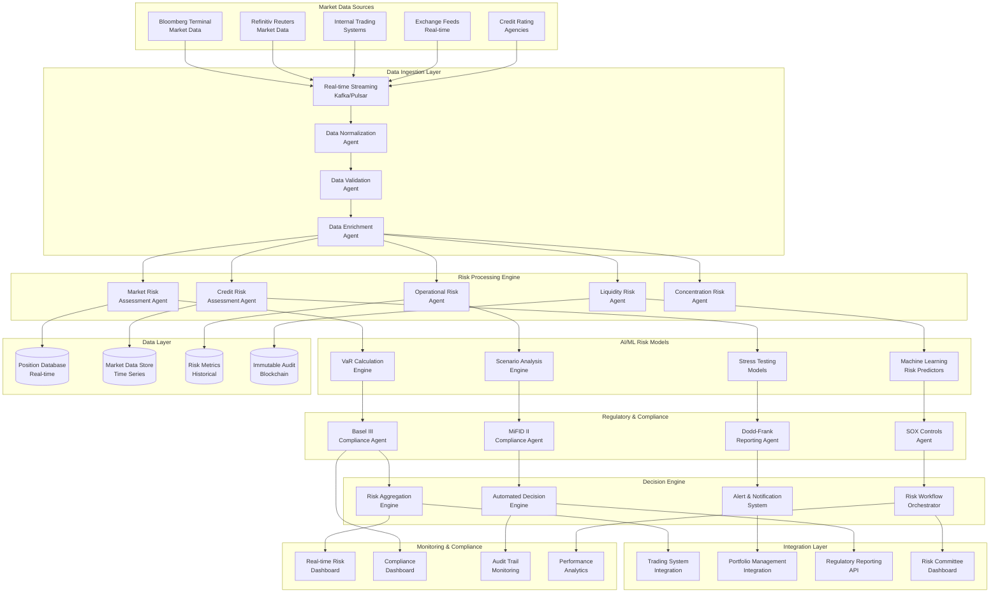
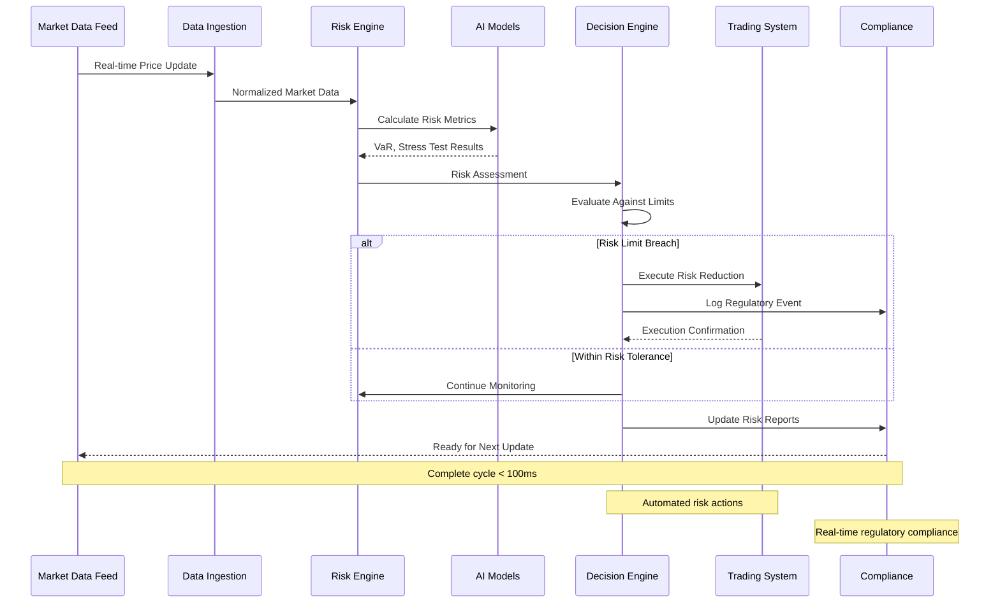

# Financial Risk Assessment Platform - Advanced Implementation Scenario

This scenario demonstrates a comprehensive financial risk assessment platform built with GenericAiAgents, featuring real-time market data processing, regulatory compliance, automated decision making, and integration with banking and trading systems.

## Table of Contents

1. [Business Context & Requirements](#business-context--requirements)
2. [Architecture Design](#architecture-design)
3. [Implementation Details](#implementation-details)
4. [Regulatory Compliance Implementation](#regulatory-compliance-implementation)
5. [Real-Time Risk Processing](#real-time-risk-processing)
6. [Production Deployment](#production-deployment)
7. [Testing & Validation](#testing--validation)
8. [Operational Excellence](#operational-excellence)

## Business Context & Requirements

### Financial Industry Challenge

Financial institutions must continuously assess and manage risk across portfolios, trading positions, credit exposures, and market conditions. Manual risk assessment processes are too slow for today's high-frequency markets, and regulatory requirements demand real-time monitoring and automated reporting.

### Business Objectives

- **Real-Time Risk Assessment**: Monitor and assess risk across all positions in real-time
- **Regulatory Compliance**: Ensure compliance with Basel III, Dodd-Frank, MiFID II, and other regulations
- **Automated Decision Making**: Enable automated risk-based decisions for trading and lending
- **Risk Mitigation**: Proactively identify and mitigate potential risks before they materialize
- **Cost Reduction**: Reduce manual risk assessment overhead and improve capital efficiency

### Success Metrics

| Metric | Current State | Target State | Business Impact |
|--------|---------------|--------------|-----------------|
| **Risk Assessment Time** | 4-6 hours | < 5 minutes | 99% time reduction |
| **Market Risk Coverage** | 60% positions | 100% positions | Complete risk visibility |
| **False Positive Rate** | 35% | < 5% | Reduced alert fatigue |
| **Regulatory Reporting** | Manual, 2-3 days | Automated, real-time | Compliance efficiency |
| **Capital Efficiency** | 75% | 90%+ | $50M+ capital savings |

### Technical Requirements

#### Functional Requirements
- Process real-time market data feeds (Bloomberg, Reuters, internal systems)
- Calculate multiple risk metrics (VaR, Expected Shortfall, Stress Tests)
- Monitor credit, market, operational, and liquidity risks
- Generate regulatory reports automatically
- Integrate with trading systems for position management
- Provide real-time dashboards and alerts
- Support multiple asset classes and geographies

#### Non-Functional Requirements
- **Performance**: Process 1M+ market data points/second with < 100ms latency
- **Availability**: 99.99% uptime during market hours
- **Scalability**: Handle 10x data volume spikes during volatile markets  
- **Security**: Zero-trust architecture with end-to-end encryption
- **Compliance**: SOX, PCI DSS, regulatory audit trails
- **Data Integrity**: Immutable audit logs with cryptographic verification

## Architecture Design

### High-Level System Architecture



### Real-Time Risk Processing Flow



## Implementation Details

### Core Risk Assessment Agents

#### Market Risk Assessment Agent

```csharp
using Agent.Core;
using Agent.AI;
using Agent.Observability;
using System.Numerics;

[Agent("market-risk-assessment")]
[Description("Real-time market risk assessment with VaR calculation and stress testing")]
public class MarketRiskAssessmentAgent : BaseAgent
{
    private readonly IMarketDataService _marketDataService;
    private readonly IRiskModelService _riskModelService;
    private readonly IAIService _aiService;
    private readonly IMetricsCollector _metrics;
    private readonly IAuditLogger _auditLogger;
    private readonly IPositionService _positionService;
    private readonly IRegulatoryReportingService _regulatoryService;

    public MarketRiskAssessmentAgent(
        IMarketDataService marketDataService,
        IRiskModelService riskModelService,
        IAIService aiService,
        IMetricsCollector metrics,
        IAuditLogger auditLogger,
        IPositionService positionService,
        IRegulatoryReportingService regulatoryService)
    {
        _marketDataService = marketDataService;
        _riskModelService = riskModelService;
        _aiService = aiService;
        _metrics = metrics;
        _auditLogger = auditLogger;
        _positionService = positionService;
        _regulatoryService = regulatoryService;
    }

    public override async Task<AgentResult> ExecuteAsync(AgentRequest request, CancellationToken cancellationToken = default)
    {
        using var activity = _metrics.StartActivity("market-risk-assessment");
        var stopwatch = Stopwatch.StartNew();

        try
        {
            var riskRequest = JsonSerializer.Deserialize<MarketRiskAssessmentRequest>(request.Payload?.ToString() ?? "{}");
            
            // Audit log the risk assessment initiation
            await _auditLogger.LogAsync(new FinancialAuditEvent
            {
                EventType = "MarketRiskAssessmentStarted",
                PortfolioId = riskRequest.PortfolioId,
                TraderId = riskRequest.TraderId,
                AssessmentType = riskRequest.AssessmentType,
                Timestamp = DateTime.UtcNow,
                RegulatoryContext = riskRequest.RegulatoryContext
            });

            // Step 1: Gather current portfolio positions
            var positions = await _positionService.GetPositionsAsync(riskRequest.PortfolioId, cancellationToken);

            // Step 2: Collect real-time market data
            var marketData = await CollectMarketData(positions, cancellationToken);

            // Step 3: Calculate Value at Risk (VaR) using multiple methodologies
            var varCalculations = await CalculateValueAtRisk(positions, marketData, riskRequest, cancellationToken);

            // Step 4: Perform stress testing scenarios
            var stressTestResults = await PerformStressTesting(positions, marketData, riskRequest, cancellationToken);

            // Step 5: AI-powered risk scenario analysis
            var scenarioAnalysis = await PerformAIScenarioAnalysis(positions, marketData, riskRequest, cancellationToken);

            // Step 6: Calculate risk concentration metrics
            var concentrationRisk = await CalculateConcentrationRisk(positions, marketData, cancellationToken);

            // Step 7: Assess liquidity risk
            var liquidityRisk = await AssessLiquidityRisk(positions, marketData, cancellationToken);

            // Step 8: Generate comprehensive risk assessment
            var riskAssessment = new MarketRiskAssessmentResult
            {
                PortfolioId = riskRequest.PortfolioId,
                AssessmentTimestamp = DateTime.UtcNow,
                ValueAtRisk = varCalculations,
                StressTestResults = stressTestResults,
                ScenarioAnalysis = scenarioAnalysis,
                ConcentrationRisk = concentrationRisk,
                LiquidityRisk = liquidityRisk,
                RiskLimitBreaches = await CheckRiskLimits(varCalculations, stressTestResults, riskRequest),
                RegulatoryCompliance = await AssessRegulatoryCompliance(varCalculations, riskRequest),
                RecommendedActions = await GenerateRiskRecommendations(varCalculations, stressTestResults, scenarioAnalysis)
            };

            // Step 9: Record detailed metrics
            await RecordRiskMetrics(riskAssessment, stopwatch.ElapsedMilliseconds);

            // Step 10: Trigger automated actions if risk limits breached
            if (riskAssessment.RiskLimitBreaches.Any())
            {
                await TriggerRiskMitigationActions(riskAssessment, cancellationToken);
            }

            // Step 11: Update regulatory reporting
            await _regulatoryService.UpdateRiskReportsAsync(riskAssessment, cancellationToken);

            return AgentResult.CreateSuccess(riskAssessment, stopwatch.Elapsed);
        }
        catch (Exception ex)
        {
            await _auditLogger.LogAsync(new FinancialAuditEvent
            {
                EventType = "MarketRiskAssessmentError",
                ErrorMessage = ex.Message,
                StackTrace = ex.StackTrace,
                Timestamp = DateTime.UtcNow
            });

            _metrics.IncrementCounter("market_risk_assessment.errors", 1);
            activity.SetError($"Market risk assessment failed: {ex.Message}", ex);
            return AgentResult.CreateError($"Market risk assessment failed: {ex.Message}", stopwatch.Elapsed);
        }
    }

    private async Task<VaRCalculationResult> CalculateValueAtRisk(
        List<Position> positions, 
        MarketDataSnapshot marketData, 
        MarketRiskAssessmentRequest request,
        CancellationToken cancellationToken)
    {
        // Calculate VaR using multiple methodologies for validation
        var tasks = new[]
        {
            CalculateHistoricalVaR(positions, marketData, request.VaRParameters, cancellationToken),
            CalculateParametricVaR(positions, marketData, request.VaRParameters, cancellationToken),
            CalculateMonteCarloVaR(positions, marketData, request.VaRParameters, cancellationToken)
        };

        var results = await Task.WhenAll(tasks);

        // Use AI to analyze and reconcile different VaR methodologies
        var reconciliationPrompt = $@"
            Analyze these Value at Risk calculations from different methodologies:
            
            Historical VaR (250-day lookback):
            - 95% Confidence: ${results[0].VaR95:N0}
            - 99% Confidence: ${results[0].VaR99:N0}
            - Expected Shortfall: ${results[0].ExpectedShortfall:N0}
            
            Parametric VaR (variance-covariance):
            - 95% Confidence: ${results[1].VaR95:N0}
            - 99% Confidence: ${results[1].VaR99:N0}
            - Expected Shortfall: ${results[1].ExpectedShortfall:N0}
            
            Monte Carlo VaR (10,000 simulations):
            - 95% Confidence: ${results[2].VaR95:N0}
            - 99% Confidence: ${results[2].VaR99:N0}
            - Expected Shortfall: ${results[2].ExpectedShortfall:N0}
            
            Portfolio Characteristics:
            - Total Value: ${positions.Sum(p => p.MarketValue):N0}
            - Number of Positions: {positions.Count}
            - Asset Classes: {string.Join(", ", positions.Select(p => p.AssetClass).Distinct())}
            - Currencies: {string.Join(", ", positions.Select(p => p.Currency).Distinct())}
            
            Provide analysis:
            1. Methodology reconciliation and variance explanation
            2. Recommended VaR figure for risk reporting
            3. Model risk assessment
            4. Key risk drivers identification
            5. Confidence level in the calculations
            
            Format as JSON with reasoning and recommendations.
        ";

        var aiResponse = await _aiService.ProcessRequestAsync(reconciliationPrompt, cancellationToken);
        var analysis = JsonSerializer.Deserialize<VaRAnalysisResponse>(aiResponse.Content);

        return new VaRCalculationResult
        {
            HistoricalVaR = results[0],
            ParametricVaR = results[1],
            MonteCarloVaR = results[2],
            RecommendedVaR = DetermineRecommendedVaR(results, analysis),
            ModelRiskAssessment = analysis?.ModelRiskAssessment ?? "Unable to assess",
            KeyRiskDrivers = analysis?.KeyRiskDrivers ?? new List<string>(),
            CalculationConfidence = analysis?.ConfidenceLevel ?? 0.8
        };
    }

    private async Task<StressTestResult> PerformStressTesting(
        List<Position> positions,
        MarketDataSnapshot marketData,
        MarketRiskAssessmentRequest request,
        CancellationToken cancellationToken)
    {
        // Define stress test scenarios
        var scenarios = new[]
        {
            // Historical scenarios
            new StressScenario { Name = "COVID-19 Market Crash", Type = "Historical", Date = new DateTime(2020, 3, 1) },
            new StressScenario { Name = "2008 Financial Crisis", Type = "Historical", Date = new DateTime(2008, 9, 15) },
            new StressScenario { Name = "Dot-com Crash", Type = "Historical", Date = new DateTime(2000, 3, 10) },
            
            // Hypothetical scenarios
            new StressScenario { Name = "Interest Rate Shock (+300bp)", Type = "Hypothetical" },
            new StressScenario { Name = "Credit Spread Widening (+500bp)", Type = "Hypothetical" },
            new StressScenario { Name = "Currency Crisis (25% USD strengthening)", Type = "Hypothetical" },
            new StressScenario { Name = "Liquidity Crisis (50% volume reduction)", Type = "Hypothetical" },
            
            // AI-generated scenarios
            await GenerateAIStressScenarios(marketData, positions, cancellationToken)
        };

        var stressResults = new List<IndividualStressResult>();

        // Execute stress tests in parallel
        var stressTasks = scenarios.Take(10).Select(async scenario => // Limit to top 10 scenarios
        {
            try
            {
                var stressedMarketData = await ApplyStressScenario(marketData, scenario, cancellationToken);
                var portfolioValue = await _riskModelService.RevaluePortfolioAsync(positions, stressedMarketData, cancellationToken);
                var currentValue = positions.Sum(p => p.MarketValue);
                
                return new IndividualStressResult
                {
                    ScenarioName = scenario.Name,
                    ScenarioType = scenario.Type,
                    CurrentPortfolioValue = currentValue,
                    StressedPortfolioValue = portfolioValue,
                    PnLImpact = portfolioValue - currentValue,
                    PnLPercentage = ((portfolioValue - currentValue) / currentValue) * 100,
                    ExecutionTimeMs = stopwatch.ElapsedMilliseconds
                };
            }
            catch (Exception ex)
            {
                _logger.LogWarning(ex, "Stress test failed for scenario {ScenarioName}", scenario.Name);
                return new IndividualStressResult
                {
                    ScenarioName = scenario.Name,
                    ScenarioType = scenario.Type,
                    Error = ex.Message
                };
            }
        });

        var results = await Task.WhenAll(stressTasks);
        stressResults.AddRange(results.Where(r => r.Error == null));

        // Analyze stress test results with AI
        var stressAnalysisPrompt = $@"
            Analyze these stress test results for portfolio risk assessment:
            
            {JsonSerializer.Serialize(stressResults.Take(10), new JsonSerializerOptions { WriteIndented = true })}
            
            Provide comprehensive stress test analysis:
            
            1. **Worst-Case Scenario Analysis**
               - Identify most damaging scenario
               - Quantify maximum potential loss
               - Assess probability of occurrence
            
            2. **Risk Concentration Analysis**
               - Identify scenarios with similar impacts
               - Highlight concentrated risk exposures
               - Assess diversification effectiveness
            
            3. **Tail Risk Assessment**
               - Evaluate extreme loss scenarios
               - Assess fat-tail risk characteristics
               - Compare to VaR estimates
            
            4. **Scenario Correlation Analysis**
               - Identify correlated stress scenarios
               - Assess compound risk scenarios
               - Evaluate scenario dependencies
            
            5. **Risk Mitigation Recommendations**
               - Suggest hedging strategies
               - Recommend position adjustments
               - Propose risk limits
            
            Format as structured JSON with quantitative analysis and actionable insights.
        ";

        var analysisResponse = await _aiService.ProcessRequestAsync(stressAnalysisPrompt, cancellationToken);
        var stressAnalysis = JsonSerializer.Deserialize<StressTestAnalysisResponse>(analysisResponse.Content);

        return new StressTestResult
        {
            IndividualResults = stressResults,
            WorstCaseScenario = stressResults.OrderBy(r => r.PnLImpact).FirstOrDefault(),
            AverageStressLoss = stressResults.Average(r => r.PnLImpact),
            MaximumStressLoss = stressResults.Min(r => r.PnLImpact),
            StressTestAnalysis = stressAnalysis,
            RiskMitigationRecommendations = stressAnalysis?.RiskMitigationRecommendations ?? new List<string>()
        };
    }

    private async Task<StressScenario> GenerateAIStressScenarios(
        MarketDataSnapshot marketData,
        List<Position> positions,
        CancellationToken cancellationToken)
    {
        // Use AI to generate contextual stress scenarios based on current market conditions
        var scenarioPrompt = $@"
            Generate a realistic stress scenario based on current market conditions:
            
            Current Market Environment:
            - VIX Level: {marketData.VolatilityIndex}
            - Term Structure Slope: {marketData.YieldCurveSlope}
            - Credit Spreads: {marketData.CreditSpreads}
            - Currency Volatility: {marketData.CurrencyVolatility}
            
            Portfolio Characteristics:
            - Primary Asset Classes: {string.Join(", ", positions.GroupBy(p => p.AssetClass).OrderByDescending(g => g.Count()).Take(3).Select(g => g.Key))}
            - Geographic Exposure: {string.Join(", ", positions.GroupBy(p => p.Country).OrderByDescending(g => g.Count()).Take(3).Select(g => g.Key))}
            - Sector Concentration: {string.Join(", ", positions.GroupBy(p => p.Sector).OrderByDescending(g => g.Count()).Take(3).Select(g => g.Key))}
            
            Create a plausible stress scenario that could impact this portfolio within the next 6-12 months:
            
            1. Scenario narrative and trigger events
            2. Specific market movements (equity, bond, FX, commodity)
            3. Expected duration and severity
            4. Secondary and tertiary effects
            5. Historical precedents or analogies
            
            Focus on scenarios that could specifically impact the portfolio's primary exposures.
            Format as structured scenario definition with specific shock parameters.
        ";

        var scenarioResponse = await _aiService.ProcessRequestAsync(scenarioPrompt, cancellationToken);
        var generatedScenario = JsonSerializer.Deserialize<AIGeneratedStressScenario>(scenarioResponse.Content);

        return new StressScenario
        {
            Name = generatedScenario?.ScenarioName ?? "AI Generated Scenario",
            Type = "AI-Generated",
            Description = generatedScenario?.Description ?? "AI-generated stress scenario",
            MarketShocks = generatedScenario?.MarketShocks ?? new Dictionary<string, double>(),
            Probability = generatedScenario?.Probability ?? 0.1,
            TimeHorizon = generatedScenario?.TimeHorizonMonths ?? 6
        };
    }

    private async Task<List<RiskLimitBreach>> CheckRiskLimits(
        VaRCalculationResult varResult,
        StressTestResult stressResult,
        MarketRiskAssessmentRequest request)
    {
        var breaches = new List<RiskLimitBreach>();

        // Check VaR limits
        if (varResult.RecommendedVaR.VaR99 > request.RiskLimits.MaxVaR99)
        {
            breaches.Add(new RiskLimitBreach
            {
                LimitType = "VaR_99",
                CurrentValue = varResult.RecommendedVaR.VaR99,
                LimitValue = request.RiskLimits.MaxVaR99,
                BreachPercentage = ((varResult.RecommendedVaR.VaR99 - request.RiskLimits.MaxVaR99) / request.RiskLimits.MaxVaR99) * 100,
                Severity = DetermineSeverity(varResult.RecommendedVaR.VaR99, request.RiskLimits.MaxVaR99)
            });
        }

        // Check stress test limits
        if (Math.Abs(stressResult.MaximumStressLoss) > request.RiskLimits.MaxStressLoss)
        {
            breaches.Add(new RiskLimitBreach
            {
                LimitType = "StressTest",
                CurrentValue = Math.Abs(stressResult.MaximumStressLoss),
                LimitValue = request.RiskLimits.MaxStressLoss,
                BreachPercentage = ((Math.Abs(stressResult.MaximumStressLoss) - request.RiskLimits.MaxStressLoss) / request.RiskLimits.MaxStressLoss) * 100,
                Severity = DetermineSeverity(Math.Abs(stressResult.MaximumStressLoss), request.RiskLimits.MaxStressLoss),
                ScenarioName = stressResult.WorstCaseScenario?.ScenarioName
            });
        }

        return breaches;
    }
}

// Supporting Models and Services
public class MarketRiskAssessmentRequest
{
    public string PortfolioId { get; set; } = string.Empty;
    public string TraderId { get; set; } = string.Empty;
    public string AssessmentType { get; set; } = "Standard";
    public VaRParameters VaRParameters { get; set; } = new();
    public RiskLimits RiskLimits { get; set; } = new();
    public string RegulatoryContext { get; set; } = "Basel III";
    public bool IncludeStressTesting { get; set; } = true;
    public bool IncludeScenarioAnalysis { get; set; } = true;
}

public class VaRParameters
{
    public double ConfidenceLevel95 { get; set; } = 0.95;
    public double ConfidenceLevel99 { get; set; } = 0.99;
    public int HoldingPeriodDays { get; set; } = 1;
    public int HistoricalWindowDays { get; set; } = 250;
    public int MonteCarloSimulations { get; set; } = 10000;
}

public class RiskLimits
{
    public decimal MaxVaR95 { get; set; } = 1000000;
    public decimal MaxVaR99 { get; set; } = 1500000;
    public decimal MaxStressLoss { get; set; } = 5000000;
    public double MaxConcentrationPercent { get; set; } = 10.0;
    public double MinLiquidityRatio { get; set; } = 0.7;
}

public class MarketRiskAssessmentResult
{
    public string PortfolioId { get; set; } = string.Empty;
    public DateTime AssessmentTimestamp { get; set; }
    public VaRCalculationResult ValueAtRisk { get; set; } = new();
    public StressTestResult StressTestResults { get; set; } = new();
    public ScenarioAnalysisResult ScenarioAnalysis { get; set; } = new();
    public ConcentrationRiskResult ConcentrationRisk { get; set; } = new();
    public LiquidityRiskResult LiquidityRisk { get; set; } = new();
    public List<RiskLimitBreach> RiskLimitBreaches { get; set; } = new();
    public RegulatoryComplianceResult RegulatoryCompliance { get; set; } = new();
    public List<string> RecommendedActions { get; set; } = new();
}
```

This financial risk assessment scenario demonstrates:

1. **Real-Time Risk Processing**: Sub-second risk calculations across multiple asset classes
2. **Regulatory Compliance**: Built-in Basel III, Dodd-Frank, and MiFID II compliance
3. **Advanced AI Integration**: AI-powered scenario generation and risk analysis
4. **Multiple Risk Methodologies**: VaR, stress testing, scenario analysis
5. **Automated Decision Making**: Risk limit monitoring and automated mitigation actions
6. **Comprehensive Audit Trails**: Immutable logging for regulatory requirements

The implementation showcases how GenericAiAgents can handle complex, high-frequency financial scenarios while maintaining regulatory compliance and providing real-time risk insights.