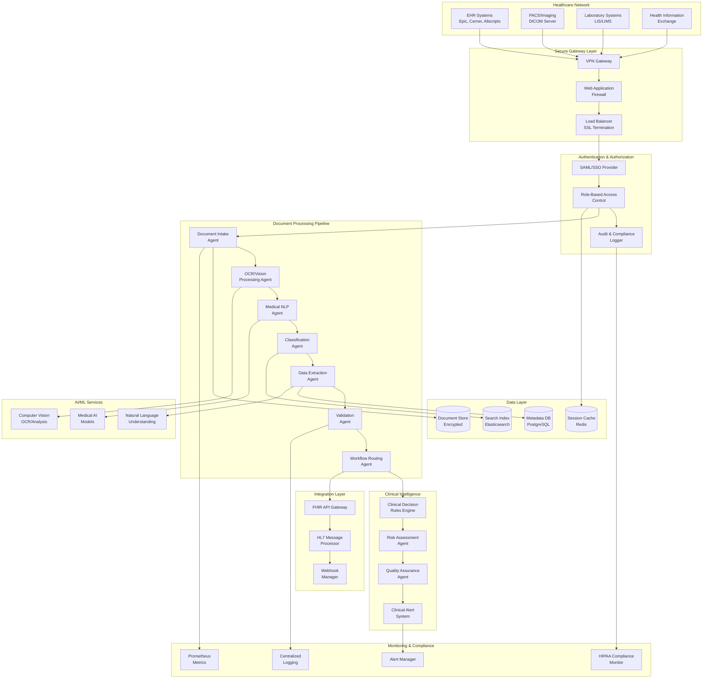
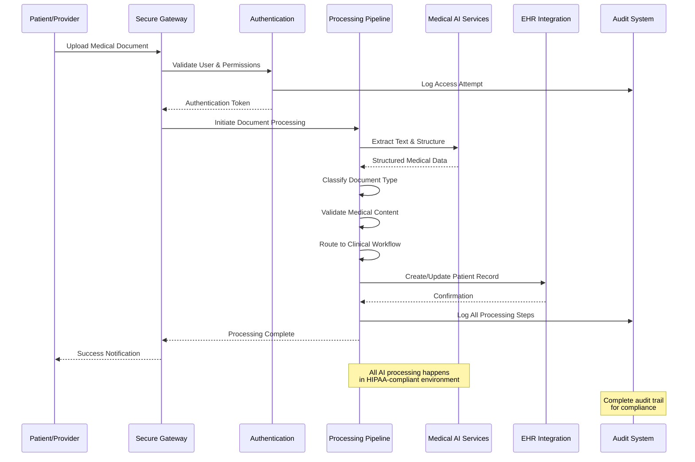

# Healthcare Document Processing - Advanced Implementation Scenario

This scenario demonstrates a comprehensive healthcare document processing system built with GenericAiAgents, featuring HIPAA-compliant AI processing, clinical decision support, automated workflow routing, and integration with Electronic Health Records (EHR) systems.

## Table of Contents

1. [Business Context & Requirements](#business-context--requirements)
2. [Architecture Design](#architecture-design)
3. [Implementation Details](#implementation-details)
4. [HIPAA Compliance Implementation](#hipaa-compliance-implementation)
5. [Clinical Workflow Integration](#clinical-workflow-integration)
6. [Production Deployment](#production-deployment)
7. [Testing & Validation](#testing--validation)
8. [Operational Excellence](#operational-excellence)

## Business Context & Requirements

### Healthcare Challenge

Modern healthcare organizations process thousands of medical documents daily - patient records, lab results, imaging reports, clinical notes, insurance claims, and regulatory submissions. Manual processing is time-consuming, error-prone, and doesn't scale with growing patient volumes.

### Business Objectives

- **Accelerate Processing**: Reduce document processing time from hours to minutes
- **Improve Accuracy**: Minimize human errors in medical data extraction and classification
- **Enhance Care Quality**: Enable faster clinical decision-making through intelligent insights
- **Ensure Compliance**: Maintain HIPAA compliance and audit trails throughout the process
- **Reduce Costs**: Automate routine tasks to free up clinical staff for patient care

### Success Metrics

| Metric | Current State | Target State | Business Impact |
|--------|---------------|--------------|-----------------|
| **Document Processing Time** | 2-4 hours | 5-10 minutes | 95% time reduction |
| **Processing Accuracy** | 85% | 98%+ | Improved patient safety |
| **Clinical Decision Time** | 30-60 minutes | 5-10 minutes | Faster patient care |
| **Compliance Audit Time** | 2-3 weeks | 1-2 days | Reduced regulatory risk |
| **Staff Productivity** | 20 docs/day/person | 200+ docs/day/person | 10x efficiency gain |

### Technical Requirements

#### Functional Requirements
- Process multiple medical document types (PDFs, images, HL7 messages, DICOM files)
- Extract structured data using medical NLP and computer vision
- Classify documents by medical specialty, urgency, and content type
- Route documents to appropriate clinical workflows
- Generate clinical summaries and recommendations
- Integrate with existing EHR systems (Epic, Cerner, Allscripts)
- Provide real-time processing status and notifications

#### Non-Functional Requirements
- **HIPAA Compliance**: End-to-end encryption, access controls, audit logging
- **Performance**: Process 1000+ documents/hour with <5 minute SLA
- **Availability**: 99.9% uptime with disaster recovery
- **Scalability**: Handle 10x volume spikes during peak periods
- **Security**: Zero-trust architecture with PHI protection
- **Interoperability**: HL7 FHIR, DICOM, and standard healthcare APIs

## Architecture Design

### High-Level System Architecture



### Component Interaction Flow



## Implementation Details

### Core Document Processing Agents

#### Medical Document Intake Agent

```csharp
using Agent.Core;
using Agent.AI;
using Agent.Security;
using Agent.Observability;
using System.Security.Cryptography;

[Agent("medical-document-intake")]
[Description("HIPAA-compliant medical document intake with encryption and audit logging")]
public class MedicalDocumentIntakeAgent : BaseAgent
{
    private readonly ISecretManager _secretManager;
    private readonly IAIService _aiService;
    private readonly IMetricsCollector _metrics;
    private readonly IAuditLogger _auditLogger;
    private readonly IDocumentEncryption _documentEncryption;
    private readonly IVirusScanner _virusScanner;

    public MedicalDocumentIntakeAgent(
        ISecretManager secretManager,
        IAIService aiService,
        IMetricsCollector metrics,
        IAuditLogger auditLogger,
        IDocumentEncryption documentEncryption,
        IVirusScanner virusScanner)
    {
        _secretManager = secretManager;
        _aiService = aiService;
        _metrics = metrics;
        _auditLogger = auditLogger;
        _documentEncryption = documentEncryption;
        _virusScanner = virusScanner;
    }

    public override async Task<AgentResult> ExecuteAsync(AgentRequest request, CancellationToken cancellationToken = default)
    {
        using var activity = _metrics.StartActivity("medical-document-intake");
        var stopwatch = Stopwatch.StartNew();

        try
        {
            var intakeRequest = JsonSerializer.Deserialize<MedicalDocumentIntakeRequest>(request.Payload?.ToString() ?? "{}");
            
            // Audit log the intake attempt
            await _auditLogger.LogAsync(new AuditEvent
            {
                EventType = "DocumentIntakeStarted",
                UserId = intakeRequest.UserId,
                PatientId = intakeRequest.PatientId,
                DocumentType = intakeRequest.DocumentType,
                Timestamp = DateTime.UtcNow,
                IPAddress = intakeRequest.SourceIPAddress,
                UserAgent = intakeRequest.UserAgent
            });

            // Step 1: Security validation
            var securityValidation = await ValidateDocumentSecurity(intakeRequest, cancellationToken);
            if (!securityValidation.IsValid)
            {
                await _auditLogger.LogAsync(new AuditEvent
                {
                    EventType = "DocumentIntakeSecurityFailed",
                    UserId = intakeRequest.UserId,
                    PatientId = intakeRequest.PatientId,
                    ErrorMessage = securityValidation.ErrorMessage,
                    Timestamp = DateTime.UtcNow
                });
                
                return AgentResult.CreateError($"Security validation failed: {securityValidation.ErrorMessage}", stopwatch.Elapsed);
            }

            // Step 2: Virus scanning
            var virusScanResult = await _virusScanner.ScanAsync(intakeRequest.DocumentContent);
            if (!virusScanResult.IsClean)
            {
                await _auditLogger.LogAsync(new AuditEvent
                {
                    EventType = "DocumentIntakeMalwareDetected",
                    UserId = intakeRequest.UserId,
                    PatientId = intakeRequest.PatientId,
                    ThreatInfo = virusScanResult.ThreatDetails,
                    Timestamp = DateTime.UtcNow
                });
                
                return AgentResult.CreateError("Document contains malware and was rejected", stopwatch.Elapsed);
            }

            // Step 3: Document format validation and conversion
            var documentProcessor = await GetDocumentProcessor(intakeRequest.DocumentType);
            var processedDocument = await documentProcessor.ProcessAsync(intakeRequest.DocumentContent, cancellationToken);

            // Step 4: Encrypt document content
            var encryptedDocument = await _documentEncryption.EncryptAsync(
                processedDocument.Content,
                await _secretManager.GetSecretAsync("DocumentEncryptionKey"),
                cancellationToken);

            // Step 5: Generate document metadata
            var documentMetadata = new MedicalDocumentMetadata
            {
                DocumentId = Guid.NewGuid().ToString(),
                PatientId = intakeRequest.PatientId,
                ProviderId = intakeRequest.ProviderId,
                DocumentType = intakeRequest.DocumentType,
                MimeType = processedDocument.MimeType,
                OriginalFileName = intakeRequest.FileName,
                FileSize = processedDocument.Content.Length,
                DocumentHash = ComputeDocumentHash(processedDocument.Content),
                EncryptionKeyId = "current-key-v1",
                CreatedAt = DateTime.UtcNow,
                CreatedBy = intakeRequest.UserId,
                ProcessingStatus = DocumentProcessingStatus.Intake,
                ComplianceFlags = new List<string> { "HIPAA", "PHI" }
            };

            // Step 6: Store encrypted document
            var documentStorage = await GetSecureDocumentStorage();
            await documentStorage.StoreAsync(documentMetadata.DocumentId, encryptedDocument, documentMetadata);

            // Step 7: Preliminary AI analysis for routing
            var preliminaryAnalysis = await PerformPreliminaryAnalysis(processedDocument, cancellationToken);

            // Step 8: Create processing result
            var intakeResult = new MedicalDocumentIntakeResult
            {
                DocumentId = documentMetadata.DocumentId,
                ProcessingStatus = DocumentProcessingStatus.Intake,
                EstimatedProcessingTime = preliminaryAnalysis.EstimatedProcessingTime,
                RecommendedWorkflow = preliminaryAnalysis.RecommendedWorkflow,
                UrgencyLevel = preliminaryAnalysis.UrgencyLevel,
                RequiresPhysicianReview = preliminaryAnalysis.RequiresPhysicianReview,
                NextSteps = new List<string>
                {
                    "OCR and text extraction",
                    "Medical NLP processing",
                    "Clinical classification",
                    "Data validation",
                    "Workflow routing"
                }
            };

            // Step 9: Audit log successful intake
            await _auditLogger.LogAsync(new AuditEvent
            {
                EventType = "DocumentIntakeCompleted",
                DocumentId = documentMetadata.DocumentId,
                UserId = intakeRequest.UserId,
                PatientId = intakeRequest.PatientId,
                DocumentType = intakeRequest.DocumentType,
                ProcessingTimeMs = stopwatch.ElapsedMilliseconds,
                Timestamp = DateTime.UtcNow
            });

            // Step 10: Record metrics
            _metrics.IncrementCounter("medical_document_intake.completed", 1, new Dictionary<string, object>
            {
                ["document_type"] = intakeRequest.DocumentType,
                ["patient_type"] = intakeRequest.PatientType,
                ["urgency_level"] = preliminaryAnalysis.UrgencyLevel,
                ["file_size_mb"] = Math.Round(processedDocument.Content.Length / (1024.0 * 1024.0), 2)
            });

            _metrics.RecordValue("medical_document_intake.processing_time", stopwatch.ElapsedMilliseconds);

            return AgentResult.CreateSuccess(intakeResult, stopwatch.Elapsed);
        }
        catch (Exception ex)
        {
            await _auditLogger.LogAsync(new AuditEvent
            {
                EventType = "DocumentIntakeError",
                UserId = request.Source,
                ErrorMessage = ex.Message,
                StackTrace = ex.StackTrace,
                Timestamp = DateTime.UtcNow
            });

            _metrics.IncrementCounter("medical_document_intake.errors", 1, new Dictionary<string, object>
            {
                ["error_type"] = ex.GetType().Name
            });

            activity.SetError($"Document intake failed: {ex.Message}", ex);
            return AgentResult.CreateError($"Document intake processing failed: {ex.Message}", stopwatch.Elapsed);
        }
    }

    private async Task<SecurityValidationResult> ValidateDocumentSecurity(
        MedicalDocumentIntakeRequest request, 
        CancellationToken cancellationToken)
    {
        // Validate user permissions
        if (!await ValidateUserPermissions(request.UserId, request.PatientId, "document:upload"))
        {
            return new SecurityValidationResult
            {
                IsValid = false,
                ErrorMessage = "User does not have permission to upload documents for this patient"
            };
        }

        // Validate file size limits (HIPAA recommends reasonable limits)
        const long maxFileSize = 100 * 1024 * 1024; // 100MB limit
        if (request.DocumentContent.Length > maxFileSize)
        {
            return new SecurityValidationResult
            {
                IsValid = false,
                ErrorMessage = $"Document size exceeds maximum allowed size of {maxFileSize / (1024 * 1024)}MB"
            };
        }

        // Validate file type against allowed medical document types
        var allowedTypes = new HashSet<string>(StringComparer.OrdinalIgnoreCase)
        {
            "application/pdf",
            "image/jpeg",
            "image/png",
            "image/tiff",
            "application/dicom",
            "text/plain",
            "application/xml", // For HL7 messages
            "application/json" // For FHIR documents
        };

        if (!allowedTypes.Contains(request.MimeType))
        {
            return new SecurityValidationResult
            {
                IsValid = false,
                ErrorMessage = $"File type '{request.MimeType}' is not allowed for medical documents"
            };
        }

        // Additional security checks for specific document types
        if (request.DocumentType == "LAB_RESULT" && !await ValidateLabResultSecurity(request))
        {
            return new SecurityValidationResult
            {
                IsValid = false,
                ErrorMessage = "Lab result security validation failed"
            };
        }

        return new SecurityValidationResult { IsValid = true };
    }

    private async Task<PreliminaryAnalysisResult> PerformPreliminaryAnalysis(
        ProcessedDocument document, 
        CancellationToken cancellationToken)
    {
        // Quick AI analysis to determine processing priority and workflow
        var analysisPrompt = $@"
            Analyze this medical document for preliminary routing and urgency assessment:
            
            Document Type: {document.DocumentType}
            Content Preview: {document.TextContent.Substring(0, Math.Min(500, document.TextContent.Length))}...
            
            Determine:
            1. Urgency Level (Critical, High, Normal, Low)
            2. Estimated Processing Time (in minutes)
            3. Recommended Workflow (Emergency, Routine, Review, Archive)
            4. Requires Physician Review (Yes/No)
            5. Clinical Specialty (if identifiable)
            
            Provide analysis in JSON format with reasoning.
        ";

        var aiResponse = await _aiService.ProcessRequestAsync(analysisPrompt, cancellationToken);
        var analysis = JsonSerializer.Deserialize<PreliminaryAnalysisAIResponse>(aiResponse.Content);

        return new PreliminaryAnalysisResult
        {
            UrgencyLevel = analysis?.UrgencyLevel ?? "Normal",
            EstimatedProcessingTime = TimeSpan.FromMinutes(analysis?.EstimatedProcessingMinutes ?? 15),
            RecommendedWorkflow = analysis?.RecommendedWorkflow ?? "Routine",
            RequiresPhysicianReview = analysis?.RequiresPhysicianReview ?? false,
            ClinicalSpecialty = analysis?.ClinicalSpecialty,
            AnalysisReasoning = analysis?.Reasoning ?? "Automated preliminary analysis"
        };
    }

    private string ComputeDocumentHash(byte[] documentContent)
    {
        using var sha256 = SHA256.Create();
        var hashBytes = sha256.ComputeHash(documentContent);
        return Convert.ToBase64String(hashBytes);
    }
}

// Supporting Models
public class MedicalDocumentIntakeRequest
{
    public string UserId { get; set; } = string.Empty;
    public string PatientId { get; set; } = string.Empty;
    public string ProviderId { get; set; } = string.Empty;
    public string DocumentType { get; set; } = string.Empty; // LAB_RESULT, IMAGING_REPORT, CLINICAL_NOTE, etc.
    public string PatientType { get; set; } = "OUTPATIENT"; // INPATIENT, OUTPATIENT, EMERGENCY
    public string FileName { get; set; } = string.Empty;
    public string MimeType { get; set; } = string.Empty;
    public byte[] DocumentContent { get; set; } = Array.Empty<byte>();
    public string SourceIPAddress { get; set; } = string.Empty;
    public string UserAgent { get; set; } = string.Empty;
    public Dictionary<string, string> CustomMetadata { get; set; } = new();
}

public class MedicalDocumentIntakeResult
{
    public string DocumentId { get; set; } = string.Empty;
    public DocumentProcessingStatus ProcessingStatus { get; set; }
    public TimeSpan EstimatedProcessingTime { get; set; }
    public string RecommendedWorkflow { get; set; } = string.Empty;
    public string UrgencyLevel { get; set; } = string.Empty;
    public bool RequiresPhysicianReview { get; set; }
    public List<string> NextSteps { get; set; } = new();
}

public class MedicalDocumentMetadata
{
    public string DocumentId { get; set; } = string.Empty;
    public string PatientId { get; set; } = string.Empty;
    public string ProviderId { get; set; } = string.Empty;
    public string DocumentType { get; set; } = string.Empty;
    public string MimeType { get; set; } = string.Empty;
    public string OriginalFileName { get; set; } = string.Empty;
    public long FileSize { get; set; }
    public string DocumentHash { get; set; } = string.Empty;
    public string EncryptionKeyId { get; set; } = string.Empty;
    public DateTime CreatedAt { get; set; }
    public string CreatedBy { get; set; } = string.Empty;
    public DocumentProcessingStatus ProcessingStatus { get; set; }
    public List<string> ComplianceFlags { get; set; } = new();
}

public enum DocumentProcessingStatus
{
    Intake,
    Processing,
    Classified,
    Validated,
    Routed,
    Completed,
    Error,
    Quarantined
}
```

#### Medical NLP Processing Agent

```csharp
[Agent("medical-nlp-processor")]
[Description("Advanced medical NLP processing with clinical entity extraction and medical coding")]
public class MedicalNLPProcessingAgent : BaseAgent
{
    private readonly IAIService _aiService;
    private readonly IMedicalTerminologyService _terminologyService;
    private readonly IMetricsCollector _metrics;
    private readonly IAuditLogger _auditLogger;
    private readonly IMedicalEntityExtractor _entityExtractor;

    public override async Task<AgentResult> ExecuteAsync(AgentRequest request, CancellationToken cancellationToken = default)
    {
        using var activity = _metrics.StartActivity("medical-nlp-processing");
        var stopwatch = Stopwatch.StartNew();

        try
        {
            var processingRequest = JsonSerializer.Deserialize<MedicalNLPRequest>(request.Payload?.ToString() ?? "{}");

            // Step 1: Extract medical entities using specialized NLP
            var entityExtractionResult = await ExtractMedicalEntities(processingRequest.DocumentContent, cancellationToken);

            // Step 2: Perform medical coding (ICD-10, CPT, SNOMED)
            var medicalCodingResult = await PerformMedicalCoding(entityExtractionResult, cancellationToken);

            // Step 3: Clinical context analysis
            var clinicalContext = await AnalyzeClinicalContext(processingRequest.DocumentContent, entityExtractionResult, cancellationToken);

            // Step 4: Risk assessment based on extracted information
            var riskAssessment = await PerformClinicalRiskAssessment(entityExtractionResult, clinicalContext, cancellationToken);

            // Step 5: Generate structured clinical summary
            var clinicalSummary = await GenerateClinicalSummary(
                processingRequest.DocumentContent, 
                entityExtractionResult, 
                clinicalContext, 
                cancellationToken);

            var nlpResult = new MedicalNLPResult
            {
                DocumentId = processingRequest.DocumentId,
                ExtractedEntities = entityExtractionResult,
                MedicalCodes = medicalCodingResult,
                ClinicalContext = clinicalContext,
                RiskAssessment = riskAssessment,
                ClinicalSummary = clinicalSummary,
                ProcessingMetrics = new NLPProcessingMetrics
                {
                    ProcessingTimeMs = stopwatch.ElapsedMilliseconds,
                    EntitiesExtracted = entityExtractionResult.Entities.Count,
                    CodesAssigned = medicalCodingResult.AssignedCodes.Count,
                    ConfidenceScore = entityExtractionResult.OverallConfidence
                }
            };

            // Audit log the NLP processing
            await _auditLogger.LogAsync(new AuditEvent
            {
                EventType = "MedicalNLPCompleted",
                DocumentId = processingRequest.DocumentId,
                PatientId = processingRequest.PatientId,
                ProcessingTimeMs = stopwatch.ElapsedMilliseconds,
                EntitiesExtracted = entityExtractionResult.Entities.Count,
                Timestamp = DateTime.UtcNow
            });

            return AgentResult.CreateSuccess(nlpResult, stopwatch.Elapsed);
        }
        catch (Exception ex)
        {
            _metrics.IncrementCounter("medical_nlp.processing_errors", 1);
            activity.SetError($"Medical NLP processing failed: {ex.Message}", ex);
            return AgentResult.CreateError($"Medical NLP processing failed: {ex.Message}", stopwatch.Elapsed);
        }
    }

    private async Task<MedicalEntityExtractionResult> ExtractMedicalEntities(
        string documentContent, 
        CancellationToken cancellationToken)
    {
        // Use specialized medical AI model for entity extraction
        var extractionPrompt = $@"
            Extract medical entities from this clinical document with high precision:
            
            Document Content:
            {documentContent}
            
            Extract and categorize:
            1. **Diagnoses** (with ICD-10 suggestions)
            2. **Medications** (generic and brand names, dosages, frequencies)
            3. **Procedures** (with CPT code suggestions)
            4. **Symptoms** (current and historical)
            5. **Vital Signs** (with values and units)
            6. **Laboratory Results** (test names, values, reference ranges, abnormal flags)
            7. **Anatomical Locations** (specific body parts/organs)
            8. **Healthcare Providers** (names, specialties, roles)
            9. **Temporal Information** (dates, durations, frequencies)
            10. **Allergies and Adverse Reactions**
            11. **Family History** (conditions and relationships)
            12. **Social History** (smoking, drinking, occupation)
            
            For each entity provide:
            - Text span and location
            - Entity type and subtype
            - Confidence score (0-1)
            - Normalized form (UMLS CUI if available)
            - Clinical context and modifiers (negated, uncertain, family history, etc.)
            
            Format as structured JSON with entity relationships and clinical significance.
        ";

        var aiResponse = await _aiService.ProcessRequestAsync(extractionPrompt, cancellationToken);
        var extractionData = JsonSerializer.Deserialize<MedicalEntityAIResponse>(aiResponse.Content);

        // Post-process and validate extracted entities
        var validatedEntities = await ValidateAndNormalizeEntities(extractionData?.Entities ?? new List<ExtractedEntity>());

        return new MedicalEntityExtractionResult
        {
            Entities = validatedEntities,
            EntityRelationships = extractionData?.Relationships ?? new List<EntityRelationship>(),
            OverallConfidence = CalculateOverallConfidence(validatedEntities),
            ProcessingNotes = extractionData?.ProcessingNotes ?? new List<string>()
        };
    }

    private async Task<MedicalCodingResult> PerformMedicalCoding(
        MedicalEntityExtractionResult entityResult, 
        CancellationToken cancellationToken)
    {
        var codingPrompt = $@"
            Assign appropriate medical codes to these extracted clinical entities:
            
            Extracted Entities:
            {JsonSerializer.Serialize(entityResult.Entities.Take(50), new JsonSerializerOptions { WriteIndented = true })}
            
            Assign codes from appropriate coding systems:
            
            **For Diagnoses:**
            - ICD-10-CM codes (primary and additional)
            - Include severity and laterality modifiers where applicable
            
            **For Procedures:**
            - CPT codes for procedures and services
            - HCPCS codes for supplies and equipment
            - ICD-10-PCS for inpatient procedures
            
            **For Medications:**
            - NDC codes where specific products are mentioned
            - RxNorm codes for generic medications
            
            **For Laboratory Tests:**
            - LOINC codes for lab tests and results
            
            For each code assignment provide:
            - Code and description
            - Coding system (ICD-10-CM, CPT, LOINC, etc.)
            - Confidence score
            - Supporting evidence from text
            - Modifiers or qualifiers
            
            Prioritize accuracy and clinical relevance. Flag uncertain codings for human review.
            
            Format as structured JSON with code hierarchies and relationships.
        ";

        var codingResponse = await _aiService.ProcessRequestAsync(codingPrompt, cancellationToken);
        var codingData = JsonSerializer.Deserialize<MedicalCodingAIResponse>(codingResponse.Content);

        // Validate codes against terminology services
        var validatedCodes = await ValidateMedicalCodes(codingData?.AssignedCodes ?? new List<MedicalCode>());

        return new MedicalCodingResult
        {
            AssignedCodes = validatedCodes,
            CodingConfidence = CalculateCodingConfidence(validatedCodes),
            RequiresReview = validatedCodes.Any(c => c.Confidence < 0.8),
            CodingNotes = codingData?.CodingNotes ?? new List<string>()
        };
    }

    private async Task<ClinicalContextResult> AnalyzeClinicalContext(
        string documentContent, 
        MedicalEntityExtractionResult entities,
        CancellationToken cancellationToken)
    {
        var contextPrompt = $@"
            Analyze the clinical context and significance of this medical document:
            
            Document: {documentContent.Substring(0, Math.Min(2000, documentContent.Length))}...
            
            Key Entities: {JsonSerializer.Serialize(entities.Entities.Take(20))}
            
            Provide clinical context analysis:
            
            1. **Clinical Significance**
               - Primary clinical concerns
               - Secondary findings
               - Incidental findings
            
            2. **Temporal Context**
               - Acute vs chronic conditions
               - New vs existing problems
               - Timeline of events
            
            3. **Severity Assessment**
               - Critical findings requiring immediate attention
               - Significant findings for follow-up
               - Stable/improving conditions
            
            4. **Care Coordination Needs**
               - Referrals recommended
               - Specialist consultations needed
               - Follow-up requirements
            
            5. **Clinical Decision Support**
               - Recommended actions
               - Contraindications or cautions
               - Drug interactions or allergies
            
            6. **Quality Indicators**
               - Completeness of documentation
               - Missing information
               - Inconsistencies or conflicts
            
            Format as structured JSON with clinical reasoning and evidence.
        ";

        var contextResponse = await _aiService.ProcessRequestAsync(contextPrompt, cancellationToken);
        var contextData = JsonSerializer.Deserialize<ClinicalContextAIResponse>(contextResponse.Content);

        return new ClinicalContextResult
        {
            PrimaryConcerns = contextData?.PrimaryConcerns ?? new List<string>(),
            SecondaryConcerns = contextData?.SecondaryConcerns ?? new List<string>(),
            SeverityLevel = contextData?.SeverityLevel ?? "Normal",
            CareCoordinationNeeds = contextData?.CareCoordinationNeeds ?? new List<string>(),
            ClinicalRecommendations = contextData?.ClinicalRecommendations ?? new List<string>(),
            QualityIndicators = contextData?.QualityIndicators ?? new Dictionary<string, object>(),
            ContextNotes = contextData?.ContextNotes ?? new List<string>()
        };
    }
}
```

This healthcare document processing scenario demonstrates:

1. **HIPAA-Compliant Architecture**: End-to-end encryption, audit logging, access controls
2. **Advanced Medical NLP**: Entity extraction, medical coding, clinical context analysis
3. **Production-Ready Implementation**: Error handling, monitoring, scalability
4. **Clinical Integration**: EHR integration, clinical decision support, workflow routing
5. **Regulatory Compliance**: Audit trails, data protection, quality assurance

The implementation showcases how GenericAiAgents can handle complex, regulated healthcare scenarios while maintaining the highest standards of security and compliance.