# Supply Chain Optimization Platform

## Table of Contents
1. [Business Context](#business-context)
2. [Technical Requirements](#technical-requirements)
3. [Architecture Overview](#architecture-overview)
4. [Implementation Details](#implementation-details)
5. [Production Deployment](#production-deployment)
6. [Testing & Validation](#testing-validation)
7. [Operational Excellence](#operational-excellence)

## Business Context

### Industry Challenge
Modern supply chains face unprecedented complexity with global disruptions, fluctuating demand patterns, and sustainability pressures. Organizations need intelligent systems that can predict disruptions, optimize inventory levels, coordinate multiple vendors, and adapt to real-time market conditions.

### Business Objectives
- **Demand Forecasting**: 95% accuracy in 30-day demand predictions
- **Inventory Optimization**: Reduce carrying costs by 25% while maintaining 99.5% service levels
- **Supplier Performance**: Monitor and optimize supplier relationships across 500+ vendors
- **Cost Reduction**: Achieve 15% reduction in total supply chain costs
- **Sustainability**: Track and optimize carbon footprint across the entire supply chain

### Success Metrics
- **Forecast Accuracy**: Mean Absolute Percentage Error (MAPE) < 5%
- **Inventory Turnover**: Increase by 30% while reducing stockouts by 80%
- **Supplier On-Time Delivery**: Maintain >98% across all suppliers
- **Total Cost of Ownership**: Reduce by 15% annually
- **Carbon Footprint**: 20% reduction in logistics-related emissions

## Technical Requirements

### Functional Requirements
- **Real-time Analytics**: Process 10M+ data points per hour from IoT sensors, ERP systems, and market feeds
- **Predictive Modeling**: ML-based demand forecasting with external factor integration
- **Automated Procurement**: Dynamic purchasing decisions based on inventory levels and lead times
- **Vendor Management**: Supplier scorecarding, performance monitoring, and relationship optimization
- **Logistics Coordination**: Route optimization, carrier selection, and shipment tracking

### Non-Functional Requirements
- **Performance**: Sub-100ms response time for optimization queries
- **Scalability**: Support 1000+ concurrent users, 10,000+ SKUs, 500+ suppliers
- **Reliability**: 99.9% uptime with automatic failover capabilities
- **Security**: End-to-end encryption, audit logging, role-based access control
- **Compliance**: SOX compliance for financial transactions, GDPR for supplier data

### Integration Requirements
- **ERP Systems**: SAP, Oracle, Microsoft Dynamics integration
- **IoT Platforms**: Real-time sensor data from warehouses and transportation
- **Market Data**: Commodity prices, weather data, economic indicators
- **Logistics Partners**: Carrier APIs for real-time shipment tracking
- **Financial Systems**: Cost accounting and budget management integration

## Architecture Overview

```mermaid
graph TB
    subgraph "Data Ingestion Layer"
        ERP[ERP Systems]
        IoT[IoT Sensors]
        Market[Market Data]
        Logistics[Logistics APIs]
        Suppliers[Supplier Portals]
    end
    
    subgraph "GenericAiAgents Core"
        subgraph "Agent Orchestration"
            DemandAgent[Demand Forecasting Agent]
            InventoryAgent[Inventory Optimization Agent]
            ProcurementAgent[Procurement Automation Agent]
            VendorAgent[Vendor Management Agent]
            LogisticsAgent[Logistics Coordination Agent]
        end
        
        subgraph "AI Services"
            MLPipeline[ML Pipeline Service]
            OptimizationEngine[Optimization Engine]
            RiskAssessment[Risk Assessment Service]
            PredictiveAnalytics[Predictive Analytics]
        end
        
        subgraph "Business Logic"
            SupplyChainEngine[Supply Chain Engine]
            CostOptimizer[Cost Optimization]
            SustainabilityTracker[Sustainability Tracker]
            ComplianceMonitor[Compliance Monitor]
        end
    end
    
    subgraph "Data Management"
        TimeSeries[(Time Series DB)]
        Analytics[(Analytics DB)]
        Master[(Master Data)]
        Cache[(Redis Cache)]
    end
    
    subgraph "Integration Services"
        MessageBus[Message Bus]
        APIGateway[API Gateway]
        EventStream[Event Streaming]
        DataSync[Data Synchronization]
    end
    
    subgraph "User Interfaces"
        ExecutiveDash[Executive Dashboard]
        Operations[Operations Console]
        SupplierPortal[Supplier Portal]
        MobileApp[Mobile App]
    end
    
    ERP --> APIGateway
    IoT --> EventStream
    Market --> DataSync
    Logistics --> APIGateway
    Suppliers --> SupplierPortal
    
    APIGateway --> MessageBus
    EventStream --> MessageBus
    DataSync --> MessageBus
    
    MessageBus --> DemandAgent
    MessageBus --> InventoryAgent
    MessageBus --> ProcurementAgent
    MessageBus --> VendorAgent
    MessageBus --> LogisticsAgent
    
    DemandAgent --> MLPipeline
    InventoryAgent --> OptimizationEngine
    ProcurementAgent --> RiskAssessment
    VendorAgent --> PredictiveAnalytics
    LogisticsAgent --> OptimizationEngine
    
    MLPipeline --> SupplyChainEngine
    OptimizationEngine --> CostOptimizer
    RiskAssessment --> ComplianceMonitor
    PredictiveAnalytics --> SustainabilityTracker
    
    SupplyChainEngine --> TimeSeries
    CostOptimizer --> Analytics
    SustainabilityTracker --> Master
    ComplianceMonitor --> Cache
    
    TimeSeries --> ExecutiveDash
    Analytics --> Operations
    Master --> SupplierPortal
    Cache --> MobileApp
```



## Implementation Details

### Core Agent Implementations

#### Demand Forecasting Agent

```csharp
using GenericAiAgents.Agent.Core;
using GenericAiAgents.Agent.AI;
using GenericAiAgents.Tools.DataProcessing;
using Microsoft.ML;
using Microsoft.Extensions.Logging;
using System.ComponentModel;

[Agent("demand-forecasting")]
[Description("Advanced demand forecasting with ML models and external factor integration")]
public class DemandForecastingAgent : BaseAgent
{
    private readonly MLContext _mlContext;
    private readonly ITimeSeriesService _timeSeriesService;
    private readonly IExternalDataService _externalDataService;
    private readonly ICacheService _cacheService;
    private readonly ILogger<DemandForecastingAgent> _logger;

    public DemandForecastingAgent(
        MLContext mlContext,
        ITimeSeriesService timeSeriesService,
        IExternalDataService externalDataService,
        ICacheService cacheService,
        ILogger<DemandForecastingAgent> logger)
    {
        _mlContext = mlContext;
        _timeSeriesService = timeSeriesService;
        _externalDataService = externalDataService;
        _cacheService = cacheService;
        _logger = logger;
    }

    [AgentFunction("forecast_demand")]
    [Description("Generate demand forecast for specified SKU and time horizon")]
    public async Task<DemandForecastResult> ForecastDemandAsync(
        string sku,
        int forecastHorizonDays,
        bool includeExternalFactors = true,
        string[] externalFactors = null)
    {
        try
        {
            _logger.LogInformation($"Generating demand forecast for SKU: {sku}, Horizon: {forecastHorizonDays} days");

            // Check cache first
            var cacheKey = $"demand_forecast_{sku}_{forecastHorizonDays}_{string.Join("_", externalFactors ?? Array.Empty<string>())}";
            var cachedResult = await _cacheService.GetAsync<DemandForecastResult>(cacheKey);
            if (cachedResult != null && cachedResult.GeneratedAt > DateTime.UtcNow.AddHours(-1))
            {
                _logger.LogInformation($"Returning cached forecast for SKU: {sku}");
                return cachedResult;
            }

            // Retrieve historical demand data
            var historicalData = await _timeSeriesService.GetHistoricalDemandAsync(sku, DateTime.UtcNow.AddYears(-3));
            if (!historicalData.Any())
            {
                throw new InvalidOperationException($"No historical data available for SKU: {sku}");
            }

            // Prepare external factors data
            var externalData = new Dictionary<string, double[]>();
            if (includeExternalFactors && externalFactors?.Any() == true)
            {
                foreach (var factor in externalFactors)
                {
                    var factorData = await _externalDataService.GetFactorDataAsync(factor, 
                        DateTime.UtcNow.AddYears(-3), 
                        DateTime.UtcNow.AddDays(forecastHorizonDays));
                    externalData[factor] = factorData;
                }
            }

            // Create and train forecasting models
            var ensembleResult = await CreateEnsembleForecastAsync(historicalData, externalData, forecastHorizonDays);

            // Calculate confidence intervals
            var confidenceIntervals = CalculateConfidenceIntervals(ensembleResult.Predictions, ensembleResult.StandardErrors);

            // Detect seasonality and trends
            var seasonalityAnalysis = AnalyzeSeasonality(historicalData);
            var trendAnalysis = AnalyzeTrend(historicalData);

            var result = new DemandForecastResult
            {
                SKU = sku,
                ForecastHorizonDays = forecastHorizonDays,
                Predictions = ensembleResult.Predictions,
                ConfidenceIntervals = confidenceIntervals,
                ModelAccuracy = ensembleResult.Accuracy,
                SeasonalityFactors = seasonalityAnalysis,
                TrendAnalysis = trendAnalysis,
                ExternalFactorsImpact = CalculateFactorImpact(externalData, ensembleResult.FeatureImportance),
                GeneratedAt = DateTime.UtcNow,
                NextUpdateDue = DateTime.UtcNow.AddHours(6)
            };

            // Cache the result
            await _cacheService.SetAsync(cacheKey, result, TimeSpan.FromHours(1));

            _logger.LogInformation($"Successfully generated demand forecast for SKU: {sku}, MAPE: {ensembleResult.Accuracy:F2}%");
            return result;
        }
        catch (Exception ex)
        {
            _logger.LogError(ex, $"Error generating demand forecast for SKU: {sku}");
            throw new AgentExecutionException($"Demand forecasting failed for SKU {sku}", ex);
        }
    }

    private async Task<EnsembleForecastResult> CreateEnsembleForecastAsync(
        IEnumerable<DemandDataPoint> historicalData,
        Dictionary<string, double[]> externalData,
        int horizon)
    {
        var models = new List<ITransformer>();
        var predictions = new List<float[]>();
        var accuracies = new List<double>();

        // ARIMA Model
        var arimaModel = await TrainArimaModelAsync(historicalData);
        var arimaPredictions = GeneratePredictions(arimaModel, horizon);
        models.Add(arimaModel);
        predictions.Add(arimaPredictions);
        accuracies.Add(EvaluateModelAccuracy(arimaModel, historicalData.TakeLast(30)));

        // Prophet-style Decomposition Model
        var prophetModel = await TrainDecompositionModelAsync(historicalData);
        var prophetPredictions = GeneratePredictions(prophetModel, horizon);
        models.Add(prophetModel);
        predictions.Add(prophetPredictions);
        accuracies.Add(EvaluateModelAccuracy(prophetModel, historicalData.TakeLast(30)));

        // Neural Network Model with External Factors
        if (externalData.Any())
        {
            var neuralModel = await TrainNeuralNetworkAsync(historicalData, externalData);
            var neuralPredictions = GeneratePredictions(neuralModel, horizon);
            models.Add(neuralModel);
            predictions.Add(neuralPredictions);
            accuracies.Add(EvaluateModelAccuracy(neuralModel, historicalData.TakeLast(30)));
        }

        // Ensemble the predictions using weighted averaging
        var weights = CalculateEnsembleWeights(accuracies);
        var ensemblePredictions = new float[horizon];
        var standardErrors = new float[horizon];

        for (int i = 0; i < horizon; i++)
        {
            var weightedSum = 0f;
            var totalWeight = 0f;
            var variance = 0f;

            for (int j = 0; j < predictions.Count; j++)
            {
                weightedSum += predictions[j][i] * weights[j];
                totalWeight += weights[j];
            }

            ensemblePredictions[i] = weightedSum / totalWeight;

            // Calculate ensemble variance
            for (int j = 0; j < predictions.Count; j++)
            {
                var diff = predictions[j][i] - ensemblePredictions[i];
                variance += weights[j] * diff * diff;
            }
            standardErrors[i] = (float)Math.Sqrt(variance / totalWeight);
        }

        return new EnsembleForecastResult
        {
            Predictions = ensemblePredictions,
            StandardErrors = standardErrors,
            Accuracy = accuracies.Zip(weights, (acc, weight) => acc * weight).Sum(),
            FeatureImportance = CalculateFeatureImportance(models, externalData.Keys.ToArray())
        };
    }

    [AgentFunction("analyze_forecast_accuracy")]
    [Description("Analyze historical forecast accuracy and identify improvement opportunities")]
    public async Task<ForecastAccuracyAnalysis> AnalyzeForecastAccuracyAsync(
        string sku,
        DateTime startDate,
        DateTime endDate)
    {
        try
        {
            var historicalForecasts = await _timeSeriesService.GetHistoricalForecastsAsync(sku, startDate, endDate);
            var actualDemand = await _timeSeriesService.GetHistoricalDemandAsync(sku, startDate, endDate);

            var analysis = new ForecastAccuracyAnalysis
            {
                SKU = sku,
                Period = new DateRange(startDate, endDate),
                MAPE = CalculateMAPE(historicalForecasts, actualDemand),
                RMSE = CalculateRMSE(historicalForecasts, actualDemand),
                MAE = CalculateMAE(historicalForecasts, actualDemand),
                BiasAnalysis = AnalyzeBias(historicalForecasts, actualDemand),
                SeasonalAccuracy = AnalyzeSeasonalAccuracy(historicalForecasts, actualDemand),
                ImprovementRecommendations = GenerateImprovementRecommendations(historicalForecasts, actualDemand)
            };

            return analysis;
        }
        catch (Exception ex)
        {
            _logger.LogError(ex, $"Error analyzing forecast accuracy for SKU: {sku}");
            throw new AgentExecutionException($"Forecast accuracy analysis failed for SKU {sku}", ex);
        }
    }

    private async Task<ITransformer> TrainArimaModelAsync(IEnumerable<DemandDataPoint> data)
    {
        var pipeline = _mlContext.Forecasting.ForecastBySsa(
            outputColumnName: "ForecastedDemand",
            inputColumnName: nameof(DemandDataPoint.Demand),
            windowSize: 7,
            seriesLength: 365,
            trainSize: data.Count(),
            horizon: 30);

        var dataView = _mlContext.Data.LoadFromEnumerable(data);
        return pipeline.Fit(dataView);
    }

    private float[] CalculateEnsembleWeights(List<double> accuracies)
    {
        var totalAccuracy = accuracies.Sum();
        return accuracies.Select(acc => (float)(acc / totalAccuracy)).ToArray();
    }
}

public class DemandForecastResult
{
    public string SKU { get; set; }
    public int ForecastHorizonDays { get; set; }
    public float[] Predictions { get; set; }
    public ConfidenceInterval[] ConfidenceIntervals { get; set; }
    public double ModelAccuracy { get; set; }
    public SeasonalityAnalysis SeasonalityFactors { get; set; }
    public TrendAnalysis TrendAnalysis { get; set; }
    public Dictionary<string, double> ExternalFactorsImpact { get; set; }
    public DateTime GeneratedAt { get; set; }
    public DateTime NextUpdateDue { get; set; }
}

public class EnsembleForecastResult
{
    public float[] Predictions { get; set; }
    public float[] StandardErrors { get; set; }
    public double Accuracy { get; set; }
    public Dictionary<string, double> FeatureImportance { get; set; }
}
```

#### Inventory Optimization Agent

```csharp
[Agent("inventory-optimization")]
[Description("Multi-echelon inventory optimization with cost minimization and service level constraints")]
public class InventoryOptimizationAgent : BaseAgent
{
    private readonly IOptimizationEngine _optimizationEngine;
    private readonly IInventoryService _inventoryService;
    private readonly ICostCalculationService _costService;
    private readonly ILogger<InventoryOptimizationAgent> _logger;

    public InventoryOptimizationAgent(
        IOptimizationEngine optimizationEngine,
        IInventoryService inventoryService,
        ICostCalculationService costService,
        ILogger<InventoryOptimizationAgent> logger)
    {
        _optimizationEngine = optimizationEngine;
        _inventoryService = inventoryService;
        _costService = costService;
        _logger = logger;
    }

    [AgentFunction("optimize_inventory_levels")]
    [Description("Optimize inventory levels across multiple locations with cost and service level constraints")]
    public async Task<InventoryOptimizationResult> OptimizeInventoryLevelsAsync(
        string[] skus,
        string[] locations,
        double targetServiceLevel = 0.995,
        OptimizationObjective objective = OptimizationObjective.MinimizeTotalCost)
    {
        try
        {
            _logger.LogInformation($"Starting inventory optimization for {skus.Length} SKUs across {locations.Length} locations");

            // Gather current inventory positions
            var currentInventory = await _inventoryService.GetCurrentInventoryAsync(skus, locations);
            
            // Get demand forecasts for all SKU-location combinations
            var demandForecasts = await GetDemandForecastsAsync(skus, locations);
            
            // Calculate cost parameters
            var costParameters = await _costService.GetCostParametersAsync(skus, locations);
            
            // Set up optimization model
            var optimizationModel = CreateOptimizationModel(
                skus, locations, currentInventory, demandForecasts, 
                costParameters, targetServiceLevel, objective);

            // Solve optimization problem
            var solution = await _optimizationEngine.SolveAsync(optimizationModel);
            
            if (!solution.IsOptimal)
            {
                _logger.LogWarning("Optimization did not find optimal solution, using best feasible solution");
            }

            // Extract results and create recommendations
            var recommendations = ExtractInventoryRecommendations(solution, skus, locations);
            
            // Calculate expected benefits
            var benefits = await CalculateOptimizationBenefitsAsync(currentInventory, recommendations, costParameters);

            var result = new InventoryOptimizationResult
            {
                SKUs = skus,
                Locations = locations,
                TargetServiceLevel = targetServiceLevel,
                Objective = objective,
                CurrentTotalCost = benefits.CurrentTotalCost,
                OptimizedTotalCost = benefits.OptimizedTotalCost,
                ExpectedSavings = benefits.ExpectedSavings,
                ServiceLevelAchievement = solution.ServiceLevelAchievement,
                Recommendations = recommendations,
                OptimizationMetrics = ExtractOptimizationMetrics(solution),
                GeneratedAt = DateTime.UtcNow
            };

            _logger.LogInformation($"Inventory optimization completed. Expected savings: ${benefits.ExpectedSavings:F2}");
            return result;
        }
        catch (Exception ex)
        {
            _logger.LogError(ex, "Error during inventory optimization");
            throw new AgentExecutionException("Inventory optimization failed", ex);
        }
    }

    [AgentFunction("calculate_safety_stock")]
    [Description("Calculate optimal safety stock levels with demand variability and lead time uncertainty")]
    public async Task<SafetyStockCalculation> CalculateSafetyStockAsync(
        string sku,
        string location,
        double serviceLevel = 0.995,
        SafetyStockMethod method = SafetyStockMethod.Statistical)
    {
        try
        {
            var demandHistory = await _inventoryService.GetDemandHistoryAsync(sku, location, DateTime.UtcNow.AddYears(-2));
            var leadTimeHistory = await _inventoryService.GetLeadTimeHistoryAsync(sku, location, DateTime.UtcNow.AddYears(-1));

            var calculation = method switch
            {
                SafetyStockMethod.Statistical => CalculateStatisticalSafetyStock(demandHistory, leadTimeHistory, serviceLevel),
                SafetyStockMethod.TimeSeriesBased => await CalculateTimeSeriesSafetyStockAsync(demandHistory, leadTimeHistory, serviceLevel),
                SafetyStockMethod.MachineLearning => await CalculateMLSafetyStockAsync(sku, location, serviceLevel),
                _ => throw new ArgumentException($"Unknown safety stock method: {method}")
            };

            return calculation;
        }
        catch (Exception ex)
        {
            _logger.LogError(ex, $"Error calculating safety stock for SKU: {sku}, Location: {location}");
            throw new AgentExecutionException($"Safety stock calculation failed for {sku} at {location}", ex);
        }
    }

    private OptimizationModel CreateOptimizationModel(
        string[] skus,
        string[] locations,
        Dictionary<(string sku, string location), double> currentInventory,
        Dictionary<(string sku, string location), DemandForecastResult> demandForecasts,
        Dictionary<(string sku, string location), CostParameters> costParameters,
        double targetServiceLevel,
        OptimizationObjective objective)
    {
        var model = new OptimizationModel();

        // Decision variables: inventory levels for each SKU-location combination
        var inventoryVariables = new Dictionary<(string sku, string location), Variable>();
        
        foreach (var sku in skus)
        {
            foreach (var location in locations)
            {
                var variable = model.AddVariable($"inv_{sku}_{location}", 0, double.MaxValue);
                inventoryVariables[(sku, location)] = variable;
            }
        }

        // Objective function
        var objectiveExpression = model.CreateLinearExpression();
        foreach (var sku in skus)
        {
            foreach (var location in locations)
            {
                var key = (sku, location);
                var costs = costParameters[key];
                var inventoryVar = inventoryVariables[key];

                switch (objective)
                {
                    case OptimizationObjective.MinimizeTotalCost:
                        objectiveExpression.AddTerm(inventoryVar, costs.HoldingCostPerUnit + costs.OrderingCostAllocation);
                        break;
                    case OptimizationObjective.MinimizeHoldingCost:
                        objectiveExpression.AddTerm(inventoryVar, costs.HoldingCostPerUnit);
                        break;
                    case OptimizationObjective.MinimizeStockoutRisk:
                        // Convert stockout probability to cost equivalent
                        var stockoutCostEquivalent = CalculateStockoutCostEquivalent(demandForecasts[key], costs.StockoutCostPerUnit);
                        objectiveExpression.AddTerm(inventoryVar, -stockoutCostEquivalent);
                        break;
                }
            }
        }

        model.SetObjective(ObjectiveSense.Minimize, objectiveExpression);

        // Service level constraints
        foreach (var sku in skus)
        {
            foreach (var location in locations)
            {
                var key = (sku, location);
                var forecast = demandForecasts[key];
                var inventoryVar = inventoryVariables[key];

                // Service level constraint: P(demand <= inventory) >= target service level
                var requiredInventory = CalculateServiceLevelInventory(forecast, targetServiceLevel);
                var serviceLevelConstraint = model.CreateLinearExpression();
                serviceLevelConstraint.AddTerm(inventoryVar, 1.0);
                model.AddConstraint(serviceLevelConstraint, ConstraintType.GreaterThanOrEqual, requiredInventory);
            }
        }

        // Capacity constraints
        foreach (var location in locations)
        {
            var locationCapacity = await _inventoryService.GetLocationCapacityAsync(location);
            if (locationCapacity.HasValue)
            {
                var capacityConstraint = model.CreateLinearExpression();
                foreach (var sku in skus)
                {
                    var inventoryVar = inventoryVariables[(sku, location)];
                    var unitVolume = await _inventoryService.GetUnitVolumeAsync(sku);
                    capacityConstraint.AddTerm(inventoryVar, unitVolume);
                }
                model.AddConstraint(capacityConstraint, ConstraintType.LessThanOrEqual, locationCapacity.Value);
            }
        }

        return model;
    }
}

public class InventoryOptimizationResult
{
    public string[] SKUs { get; set; }
    public string[] Locations { get; set; }
    public double TargetServiceLevel { get; set; }
    public OptimizationObjective Objective { get; set; }
    public double CurrentTotalCost { get; set; }
    public double OptimizedTotalCost { get; set; }
    public double ExpectedSavings { get; set; }
    public double ServiceLevelAchievement { get; set; }
    public List<InventoryRecommendation> Recommendations { get; set; }
    public OptimizationMetrics OptimizationMetrics { get; set; }
    public DateTime GeneratedAt { get; set; }
}

public enum OptimizationObjective
{
    MinimizeTotalCost,
    MinimizeHoldingCost,
    MinimizeStockoutRisk
}
```

### Configuration and Services

#### Supply Chain Configuration

```csharp
public class SupplyChainConfiguration
{
    public class AgentConfiguration
    {
        public TimeSpan ForecastUpdateInterval { get; set; } = TimeSpan.FromHours(6);
        public TimeSpan InventoryOptimizationInterval { get; set; } = TimeSpan.FromHours(12);
        public TimeSpan VendorAssessmentInterval { get; set; } = TimeSpan.FromDays(1);
        public TimeSpan LogisticsOptimizationInterval { get; set; } = TimeSpan.FromHours(4);
        public int MaxConcurrentOptimizations { get; set; } = 10;
        public double DefaultServiceLevel { get; set; } = 0.995;
    }

    public class DataSources
    {
        public string ERPConnectionString { get; set; }
        public string IoTEventHubConnectionString { get; set; }
        public string MarketDataAPIEndpoint { get; set; }
        public string MarketDataAPIKey { get; set; }
        public Dictionary<string, string> CarrierAPIEndpoints { get; set; } = new();
        public string SupplierPortalConnectionString { get; set; }
    }

    public class ModelConfiguration
    {
        public int DemandForecastHorizonDays { get; set; } = 90;
        public int MinHistoricalDataPoints { get; set; } = 365;
        public double ModelRetrainingThreshold { get; set; } = 0.05; // MAPE increase threshold
        public string[] DefaultExternalFactors { get; set; } = { "weather", "economic_indicators", "commodity_prices" };
        public int EnsembleModelCount { get; set; } = 3;
    }

    public class OptimizationSettings
    {
        public int MaxOptimizationTimeMinutes { get; set; } = 30;
        public double OptimalityGap { get; set; } = 0.01;
        public int MaxIterations { get; set; } = 10000;
        public bool UseHeuristics { get; set; } = true;
        public int NumberOfScenarios { get; set; } = 1000; // For stochastic optimization
    }

    public class ComplianceSettings
    {
        public bool SOXComplianceEnabled { get; set; } = true;
        public bool GDPRComplianceEnabled { get; set; } = true;
        public TimeSpan AuditRetentionPeriod { get; set; } = TimeSpan.FromDays(2555); // 7 years
        public string[] AuditableOperations { get; set; } = {
            "purchase_order_creation",
            "inventory_adjustment",
            "supplier_selection",
            "cost_allocation"
        };
    }

    public AgentConfiguration Agents { get; set; } = new();
    public DataSources Data { get; set; } = new();
    public ModelConfiguration Models { get; set; } = new();
    public OptimizationSettings Optimization { get; set; } = new();
    public ComplianceSettings Compliance { get; set; } = new();
}
```

### Startup Configuration

```csharp
public class SupplyChainStartup
{
    public void ConfigureServices(IServiceCollection services, IConfiguration configuration)
    {
        // Core GenericAiAgents services
        services.AddGenericAiAgents(options =>
        {
            options.UseAzureOpenAI(configuration.GetConnectionString("AzureOpenAI"));
            options.ConfigureAgentOrchestration(orchestration =>
            {
                orchestration.MaxConcurrentAgents = 50;
                orchestration.DefaultTimeout = TimeSpan.FromMinutes(10);
            });
        });

        // Supply Chain Configuration
        var supplyChainConfig = configuration.GetSection("SupplyChain").Get<SupplyChainConfiguration>();
        services.AddSingleton(supplyChainConfig);

        // Data Services
        services.AddScoped<ITimeSeriesService, InfluxDBTimeSeriesService>();
        services.AddScoped<IInventoryService, ERPIntegratedInventoryService>();
        services.AddScoped<IExternalDataService, CompositeExternalDataService>();
        services.AddScoped<ICostCalculationService, ActivityBasedCostService>();

        // ML Services
        services.AddSingleton<MLContext>();
        services.AddScoped<IOptimizationEngine, GurobiOptimizationEngine>();
        services.AddScoped<IPredictiveModelService, EnsemblePredictiveModelService>();

        // Integration Services
        services.AddScoped<IERPIntegrationService, SAPIntegrationService>();
        services.AddScoped<IIoTDataProcessor, AzureIoTDataProcessor>();
        services.AddScoped<ICarrierIntegrationService, MultiCarrierIntegrationService>();

        // Caching
        services.AddStackExchangeRedisCache(options =>
        {
            options.Configuration = configuration.GetConnectionString("Redis");
        });
        services.AddScoped<ICacheService, RedisCacheService>();

        // Background Services
        services.AddHostedService<DemandForecastingBackgroundService>();
        services.AddHostedService<InventoryOptimizationBackgroundService>();
        services.AddHostedService<ModelRetrainingBackgroundService>();

        // Security and Compliance
        services.AddScoped<IAuditLogger, ComplianceAuditLogger>();
        services.AddScoped<IDataEncryptionService, AES256EncryptionService>();

        // Agents
        services.AddScoped<DemandForecastingAgent>();
        services.AddScoped<InventoryOptimizationAgent>();
        services.AddScoped<ProcurementAutomationAgent>();
        services.AddScoped<VendorManagementAgent>();
        services.AddScoped<LogisticsCoordinationAgent>();
    }

    public void Configure(IApplicationBuilder app, IWebHostEnvironment env)
    {
        if (env.IsDevelopment())
        {
            app.UseDeveloperExceptionPage();
        }

        app.UseRouting();
        app.UseAuthentication();
        app.UseAuthorization();

        app.UseGenericAiAgents();

        app.UseEndpoints(endpoints =>
        {
            endpoints.MapControllers();
            endpoints.MapHub<SupplyChainHub>("/supplychainhub");
        });
    }
}
```

## Production Deployment

### Infrastructure Requirements

```yaml
# docker-compose.production.yml
version: '3.8'

services:
  supply-chain-api:
    image: supply-chain-optimization:latest
    replicas: 3
    environment:
      - ASPNETCORE_ENVIRONMENT=Production
      - ConnectionStrings__Database=Host=postgres;Database=SupplyChain;Username=app;Password=${DB_PASSWORD}
      - ConnectionStrings__Redis=redis:6379
      - ConnectionStrings__AzureOpenAI=${AZURE_OPENAI_CONNECTION}
    depends_on:
      - postgres
      - redis
      - influxdb
    networks:
      - supply-chain-network

  postgres:
    image: postgres:15
    environment:
      POSTGRES_DB: SupplyChain
      POSTGRES_USER: app
      POSTGRES_PASSWORD: ${DB_PASSWORD}
    volumes:
      - postgres_data:/var/lib/postgresql/data
    networks:
      - supply-chain-network

  redis:
    image: redis:7-alpine
    volumes:
      - redis_data:/data
    networks:
      - supply-chain-network

  influxdb:
    image: influxdb:2.7
    environment:
      INFLUXDB_DB: timeseries
      INFLUXDB_ADMIN_USER: admin
      INFLUXDB_ADMIN_PASSWORD: ${INFLUXDB_PASSWORD}
    volumes:
      - influxdb_data:/var/lib/influxdb2
    networks:
      - supply-chain-network

  gurobi-optimization:
    image: gurobi/optimizer:10.0.0
    environment:
      GRB_LICENSE_FILE: /opt/gurobi/gurobi.lic
    volumes:
      - ./gurobi.lic:/opt/gurobi/gurobi.lic:ro
    networks:
      - supply-chain-network

volumes:
  postgres_data:
  redis_data:
  influxdb_data:

networks:
  supply-chain-network:
    driver: overlay
```

### Kubernetes Deployment

```yaml
# k8s-deployment.yml
apiVersion: apps/v1
kind: Deployment
metadata:
  name: supply-chain-optimization
  labels:
    app: supply-chain-optimization
spec:
  replicas: 5
  selector:
    matchLabels:
      app: supply-chain-optimization
  template:
    metadata:
      labels:
        app: supply-chain-optimization
    spec:
      containers:
      - name: supply-chain-api
        image: supply-chain-optimization:latest
        ports:
        - containerPort: 8080
        env:
        - name: ASPNETCORE_ENVIRONMENT
          value: "Production"
        - name: ConnectionStrings__Database
          valueFrom:
            secretKeyRef:
              name: database-secret
              key: connection-string
        resources:
          requests:
            memory: "2Gi"
            cpu: "1000m"
          limits:
            memory: "4Gi"
            cpu: "2000m"
        livenessProbe:
          httpGet:
            path: /health
            port: 8080
          initialDelaySeconds: 30
          periodSeconds: 10
        readinessProbe:
          httpGet:
            path: /ready
            port: 8080
          initialDelaySeconds: 5
          periodSeconds: 5
---
apiVersion: v1
kind: Service
metadata:
  name: supply-chain-service
spec:
  selector:
    app: supply-chain-optimization
  ports:
    - protocol: TCP
      port: 80
      targetPort: 8080
  type: LoadBalancer
---
apiVersion: autoscaling/v2
kind: HorizontalPodAutoscaler
metadata:
  name: supply-chain-hpa
spec:
  scaleTargetRef:
    apiVersion: apps/v1
    kind: Deployment
    name: supply-chain-optimization
  minReplicas: 3
  maxReplicas: 20
  metrics:
  - type: Resource
    resource:
      name: cpu
      target:
        type: Utilization
        averageUtilization: 70
  - type: Resource
    resource:
      name: memory
      target:
        type: Utilization
        averageUtilization: 80
```

## Testing & Validation

### Integration Tests

```csharp
[TestFixture]
public class SupplyChainIntegrationTests : TestBase
{
    private ITestHost _testHost;
    private DemandForecastingAgent _demandAgent;
    private InventoryOptimizationAgent _inventoryAgent;

    [SetUp]
    public async Task SetUp()
    {
        _testHost = await CreateTestHostAsync();
        _demandAgent = _testHost.Services.GetRequiredService<DemandForecastingAgent>();
        _inventoryAgent = _testHost.Services.GetRequiredService<InventoryOptimizationAgent>();
    }

    [Test]
    public async Task DemandForecastingAgent_ShouldGenerateAccurateForecasts()
    {
        // Arrange
        var testSKU = "TEST-SKU-001";
        var forecastHorizon = 30;
        
        await SeedTestDemandDataAsync(testSKU, DateTime.UtcNow.AddYears(-2), DateTime.UtcNow);

        // Act
        var forecast = await _demandAgent.ForecastDemandAsync(testSKU, forecastHorizon);

        // Assert
        Assert.That(forecast, Is.Not.Null);
        Assert.That(forecast.SKU, Is.EqualTo(testSKU));
        Assert.That(forecast.Predictions.Length, Is.EqualTo(forecastHorizon));
        Assert.That(forecast.ModelAccuracy, Is.LessThan(10)); // MAPE < 10%
        Assert.That(forecast.ConfidenceIntervals, Is.Not.Null);
        Assert.That(forecast.ConfidenceIntervals.Length, Is.EqualTo(forecastHorizon));

        // Validate forecast values are reasonable (not negative, within expected bounds)
        Assert.That(forecast.Predictions, Has.All.GreaterThanOrEqualTo(0));
        Assert.That(forecast.Predictions.Average(), Is.InRange(50, 500)); // Based on test data
    }

    [Test]
    public async Task InventoryOptimizationAgent_ShouldReduceTotalCost()
    {
        // Arrange
        var testSKUs = new[] { "SKU-001", "SKU-002", "SKU-003" };
        var testLocations = new[] { "WAREHOUSE-A", "WAREHOUSE-B" };
        
        await SeedTestInventoryDataAsync(testSKUs, testLocations);
        var currentCost = await CalculateCurrentTotalCostAsync(testSKUs, testLocations);

        // Act
        var optimization = await _inventoryAgent.OptimizeInventoryLevelsAsync(
            testSKUs, testLocations, 0.995, OptimizationObjective.MinimizeTotalCost);

        // Assert
        Assert.That(optimization, Is.Not.Null);
        Assert.That(optimization.ExpectedSavings, Is.GreaterThan(0));
        Assert.That(optimization.OptimizedTotalCost, Is.LessThan(optimization.CurrentTotalCost));
        Assert.That(optimization.ServiceLevelAchievement, Is.GreaterThanOrEqualTo(0.995));
        Assert.That(optimization.Recommendations, Is.Not.Empty);

        // Validate each recommendation
        foreach (var recommendation in optimization.Recommendations)
        {
            Assert.That(recommendation.OptimalInventoryLevel, Is.GreaterThan(0));
            Assert.That(recommendation.ReorderPoint, Is.GreaterThan(0));
            Assert.That(recommendation.SafetyStock, Is.GreaterThan(0));
        }
    }

    [Test]
    public async Task EndToEndWorkflow_ShouldCompleteSuccessfully()
    {
        // Arrange
        var testSKU = "WORKFLOW-TEST-SKU";
        await SeedCompleteTestDataAsync(testSKU);

        // Act & Assert - Demand Forecasting
        var forecast = await _demandAgent.ForecastDemandAsync(testSKU, 30);
        Assert.That(forecast.ModelAccuracy, Is.LessThan(15));

        // Act & Assert - Inventory Optimization
        var optimization = await _inventoryAgent.OptimizeInventoryLevelsAsync(
            new[] { testSKU }, new[] { "TEST-LOCATION" });
        Assert.That(optimization.ExpectedSavings, Is.GreaterThanOrEqualTo(0));

        // Act & Assert - Safety Stock Calculation
        var safetyStock = await _inventoryAgent.CalculateSafetyStockAsync(
            testSKU, "TEST-LOCATION", 0.995);
        Assert.That(safetyStock.OptimalSafetyStock, Is.GreaterThan(0));
        Assert.That(safetyStock.ServiceLevelAchieved, Is.GreaterThanOrEqualTo(0.995));
    }

    private async Task SeedTestDemandDataAsync(string sku, DateTime startDate, DateTime endDate)
    {
        var timeSeriesService = _testHost.Services.GetRequiredService<ITimeSeriesService>();
        var random = new Random(42); // Fixed seed for reproducible tests
        
        var dataPoints = new List<DemandDataPoint>();
        var currentDate = startDate;
        
        while (currentDate <= endDate)
        {
            var baselineIndex = currentDate.DayOfYear;
            var seasonal = Math.Sin(2 * Math.PI * baselineIndex / 365.0) * 50 + 100;
            var noise = random.NextGaussian() * 10;
            var weekdayAdjustment = currentDate.DayOfWeek switch
            {
                DayOfWeek.Saturday or DayOfWeek.Sunday => -20,
                _ => 0
            };
            
            var demand = Math.Max(0, seasonal + noise + weekdayAdjustment);
            
            dataPoints.Add(new DemandDataPoint
            {
                SKU = sku,
                Date = currentDate,
                Demand = (float)demand,
                Location = "TEST-LOCATION"
            });
            
            currentDate = currentDate.AddDays(1);
        }
        
        await timeSeriesService.SaveDemandDataAsync(dataPoints);
    }
}

public static class RandomExtensions
{
    public static double NextGaussian(this Random random, double mean = 0, double standardDeviation = 1)
    {
        static double GenerateNormalRandom(Random rand)
        {
            double u1 = 1.0 - rand.NextDouble();
            double u2 = 1.0 - rand.NextDouble();
            return Math.Sqrt(-2.0 * Math.Log(u1)) * Math.Sin(2.0 * Math.PI * u2);
        }

        return mean + standardDeviation * GenerateNormalRandom(random);
    }
}
```

### Performance Benchmarks

```csharp
[MemoryDiagnoser]
[SimpleJob(RuntimeMoniker.Net80)]
public class SupplyChainPerformanceBenchmarks
{
    private DemandForecastingAgent _demandAgent;
    private InventoryOptimizationAgent _inventoryAgent;
    private string[] _testSKUs;
    private string[] _testLocations;

    [GlobalSetup]
    public async Task GlobalSetup()
    {
        var services = new ServiceCollection();
        ConfigureTestServices(services);
        var serviceProvider = services.BuildServiceProvider();
        
        _demandAgent = serviceProvider.GetRequiredService<DemandForecastingAgent>();
        _inventoryAgent = serviceProvider.GetRequiredService<InventoryOptimizationAgent>();
        
        _testSKUs = Enumerable.Range(1, 100).Select(i => $"SKU-{i:D3}").ToArray();
        _testLocations = Enumerable.Range(1, 10).Select(i => $"LOC-{i:D2}").ToArray();
        
        await SeedPerformanceTestDataAsync();
    }

    [Benchmark]
    [Arguments(1, 30)]
    [Arguments(10, 30)]
    [Arguments(100, 30)]
    public async Task DemandForecasting_Performance(int skuCount, int forecastHorizon)
    {
        var skus = _testSKUs.Take(skuCount).ToArray();
        var tasks = skus.Select(sku => _demandAgent.ForecastDemandAsync(sku, forecastHorizon));
        await Task.WhenAll(tasks);
    }

    [Benchmark]
    [Arguments(10, 2)]
    [Arguments(50, 5)]
    [Arguments(100, 10)]
    public async Task InventoryOptimization_Performance(int skuCount, int locationCount)
    {
        var skus = _testSKUs.Take(skuCount).ToArray();
        var locations = _testLocations.Take(locationCount).ToArray();
        
        await _inventoryAgent.OptimizeInventoryLevelsAsync(skus, locations);
    }

    [Benchmark]
    public async Task ConcurrentForecastingOperations()
    {
        var tasks = new List<Task>();
        
        for (int i = 0; i < 20; i++)
        {
            var sku = _testSKUs[i % _testSKUs.Length];
            tasks.Add(_demandAgent.ForecastDemandAsync(sku, 30));
        }
        
        await Task.WhenAll(tasks);
    }
}
```

## Operational Excellence

### Monitoring and Observability

```csharp
public class SupplyChainTelemetryService : ISupplyChainTelemetryService
{
    private readonly ILogger<SupplyChainTelemetryService> _logger;
    private readonly ActivitySource _activitySource;
    private readonly Meter _meter;
    
    private readonly Counter<int> _forecastsGenerated;
    private readonly Counter<int> _optimizationsCompleted;
    private readonly Histogram<double> _forecastAccuracy;
    private readonly Histogram<double> _optimizationSavings;
    private readonly Gauge<int> _activeOptimizations;

    public SupplyChainTelemetryService(ILogger<SupplyChainTelemetryService> logger)
    {
        _logger = logger;
        _activitySource = new ActivitySource("SupplyChain.Operations");
        _meter = new Meter("SupplyChain.Metrics");
        
        _forecastsGenerated = _meter.CreateCounter<int>("forecasts_generated_total", 
            description: "Total number of demand forecasts generated");
        _optimizationsCompleted = _meter.CreateCounter<int>("optimizations_completed_total", 
            description: "Total number of inventory optimizations completed");
        _forecastAccuracy = _meter.CreateHistogram<double>("forecast_accuracy_mape", 
            description: "Mean Absolute Percentage Error of demand forecasts");
        _optimizationSavings = _meter.CreateHistogram<double>("optimization_savings_dollars", 
            description: "Dollar savings achieved through inventory optimization");
        _activeOptimizations = _meter.CreateObservableGauge<int>("active_optimizations", 
            description: "Number of currently running optimizations");
    }

    public void RecordForecastGenerated(string sku, double accuracy, TimeSpan duration)
    {
        using var activity = _activitySource.StartActivity("forecast_generated");
        activity?.SetTag("sku", sku);
        activity?.SetTag("accuracy", accuracy);
        activity?.SetTag("duration_ms", duration.TotalMilliseconds);

        _forecastsGenerated.Add(1, new KeyValuePair<string, object?>("sku", sku));
        _forecastAccuracy.Record(accuracy, new KeyValuePair<string, object?>("sku", sku));

        _logger.LogInformation("Forecast generated for SKU {SKU} with {Accuracy:F2}% accuracy in {Duration:F2}ms", 
            sku, accuracy, duration.TotalMilliseconds);
    }

    public void RecordOptimizationCompleted(string[] skus, string[] locations, double savings, TimeSpan duration)
    {
        using var activity = _activitySource.StartActivity("optimization_completed");
        activity?.SetTag("sku_count", skus.Length);
        activity?.SetTag("location_count", locations.Length);
        activity?.SetTag("savings", savings);
        activity?.SetTag("duration_ms", duration.TotalMilliseconds);

        _optimizationsCompleted.Add(1, 
            new KeyValuePair<string, object?>("sku_count", skus.Length),
            new KeyValuePair<string, object?>("location_count", locations.Length));
        _optimizationSavings.Record(savings, 
            new KeyValuePair<string, object?>("sku_count", skus.Length));

        _logger.LogInformation("Optimization completed for {SkuCount} SKUs across {LocationCount} locations, " +
                              "achieving ${Savings:F2} savings in {Duration:F2}ms", 
            skus.Length, locations.Length, savings, duration.TotalMilliseconds);
    }
}
```

### Health Checks

```csharp
public class SupplyChainHealthChecks : IHealthCheck
{
    private readonly ITimeSeriesService _timeSeriesService;
    private readonly IInventoryService _inventoryService;
    private readonly IOptimizationEngine _optimizationEngine;
    private readonly ICacheService _cacheService;

    public SupplyChainHealthChecks(
        ITimeSeriesService timeSeriesService,
        IInventoryService inventoryService,
        IOptimizationEngine optimizationEngine,
        ICacheService cacheService)
    {
        _timeSeriesService = timeSeriesService;
        _inventoryService = inventoryService;
        _optimizationEngine = optimizationEngine;
        _cacheService = cacheService;
    }

    public async Task<HealthCheckResult> CheckHealthAsync(
        HealthCheckContext context, 
        CancellationToken cancellationToken = default)
    {
        var checks = new Dictionary<string, bool>
        {
            ["TimeSeriesDatabase"] = await CheckTimeSeriesHealthAsync(),
            ["InventoryService"] = await CheckInventoryServiceHealthAsync(),
            ["OptimizationEngine"] = await CheckOptimizationEngineHealthAsync(),
            ["CacheService"] = await CheckCacheServiceHealthAsync()
        };

        var failedChecks = checks.Where(c => !c.Value).Select(c => c.Key).ToList();

        if (failedChecks.Any())
        {
            return HealthCheckResult.Unhealthy($"Failed health checks: {string.Join(", ", failedChecks)}");
        }

        return HealthCheckResult.Healthy("All supply chain services are healthy");
    }

    private async Task<bool> CheckTimeSeriesHealthAsync()
    {
        try
        {
            await _timeSeriesService.GetHealthStatusAsync();
            return true;
        }
        catch
        {
            return false;
        }
    }
}
```

<function_calls>
<invoke name="TodoWrite">
<parameter name="todos">[
  {"content": "Create advanced scenarios documentation structure", "status": "completed"},
  {"content": "Document healthcare document processing scenario", "status": "completed"},
  {"content": "Document financial risk assessment platform", "status": "completed"},
  {"content": "Document supply chain optimization scenario", "status": "completed"},
  {"content": "Document multi-tenant SaaS platform scenario", "status": "in_progress"}
]